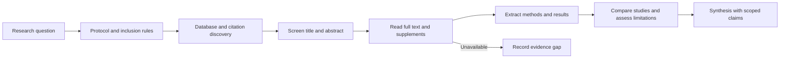

# Analyze Scientific Papers

Answer a defined research question from inspectable primary evidence. Separate
discovery metadata, paper content, reported results, and your synthesis so an
inaccessible method or missing dataset is not filled from model memory.

## Operating contract

- Treat the research question, inclusion criteria, population, intervention or
  exposure, outcomes, and time period as the scope boundary.
- Use metadata services to discover papers; use the paper, supplement, registry,
  correction, or data repository to support substantive claims.
- Preserve study design and uncertainty. Association is not causation,
  statistical significance is not practical importance, and absence of evidence
  is not evidence of absence.
- Do not fabricate inaccessible methods, sample sizes, effect estimates,
  quotations, DOI records, or replication status.
- Handle paywalled or unavailable material as an explicit evidence gap. Do not
  substitute a neighboring paper or review without labeling it.

## Workflow

## Procedure

1. Operationalize the question before searching. Record the target population or
   system, intervention/exposure, comparator, outcomes, eligible designs, date
   range, and exclusions that materially affect the answer.
1. Search more than one appropriate index when coverage matters. Use stable
   identifiers such as DOI, PMID, arXiv ID, trial registration, or repository
   accession to de-duplicate records. Save exact queries and search dates for
   reproducibility.
1. Screen against the stated criteria. Exclude with a reason rather than
   silently dropping inconvenient or contradictory results. Follow citations,
   corrections, retractions, protocols, and companion papers when they change
   interpretation.
1. Read the full methods and results for load-bearing claims. Extract sample
   construction, controls, measurement, missing-data handling, statistical
   model, uncertainty, effect size, subgroup definition, and deviations from
   preregistration where available.
1. Compare studies on design and applicability before combining conclusions. Do
   not average incomparable outcomes or transfer results between populations,
   versions, doses, environments, or endpoints without a defensible mapping.
1. Synthesize by claim. State which studies support or conflict, the strongest
   limitations, and what remains unknown. Prefer exact estimates with
   uncertainty over vote counting by significance.
1. Return citations adjacent to the claims they support. Distinguish
   paper-reported facts, your inference, and recommendations. Include the search
   and access limits when they could change the conclusion.

## Read only the material needed

| Situation | Read or use |
| --- | --- |
| Designing a search, de-duplicating records, or separating metadata from evidence | [Discovery and evidence boundaries](references/discovery-and-evidence.md) |
| Choosing review scope, inclusion rules, and synthesis method | [Decision guide](references/decision-guide.md) |
| Extracting methods and comparing claims | [Worked evidence-extraction examples](references/worked-examples.md) |
| Judging what a source or analysis actually establishes | [Verification and evidence](references/verification-and-evidence.md) |
| Handling inaccessible papers, conflicting studies, or weak designs | [Failure modes](references/failure-modes.md) |
| Using the bundled metadata retriever | [Metadata retrieval helper](scripts/fetch_metadata.py) |
| Preparing a structured research note | [Evidence note template](assets/evidence-note-template.md) |
| Checking official APIs and source freshness | [Source index](references/source-index.md) |

## Additional specialized references

Read only the reference whose subject affects the current task.

| Reference | Use when |
| --- | --- |
| [Domain model and authority](references/domain-model.md) | Current implementation is evidence of state, not automatically the desired contract. |
| [Enterprise operation and governance](references/enterprise-operation.md) | The skill may be used in repositories with protected branches, regulated data, separate owning teams, long support windows, and reproducible-build or audit requirements. |
| [Bundled resource catalog](references/resource-catalog.md) | Use this catalog to locate the exact skill-local files needed for the task. |

## Evaluation cases

Use [evaluation cases](references/evaluation-cases.md) for realistic activation,
near-miss, and instruction-conformance probes. These are maintained test inputs,
not claimed results.

## Bundled executable helpers

- `scripts/fetch_metadata.py --help`
- `scripts/test_fetch_metadata.py`

Run a helper only for the contract it documents. Inspect arguments and output; a
zero exit status proves only the checks implemented by that helper.

## Bundled output material

- `assets/evidence-note-template.md`

Copy or adapt assets into the target workspace. Do not edit the installed skill
as a substitute for changing the requested repository.

## Completion evidence

- Exact research question and selection criteria.
- Search sources, exact queries, dates, and screening limits.
- Per-study evidence with stable identifiers, design, population, methods,
  results, uncertainty, and limitations.
- Claim-level synthesis that identifies agreement, conflict, applicability, and
  unknowns.
- Citations to the actual paper or authoritative record supporting each material
  claim.

## Stop or escalate

- The question requires a material population, outcome, or policy choice that
  the user has not defined and source inspection cannot resolve.
- The load-bearing full text or data is unavailable; report the narrower
  evidence instead of reconstructing it.
- The available studies are not comparable enough for the requested aggregate
  conclusion.
- The request would require overstating causality, clinical applicability, or
  current consensus beyond the evidence.

Do not claim completion while a required check is failed, unattempted, or
unavailable. State the exact evidence and the remaining boundary instead of
promoting a narrower result into a broader claim.
