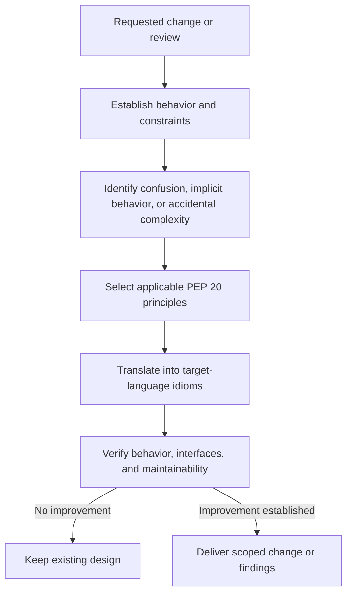

# Apply PEP 20 to Codebases

Use PEP 20 as a set of engineering decision principles across languages: make
behavior explicit, choose understandable structures, name concepts precisely,
and retain justified complexity. Apply the principles to the target language and
repository rather than translating code into Python style.

## Operating contract

- Preserve observable behavior, public contracts, supported platforms,
  performance obligations, and the target language’s idioms.
- Treat PEP 20 aphorisms as decision guidance, not executable requirements or an
  excuse to flatten every abstraction.
- Do not replace established project conventions, formatters, or architecture
  solely because another form looks more “Pythonic.”
- Naming changes must improve semantic precision and update all authorized
  consumers; aesthetic preference alone is insufficient.
- Practicality can outweigh purity, but the tradeoff must be explicit and
  supported by the actual constraints.

## Workflow

## Procedure

1. Inspect the code, repository conventions, language version, public surface,
   tests, and actual reason for change. Do not infer that unfamiliar syntax or
   abstraction is defective.
1. State the concrete problem: hidden side effect, ambiguous name, nested
   control flow, duplicated source of truth, over-general abstraction, swallowed
   error, or inconsistent contract.
1. Choose only the PEP 20 principles relevant to that problem. Translate them
   into the target language’s normal mechanisms—for example, Rust ownership
   types, C# disposal, Go explicit errors, Java sealed types, or C++ RAII.
1. Compare the current and proposed designs on behavior, clarity at call sites,
   error handling, ownership, change cost, and performance. Prefer one canonical
   path when it does not remove necessary variants or native escape hatches.
1. Implement only when authorized. Preserve generated/source boundaries and
   update callers, tests, documentation, and serialized or public names only
   where the contract actually changes.
1. Run the project’s existing checks and a behavior-focused test. Review the
   resulting diff for renamed ambiguity, duplicated policy, new public surface,
   and accidental compatibility obligations.
1. Report which principles informed the decision, what concrete defect changed,
   and where justified complexity remains. Do not claim general PEP 20
   compliance.

## Read only the material needed

| Situation | Read or use |
| --- | --- |
| Translating principles into non-Python languages | [Cross-language decisions](references/cross-language-decisions.md) |
| Choosing precise names for actions, units, ownership, and effects | [Naming decisions](references/naming-decisions.md) |
| Reviewing detailed before/after examples | [Applied examples](references/applied-examples.md) |
| Determining whether a refactor is warranted | [Decision guide](references/decision-guide.md) |
| Avoiding simplification that changes a contract | [Failure modes](references/failure-modes.md) |
| Checking behavior and interface preservation | [Verification and evidence](references/verification-and-evidence.md) |
| Reviewing complete cross-language worked examples | [Worked examples](references/worked-examples.md) |
| Checking source scope and PEP status | [Source index](references/source-index.md) |

## Additional specialized references

Read only the reference whose subject affects the current task.

| Reference | Use when |
| --- | --- |
| [Domain model and authority](references/domain-model.md) | Current implementation is evidence of state, not automatically the desired contract. |
| [Enterprise operation and governance](references/enterprise-operation.md) | The skill may be used in repositories with protected branches, regulated data, separate owning teams, long support windows, and reproducible-build or audit requirements. |
| [Bundled resource catalog](references/resource-catalog.md) | Use this catalog to locate the exact skill-local files needed for the task. |

## Evaluation cases

Use [evaluation cases](references/evaluation-cases.md) for realistic activation,
near-miss, and instruction-conformance probes. These are maintained test inputs,
not claimed results.

## Bundled executable helpers

- `scripts/test_examples.py`

Run a helper only for the contract it documents. Inspect arguments and output; a
zero exit status proves only the checks implemented by that helper.

## Bundled output material

- No output template is mandatory. Preserve the repository’s established format.

Copy or adapt assets into the target workspace. Do not edit the installed skill
as a substitute for changing the requested repository.

## Completion evidence

- The concrete design or naming problem and the evidence for it.
- The selected PEP 20 principles and their target-language interpretation.
- A scoped change or review findings that preserve required contracts.
- Executed behavior, type, lint, build, and integration checks as applicable.
- Remaining complexity and why it is required.

## Stop or escalate

- The request is only to run PEP 8 or a formatter; use the project’s formatter
  instead.
- The proposed simplification would silently change a public, persistence,
  concurrency, ownership, or error contract.
- The “better” name or abstraction is only subjective and project conventions do
  not support it.
- A material product decision is required to choose between externally visible
  behaviors.

Do not claim completion while a required check is failed, unattempted, or
unavailable. State the exact evidence and the remaining boundary instead of
promoting a narrower result into a broader claim.
