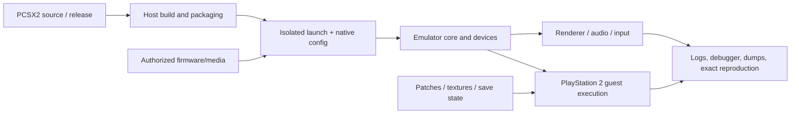

# Build and Debug PCSX2

Build, launch, or investigate PCSX2 while keeping emulator build/configuration,
PlayStation 2 guest behavior, media/firmware provenance, rendering, patches,
saves, and host environment as separate evidence layers.

## Operating contract

- Use the exact PCSX2 revision/release and current upstream source/options. Do
  not transfer commands or configuration from the other emulator.
- Use a task-owned isolated data/config/cache/log directory for experiments.
  Preserve ordinary user saves, states, memory cards, settings, textures,
  cheats, and game lists.
- Do not obtain or redistribute BIOS, firmware, copyrighted game images, keys,
  or proprietary assets. Use only user-authorized legally available inputs.
- Separate command construction, emulator process startup, guest boot, specific
  guest behavior, renderer output, and performance. Evidence at one layer does
  not prove another.
- Treat save states as revision/settings-dependent diagnostic artifacts, not
  durable portable correctness evidence. Record provenance before use.

## Workflow

## Procedure

1. Classify the task: source build, packaged launch, configuration, guest/ELF
   debugging, patch/texture work, rendering, save-state analysis, or upstream
   issue reproduction. Record PCSX2 revision/version, host OS/architecture, and
   authorized inputs.
1. Inspect upstream build files/docs and existing repository changes before
   selecting dependencies, generator, compiler, build type, feature flags, or
   packaging. Do not use remembered commands for a different release.
1. For experiments, create an isolated task-owned data/config/log/cache path.
   Inventory native settings and passthrough options. Use the bundled command
   builder only to construct/validate arguments; inspect the result before
   execution.
1. Establish a minimum reproduction with game/ELF/serial/hash, exact scene or
   frame, settings, renderer, patches/textures, save-state provenance, and
   expected versus actual PlayStation 2 behavior. Reproduce on the same revision
   before changing code.
1. Locate the owning layer: host build/package, configuration/paths,
   core/CPU/devices, guest program/data, patch, save state, renderer/driver,
   audio/input, or external dependency. Use logs/debugger/dumps and controlled
   A/B settings rather than broad toggles.
1. Change one causal factor and preserve a known-good comparison. For source
   fixes, add the narrowest suitable test or repeatable reproduction; for guest
   patches, record target identity and address/condition constraints. Do not
   suppress emulator errors or reset user state.
1. Re-run the exact reproduction and relevant build/core/renderer/guest checks.
   Clean task-owned state only after preserving useful evidence. Report which
   layer was executed and what remains unverified.

## Read only the material needed

| Situation | Read or use |
| --- | --- |
| Building from source and inspecting upstream requirements | [Source builds](references/source-builds.md) |
| Using documented CLI options and isolated data paths | [Native launch](references/native-launch.md) |
| Building exact command lines and data paths | [Commands and data paths](references/commands-and-data-paths.md) |
| Debugging guest execution, GS dumps, rendering, and evidence | [Debugging evidence](references/debugging-and-evidence.md) |
| Debugger and rendering behavior | [Debugger and rendering](references/debugging-and-rendering.md) |
| PNACH patches and texture replacement | [Patches and textures](references/patches-and-textures.md) |
| Choosing build, launch, guest, renderer, or patch evidence | [Decision guide](references/decision-guide.md) |
| Using complete build/launch/debug examples | [Worked examples](references/worked-examples.md) |
| Matching process, guest, and renderer claims to evidence | [Verification and evidence](references/verification-and-evidence.md) |
| Avoiding user-state damage and layer conflation | [Failure modes](references/failure-modes.md) |
| Applying enterprise provenance and sandbox controls | [Enterprise operation](references/enterprise-operation.md) |
| Checking current upstream sources | [Source index](references/source-index.md) |

## Additional specialized references

Read only the reference whose subject affects the current task.

| Reference | Use when |
| --- | --- |
| [PCSX2 PS2 emulator: select the source-build task](references/build.md) | Resolve the requested source revision and read its build documentation, CMake options, dependency provisioning, and supported host/target architectures. |
| [Domain model and authority](references/domain-model.md) | Current implementation is evidence of state, not automatically the desired contract. |
| [Bundled resource catalog](references/resource-catalog.md) | Use this catalog to locate the exact skill-local files needed for the task. |

## Evaluation cases

Use [evaluation cases](references/evaluation-cases.md) for realistic activation,
near-miss, and instruction-conformance probes. These are maintained test inputs,
not claimed results.

## Bundled executable helpers

- `scripts/build_command.py --help`
- `scripts/test_build_command.py`

Run a helper only for the contract it documents. Inspect arguments and output; a
zero exit status proves only the checks implemented by that helper.

## Bundled output material

- No output template is mandatory. Preserve the repository’s established format.

Copy or adapt assets into the target workspace. Do not edit the installed skill
as a substitute for changing the requested repository.

## Completion evidence

- Exact PCSX2 revision/release, host/toolchain, build options, and produced
  artifact when building.
- Isolated data/config/log paths and inspected native argument vector.
- Authorized firmware/media/ELF/patch/texture/save-state identities without
  redistributing them.
- Minimum reproduction with expected/actual behavior and owning-layer analysis.
- Executed host build, emulator launch, guest, renderer, debugger/dump, and
  regression checks distinguished.
- Task-owned cleanup and preserved user data/settings.

## Stop or escalate

- Required firmware/media/input is unavailable or not authorized.
- The only available experiment would overwrite user data/configuration or
  require unapproved system access.
- The exact upstream version/options cannot be established.
- A result depends on an unavailable physical GPU/driver/game scene and narrower
  evidence would be misleading if promoted.

Do not claim completion while a required check is failed, unattempted, or
unavailable. State the exact evidence and the remaining boundary instead of
promoting a narrower result into a broader claim.
