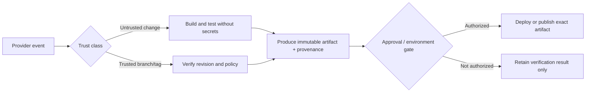

# Configure CI/CD Pipelines

Implement provider-native automation that executes the project’s established
build, test, packaging, release, or deployment commands with explicit trust
boundaries, immutable artifact identity, least privilege, and auditable failure
propagation.

## Operating contract

- Preserve the selected provider and repository policy. Do not introduce a
  cross-provider abstraction or new deployment system unless requested.
- Treat pull-request content, fork code, generated metadata, caches, and
  artifacts as untrusted until their producer, revision, and integrity are
  established.
- Use least-privilege job and token permissions. A later privileged job must not
  execute untrusted code or consume unauthenticated instructions from an earlier
  job.
- Pin or otherwise govern third-party actions/images/includes according to
  repository policy; tags alone may move.
- Deployment, release publication, environment approval, and secret access
  remain separate authorized operations.

## Workflow

## Procedure

1. Inspect the existing provider files, reusable workflows/includes, project
   commands, runner requirements, protected environments, secrets, permissions,
   and artifact consumers. Identify the exact event and trust class.
1. Define the job graph before editing: inputs, outputs, dependencies,
   concurrency/cancellation behavior, revision identity, artifact identity, and
   failure propagation. Use provider-native needs/dependencies rather than
   hidden ordering by job names.
1. Implement the smallest provider-native change. Reuse project scripts instead
   of duplicating build logic in YAML. Quote shell inputs, avoid evaluating
   branch or issue text as code, and prevent secrets from reaching untrusted
   jobs or logs.
1. Make caches performance-only. Keys must include material dependency/tool
   inputs; cache misses must not change correctness. Artifacts used across jobs
   or deployment must be immutable, scoped, and associated with the verified
   source revision.
1. Separate verification from release/deployment. Use OIDC or the repository’s
   approved short-lived credential mechanism where available. Preserve
   environment approvals, branch/ruleset controls, and manual promotion
   boundaries.
1. Validate syntax with the provider or established linter, inspect resolved
   conditions and permissions, and run the narrowest available test. For changed
   trust paths, test both authorized and unauthorized events.
1. Inspect the final job graph and package contents. Report provider-side checks
   not executed, especially protected-environment approval, hosted runner
   behavior, cloud identity exchange, or actual deployment.

## Read only the material needed

| Situation | Read or use |
| --- | --- |
| Implementing GitHub Actions events, permissions, artifacts, OIDC, or reusable workflows | [GitHub Actions](references/github-actions.md) |
| Implementing GitLab CI workflow rules, needs, artifacts, includes, or ID tokens | [GitLab CI](references/gitlab-ci.md) |
| Implementing Bitbucket Pipelines start conditions, artifacts, OIDC, or steps | [Bitbucket Pipelines](references/bitbucket-pipelines.md) |
| Reasoning about provider event and job behavior | [Provider behavior](references/provider-behavior.md) |
| Reviewing fork, token, artifact, cache, and deployment hazards | [Provider hazards](references/provider-hazards.md) |
| Choosing a trust and promotion design | [Decision guide](references/decision-guide.md) |
| Using complete provider examples | [Worked examples](references/worked-examples.md) |
| Matching claims to syntax, runner, and deployment evidence | [Verification and evidence](references/verification-and-evidence.md) |
| Checking current provider documentation | [Source index](references/source-index.md) |

## Additional specialized references

Read only the reference whose subject affects the current task.

| Reference | Use when |
| --- | --- |
| [Domain model and authority](references/domain-model.md) | Current implementation is evidence of state, not automatically the desired contract. |
| [Enterprise operation and governance](references/enterprise-operation.md) | The skill may be used in repositories with protected branches, regulated data, separate owning teams, long support windows, and reproducible-build or audit requirements. |
| [Failure modes and recovery](references/failure-modes.md) | Preserve the first useful error and the state that produced it. |
| [Bundled resource catalog](references/resource-catalog.md) | Locate and apply complete native templates without treating them as universal defaults. |

## Evaluation cases

Use [evaluation cases](references/evaluation-cases.md) for realistic activation,
near-miss, and instruction-conformance probes. These are maintained test inputs,
not claimed results.

## Bundled executable helpers

- No bundled script is mandatory. Use the target repository’s established tools.

Run a helper only for the contract it documents. Inspect arguments and output; a
zero exit status proves only the checks implemented by that helper.

## Bundled output material

- `assets/github-actions/ci.reference.yml`
- `assets/gitlab/ci.reference.yml`
- `assets/bitbucket/bitbucket-pipelines.reference.yml`

Copy or adapt assets into the target workspace. Do not edit the installed skill
as a substitute for changing the requested repository.

## Completion evidence

- Updated provider configuration and any strictly necessary project script
  changes.
- Explicit event, trust, permission, artifact, and promotion model.
- Syntax/lint results and any provider-side run identifiers actually observed.
- Artifact/revision identity and deployment/publish boundary.
- Unexecuted hosted, secret, approval, or deployment checks.

## Stop or escalate

- The requested deployment target, environment, credential authority, or
  approval owner is materially undefined.
- The only available design would expose secrets or privileged tokens to
  untrusted code.
- A provider or repository policy blocks the requested operation and changing
  that policy was not authorized.
- The pipeline would need to publish or deploy when only verification was
  requested.

Do not claim completion while a required check is failed, unattempted, or
unavailable. State the exact evidence and the remaining boundary instead of
promoting a narrower result into a broader claim.
