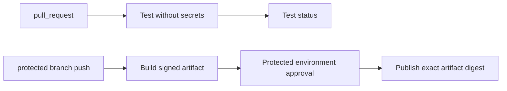

# Worked CI/CD examples

## GitHub Actions: untrusted tests, trusted release



Keep the pull-request workflow read-only. The release workflow must establish
that the source revision is permitted and the artifact was produced by the
trusted build. Never pass a PR-controlled command or path from the first run
into a privileged shell without validation.

## GitLab: explicit workflow and job rules

```yaml
workflow:
  rules:
    - if: '$CI_PIPELINE_SOURCE == "merge_request_event"'
    - if: '$CI_COMMIT_BRANCH == $CI_DEFAULT_BRANCH'
    - when: never

build:
  stage: build
  script: ./scripts/ci-build.sh
  artifacts:
    paths: [dist/]
    expire_in: 7 days
```

Add deployment as a separate job with `needs`, protected environment/variables,
and rules that match the actual release policy. Do not copy a GitHub event
mental model into GitLab variables.

## False success to reject

```sh
run-tests || true
publish-report
```

This hides a required test failure. If report publication must always run,
capture the test status, publish the report, then exit with the original failing
status or use provider-native `always`/failure handling without changing the
required job outcome.
