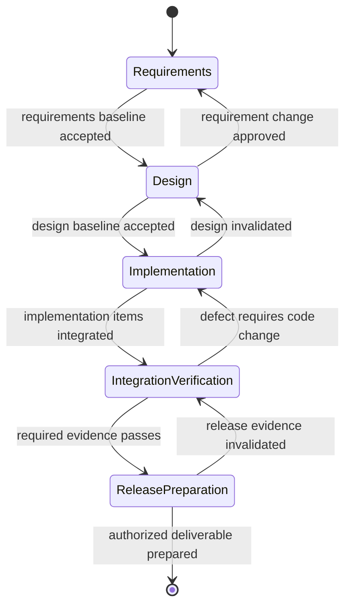

# Coordinate Phase-Gated Subagents

Coordinate multiple coding agents through a sequential software-development
lifecycle without allowing child agents to redefine the goal, skip required
phase evidence, or write concurrently to conflicting ownership. Use parallelism
only where independent work inside the current phase outweighs coordination
cost.

## Operating contract

- This skill is explicit-invocation-only. Do not start a multi-agent workflow
  merely because the harness supports subagents.
- The root user goal, authorized scope, constraints, and accepted baselines
  control every child assignment. A child proposal is evidence, not authority.
- Requirements, design, implementation, integration/verification, and release
  preparation are sequential lifecycle phases. Local TDD and refactoring remain
  valid cycles inside implementation.
- Assign disjoint write ownership or serialize dependent work. Do not merge
  conflicting child changes by selecting whichever looks plausible.
- Use zero or one proportionate independent review by default; add specialist
  reviews only for distinct material risks or explicit process requirements.
- A phase completes only when every required condition has corresponding
  evidence. Failed, unavailable, and unattempted checks remain distinct.

## Root-agent coordination contract

- Treat the user goal, scope, approval boundary, and required evidence as
  controlling. This skill narrows how to produce a multi-agent phase
  coordination; it MUST NOT broaden authority or override repository
  instructions.
- For GPT-5.6 and GPT-6, provide phase inputs, ownership, write paths, gate
  evidence, and root authority, hard constraints, available tools, and the
  finish condition once. Remove repeated directions and examples unless a
  recorded evaluation shows that they prevent a real failure.
- Infer routine, reversible steps from inspected evidence. Ask only when an
  unresolved choice changes an external contract. Stop before an external write,
  destructive action, credential use, or material scope expansion that the user
  did not authorize.
- Load a linked reference only when its subject affects the current decision.
  Use scripts for deterministic mechanics; use model judgment for semantic
  decisions. Inspect tool output before relying on it.
- Validate at the boundary of the claim with gate records, integration diffs,
  and independently executed checks. Report commands, observed results, and
  gaps. A parser, build, or single green test proves only the property that it
  can discriminate.
- Use **MUST** only for an absolute safety or interoperability requirement,
  **SHOULD** for a default with valid exceptions, and **MAY** for an option.
  Write short active sentences and use one stable term for each concept. This
  style is STE-inspired; it is not a claim of formal ASD-STE100 conformance.

## Workflow

## Procedure

1. Capture the exact root goal, authorized edit boundary, deliverable,
   acceptance conditions, existing process artifacts, harness capabilities, and
   project controls. Use the repository's own issue/spec/plan formats rather
   than introducing a parallel lifecycle schema.
1. Determine whether multi-agent execution adds value. Partition by independent
   components, research domains, or distinct verification boundaries. Keep
   simple or tightly coupled work with one agent.
1. For the current phase, create bounded work items containing goal, source
   evidence, constraints, allowed files/actions, expected return shape, and stop
   condition. Verify effective model, tools, permissions, workspace,
   timeout/cancellation, and write ownership from the harness—not from the
   prompt alone.
1. Launch only ready, nonconflicting work. Reuse shared reconnaissance; do not
   make every child rediscover the same repository. Persist and inspect each
   completed result before it can be lost or superseded.
1. Integrate evidence and artifacts centrally. Check diffs, commands, outputs,
   and unresolved assumptions. Do not accept a child's “done” label without the
   phase evidence or let a child commit, publish, deploy, reset, or expand scope
   unless explicitly authorized.
1. Apply the current phase gate. If a discovery invalidates an accepted earlier
   baseline, open a documented change decision, revise the earliest affected
   baseline, and repeat downstream checks rather than patching around the
   conflict.
1. Close or release child resources according to the harness. Deliver the
   integrated result and a truthful evidence summary; do not leave stale
   workers, worktrees, or unconsumed results.

## Choose the phase-control reference

| Situation | Read or use |
| --- | --- |
| Defining and baselining requested behavior | [Phase 1 — requirements](references/phase-1-software-requirements.md) |
| Defining component, interface, ownership, and deployment decisions | [Phase 2 — design](references/phase-2-software-design.md) |
| Assigning and integrating implementation work | [Phase 3 — implementation](references/phase-3-software-implementation.md) |
| Integrating, verifying, and resolving defects | [Phase 4 — integration and verification](references/phase-4-software-integration-verification.md) |
| Preparing an authorized release deliverable | [Phase 5 — release preparation](references/phase-5-software-release.md) |
| Checking native subagent/model/cancellation capabilities | [Host capabilities](references/subagent-host-capabilities.md) |
| Partitioning work and protecting Git/workspaces | [Parallel assignment](references/parallel-software-work-assignment.md) |
| Revising accepted baselines after a late discovery | [Baseline change control](references/revise-software-phase-baselines.md) |
| Avoiding proliferation, duplicate work, lost results, and review ceremony | [Coordination failure modes](references/subagent-coordination-failures.md) |
| Using complete work-item and gate examples | [Worked scenarios](references/phase-gated-delivery-worked-scenarios.md) |
| Checking phase claims against evidence | [Verification and claim evidence](references/phase-gated-delivery-verification-and-claim-evidence.md) |
| Reviewing source patterns and their limits | [Standards, APIs, and authorities](references/phase-gated-delivery-standards-apis-and-authorities.md) |

## Coordination and gate references

Read only the reference whose subject affects the current task.

| Reference | Use when |
| --- | --- |
| [Adapt subagent methods from Bun's software rewrite](references/bun-software-rewrite-methods.md) | Primary source: <https://bun.com/blog/bun-in-rust> (Jarred Sumner, July 8, 2026). |
| [Operational decisions](references/phase-gated-delivery-operational-decisions.md) | Use when selecting the next evidence-backed multi-agent phase coordination action. |
| [Concepts, contracts, and invariants](references/phase-gated-delivery-concepts-contracts-and-invariants.md) | Use when distinguishing the requested multi-agent phase coordination from observed repository state. |
| [Enterprise operation and governance](references/phase-gated-delivery-organizational-controls-and-scale.md) | Use when the multi-agent phase coordination crosses ownership, data-handling, release, or audit boundaries. |
| [Failure modes and recovery](references/phase-gated-delivery-failure-patterns-and-recovery.md) | Preserve the first useful error and the state that produced it. |
| [Review software independently for evidenced defects](references/independent-software-review.md) | Defect-focused review checks software requirements, design, or implementation against evidence. |
| [Bundled resource map](references/phase-gated-delivery-bundled-resource-map.md) | Use when locating bundled resources for the multi-agent phase coordination. |
| [Decide whether a development phase may advance](references/software-phase-completion-criteria.md) | A phase gate is the required completion checks for the current development phase. |
| [Isolate subagent software edits and Git operations](references/subagent-workspaces-and-git-safety.md) | Parallel agents must not coordinate by destructively rewriting one shared working tree. |

## Behavioral evaluation

Run [the maintained Agent Skills evaluations](evals/evals.json) in clean
target-client contexts. Compare this revision with a no-skill or prior-skill
baseline. Review commands, diffs, and artifacts; do not grade prose alone. The
checked-in cases are test inputs, not claimed results.

## Bundled executable helpers

- No bundled script is mandatory. Use the target repository's established tools.

Run a helper only for the contract it documents. Inspect arguments and output; a
zero exit status proves only the checks implemented by that helper.

## Bundled output material

- `assets/software-requirements-baseline.template.md`
- `assets/software-design-baseline.template.md`
- `assets/subagent-software-work-item.template.md`
- `assets/software-phase-completion.template.md`
- `assets/software-baseline-change-request.template.md`
- `assets/software-defect-review.template.md`
- `assets/software-requirement-verification.template.md`

Copy or adapt assets into the target workspace. Do not edit the installed skill
as a substitute for changing the requested repository.

## Completion evidence

- Accepted or explicitly unresolved requirements and design baselines in the
  project's established format.
- A work partition with nonconflicting ownership, dependencies, and stop
  conditions.
- Consumed child results with inspected evidence and integrated artifacts.
- Phase-gate decisions tied to executed checks, source evidence, and unresolved
  limits.
- No open worker, workspace, or branch state left unintentionally.
- Release preparation only to the level authorized; publication or deployment
  requires separate authority.

## Stop or escalate

- Subagent execution, isolation, effective model/tool selection, or cancellation
  cannot be established for a risky task; serialize or perform the work locally.
- A material requirement, public contract, architecture, or policy decision
  remains user-owned.
- Required phase evidence is failed, unavailable, or unattempted.
- Concurrent ownership overlaps or a child changed the root goal.
- The coordination cost exceeds the value of parallelism.

Do not claim completion while a required check is failed, unattempted, or
unavailable. State the exact evidence and the remaining boundary instead of
promoting a narrower result into a broader claim.
