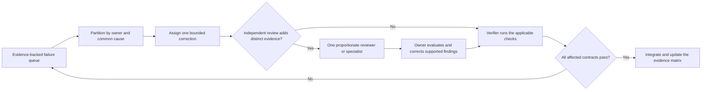

# Phase 4: integrate and verify the system

Goal: assemble the phase-3 outputs and demonstrate conformance to the accepted
requirements and design baselines at every affected boundary.

## Integration order

Integrate in dependency order. Before combining a work item, verify its declared
prerequisites, base revision, owned paths, interface version, and local
evidence. Avoid giant merge batches that make regression attribution impossible.

## Build evidence-backed failure queues

Capture machine output before assigning correction work. Useful queues include:

- compiler, type-checker, linker, or packaging errors grouped by root cause and
  owning component;
- unit, integration, system, simulator, device, and migration failures linked to
  the requirement and boundary they exercise;
- sanitizer, race, memory-safety, static-analysis, security, protocol, API, or
  schema-conformance findings;
- matched baseline-versus-candidate performance regressions;
- platform-, runtime-, architecture-, and deployment-specific failures.

A queue item contains the unaltered diagnostic, exact reproduction command,
revision and environment, applicable requirement/design identifiers, ownership,
and the evidence needed to close it. Do not paraphrase away critical output or
merge different causes because their messages look similar.

## Repair one independently actionable failure cluster

1. Assign one implementer or owner a bounded defect with explicit write scope.
1. Require a causal explanation supported by the reproduction; do not accept a
   symptom patch, retry, assertion change, or new fallback as the default fix.
1. Use zero or one independent review pass when it can add evidence beyond the
   verifier. Add a specialist only for a distinct material risk such as ABI,
   concurrency, security, migration, or hardware behavior.
1. The owner evaluates findings; reviewer assertions are not authority. Apply
   supported corrections within the same owned boundary.
1. Run the narrow defect check, affected component checks, and every integration
   check needed for changed contracts. Record failed, unavailable, and unrun
   checks separately.

The lifecycle remains in Integration/Verification. Reopen an earlier phase only
when evidence shows that an accepted requirement or design baseline is wrong or
incomplete; use the baseline-change procedure rather than silently redefining
it.

## Verification matrix

For every mandatory requirement and affected nonfunctional constraint, record:

- requirement and design identifiers;
- source revision, build/runtime configuration, and environment;
- exact evidence command or procedure;
- independently established expected result;
- observed result and relevant raw artifact/log location;
- evidence layer: static, build, unit, integration, simulator/emulator, device,
  end-to-end, staging, or production observation;
- status using the project’s existing vocabulary, preserving pass, fail,
  blocked/unavailable, and not-run distinctions;
- approved deviation or risk decision where applicable.

A parser success cannot satisfy runtime behavior. A simulator result cannot be
reported as physical-device execution. A passed subset cannot complete a gate
that requires another unexecuted layer.

## Compatibility and migration checks

When the requirement is behavioral compatibility or migration safety, compare
against the actual declared contract, supported baseline, persisted data, and
known consumers. Preserve an old executable or golden artifact only when it is a
valid oracle for the requested contract. Existing behavior and tests are
evidence, not independent authority for invented compatibility obligations.

## Phase completion check

Advance only when:

- all mandatory requirement and design checks have sufficient evidence at the
  claimed boundary;
- integration and packaging/distribution checks required by the deliverable have
  completed;
- critical diagnostics are resolved or have an explicit authorized disposition;
- remaining limitations and unexecuted environments are visible;
- no child agent, workspace, or integration branch can still mutate the result;
- any required approval uses the repository’s real mechanism.
