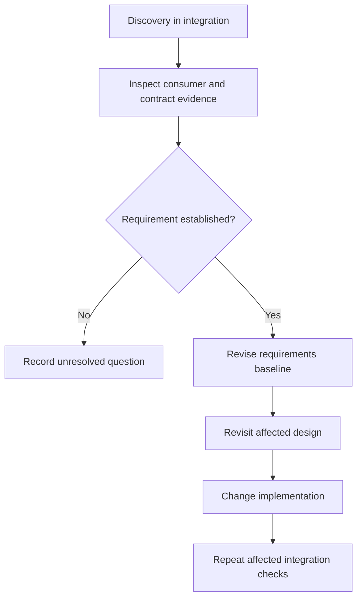

# Worked scenarios for Phase Gated Delivery

## Example 1: component migration with three independent work streams

Requirements and design are already accepted. The implementation phase has:

| Work item | Owner | Writable paths | Dependencies | Required return |
| --- | --- | --- | --- | --- |
| Adapter implementation | agent A | `src/adapter/**` | accepted interface | diff, tests, unresolved assumptions |
| Data migration tool | agent B | `tools/migrate/**` | accepted schema mapping | diff, dry-run evidence, rollback limits |
| Integration test design | agent C | read-only until contracts confirmed | adapter + migration contracts | proposed cases and fixture needs |

Agent C does not create production seams merely to make testing convenient. A
coordinator consumes A and B, then assigns the actual integration-test edit once
the interfaces exist. Parallelism stays inside implementation; verification of
the integrated product is still a later gate.

## Example 2: late requirement discovery

During integration, a child discovers that an external consumer requires stable
ordering that the requirements baseline omitted.

Do not add sorting as an “obvious fix” and keep the old baseline unchanged.
Conversely, do not invent the obligation from one child's speculation.

## Example 3: proportionate review

A high-risk authentication boundary receives one independent security review and
one target-system integration check because they answer distinct questions. A
mechanical documentation update receives neither a multi-agent review panel nor
an arbiter. Clean review results are acceptable; findings are not a quota.
