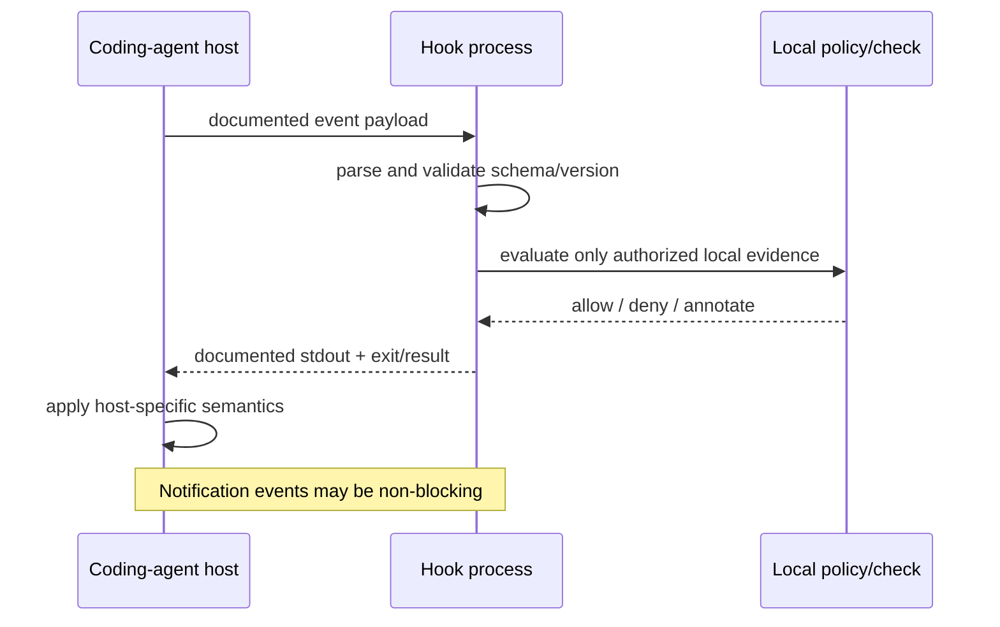

# Create Agent Hooks

Implement a hook against the exact coding-agent host and version, with explicit
event semantics, input validation, exit/blocking behavior, least privilege,
deterministic output, and reversible configuration. Do not invent a universal
hook schema or assume similar event names have equivalent authority.

## Operating contract

- Identify the host, installed version, configuration scope, event, transport,
  working directory, and whether the hook can observe, modify, or block
  execution.
- Treat hook input as untrusted data. Parse documented fields, validate paths
  and command arguments, and never execute embedded instructions or shell text
  by default.
- Preserve existing hook configuration and ordering. Add or remove only the
  task-owned entry; rollback must not delete unrelated settings or scripts.
- Use synchronous blocking only when the host documents it and the policy
  requires it. Notification-only hooks cannot enforce authorization.
- Keep secrets out of hook files, command lines, stdout/stderr, and captured
  payload fixtures.

## Model and skill execution contract

- Treat the user goal, scope, approval boundary, and required evidence as
  controlling. This skill narrows how to produce a agent hook; it MUST NOT
  broaden authority or override repository instructions.
- For GPT-5.6 and GPT-6, provide the named client version, native event,
  payload, permission mode, and rollback path, hard constraints, available
  tools, and the finish condition once. Remove repeated directions and examples
  unless a recorded evaluation shows that they prevent a real failure.
- Infer routine, reversible steps from inspected evidence. Ask only when an
  unresolved choice changes an external contract. Stop before an external write,
  destructive action, credential use, or material scope expansion that the user
  did not authorize.
- Load a linked reference only when its subject affects the current decision.
  Use scripts for deterministic mechanics; use model judgment for semantic
  decisions. Inspect tool output before relying on it.
- Validate at the boundary of the claim with schema checks, live registration,
  event observation, and failure-path tests. Report commands, observed results,
  and gaps. A parser, build, or single green test proves only the property that
  it can discriminate.
- Use **MUST** only for an absolute safety or interoperability requirement,
  **SHOULD** for a default with valid exceptions, and **MAY** for an option.
  Write short active sentences and use one stable term for each concept. This
  style is STE-inspired; it is not a claim of formal ASD-STE100 conformance.

## Workflow

## Procedure

1. Inspect the installed host/version and existing hook configuration before
   choosing an event or file path. Read the matching host reference and official
   documentation; do not adapt another host's payload by name alone.
1. Define the hook contract: trigger, input fields, trust boundary, allowed side
   effects, output format, exit codes, timeout, failure policy, ordering, and
   proof of registration. Decide whether the goal is telemetry, context
   injection, validation, or blocking.
1. Implement a small handler using the host's native transport. Prefer
   structured parsing and argument arrays over shell interpolation. Resolve
   repository-relative paths against documented context and reject unsupported
   or ambiguous inputs explicitly.
1. Add the narrow configuration entry while preserving unrelated entries,
   comments where supported, scope, and precedence. Keep executable files in
   `scripts/` and sample host configurations/fixtures in `assets/`.
1. Test the handler with representative valid, malformed, adversarial, and
   missing-field payloads. Verify output and exit behavior. Then perform a real
   host invocation when available; a fixture test does not prove registration or
   enforcement.
1. Test failure behavior: handler crash, timeout, invalid output, unavailable
   dependency, and multiple hooks. Confirm whether the host fails open, fails
   closed, warns, retries, or ignores the result.
1. Document rollback as removal of the added entry and task-created files only.
   Report live registration evidence and untested host behavior separately.

## Choose the agent-integration reference

| Situation | Read or use |
| --- | --- |
| Claude Code hooks | [Claude Code](references/claude-code.md) |
| OpenAI Codex hooks | [Codex](references/codex.md) |
| Cursor hooks | [Cursor](references/cursor.md) |
| Gemini CLI hooks | [Gemini CLI](references/gemini-cli.md) |
| GitHub Copilot hooks | [GitHub Copilot](references/github-copilot.md) |
| OpenCode plugin hooks | [OpenCode](references/opencode.md) |
| VS Code agent hooks | [VS Code](references/vscode.md) |
| Choosing observe, annotate, or block semantics | [Operational decisions](references/agent-hook-operational-decisions.md) |
| Implementing robust structured handlers | [Worked hook examples](references/agent-hook-worked-scenarios.md) |
| Testing fixtures versus live registration | [Verification and claim evidence](references/agent-hook-verification-and-claim-evidence.md) |
| Reviewing injection, timeout, rollback, and fail-open risks | [Failure patterns and recovery](references/agent-hook-failure-patterns-and-recovery.md) |
| Checking current host documentation | [Standards, APIs, and authorities](references/agent-hook-standards-apis-and-authorities.md) |

## Agent behavior references

Read only the reference whose subject affects the current task.

| Reference | Use when |
| --- | --- |
| [Concepts, contracts, and invariants](references/agent-hook-concepts-contracts-and-invariants.md) | Use when distinguishing the requested agent hook from observed repository state. |
| [Enterprise operation and governance](references/agent-hook-organizational-controls-and-scale.md) | Use when the agent hook crosses ownership, data-handling, release, or audit boundaries. |
| [Bundled resource map](references/agent-hook-bundled-resource-map.md) | Use when locating bundled resources for the agent hook. |

## Behavioral evaluation

Run [the maintained Agent Skills evaluations](evals/evals.json) in clean
target-client contexts. Compare this revision with a no-skill or prior-skill
baseline. Review commands, diffs, and artifacts; do not grade prose alone. The
checked-in cases are test inputs, not claimed results.

## Bundled executable helpers

- `scripts/test_assets.py`

Run a helper only for the contract it documents. Inspect arguments and output; a
zero exit status proves only the checks implemented by that helper.

## Bundled output material

- `assets/shared/observe.py`
- `assets/fixtures/`
- `assets/claude-code/settings.json`
- `assets/codex/hooks.json`
- `assets/cursor/hooks.json`
- `assets/gemini-cli/settings.json`
- `assets/github-copilot/hooks.json`
- `assets/opencode/`
- `assets/vscode/hooks.json`

Copy or adapt assets into the target workspace. Do not edit the installed skill
as a substitute for changing the requested repository.

## Completion evidence

- Host/version/event and exact hook contract.
- Handler and minimal configuration change preserving unrelated entries.
- Fixture tests for valid, malformed, adversarial, and failure payloads.
- Live invocation/registration evidence when available.
- Rollback instructions limited to task-owned additions.
- Explicit statement of notification, modification, and blocking authority.

## Stop or escalate

- The host/version or event semantics cannot be established from installed state
  or current official documentation.
- The requested policy cannot be enforced by the selected event or host.
- The hook would require unsafe shell evaluation, broad credentials, or
  unapproved network export.
- Changing system/global configuration or organization policy was not
  authorized.

Do not claim completion while a required check is failed, unattempted, or
unavailable. State the exact evidence and the remaining boundary instead of
promoting a narrower result into a broader claim.
