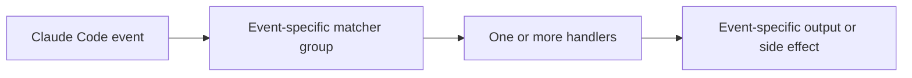

# Configure Claude Code agent event hooks

Original source note dated 2026-09-12, referring to the official [Claude Code
hooks reference][ref-claude-code-hooks-reference].

User hooks live in `~/.claude/settings.json`; shared and local project hooks use
`.claude/settings.json` and `.claude/settings.local.json`. The schema flow is:

Supported handler types and event-specific output vary; command, HTTP, prompt,
agent, and MCP-tool handlers are not interchangeable. Use
`${CLAUDE_PROJECT_DIR}` for project scripts and prefer documented exec form when
path tokenization must be avoided.

Hooks run with Claude Code's environment and current directory. Review inherited
credentials and remote execution. Matchers depend on the event; omission or an
empty matcher can match every event. Exit code `2`, JSON decisions, async mode,
and timeout behavior are event-specific. Use `/hooks` to inspect loaded sources.
Set `disableAllHooks` only for deliberate all-hook rollback; it cannot override
managed hooks.

Copy the configuration asset and shared handler to the paths described in the
asset, merge rather than replace settings, trigger `SessionStart`, inspect
`/hooks`, and delete only the added entry to roll back.

[ref-claude-code-hooks-reference]: https://code.claude.com/docs/en/hooks
