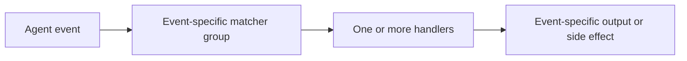

# Configure Codex coding-agent event hooks

Original source note dated 2026-09-12, referring to Codex CLI 0.154.0 and the
official [hooks reference][ref-hooks-reference].

Codex discovers `hooks.json` or inline `[hooks]` beside active configuration,
notably `~/.codex/` for user scope and `<repo>/.codex/` for project scope. Do
not define both forms in one layer. Project hooks load only for a trusted
project. Every new or changed non-managed definition is skipped until its exact
hash is reviewed and trusted through `/hooks`.

The configuration flow is:

Matchers are regular expressions but not every event honors them. Command
handlers receive JSON on stdin, run from the session working directory, and use
seconds for `timeout`. Most default to 600 seconds; `SessionEnd` and `Interrupt`
have shorter limits. Synchronous output and blocking meaning vary by event.
Async handlers can finish out of order and are canceled at session end. Inspect
the event's exact input/output section before returning a decision.

For a project fixture, copy `assets/codex/hooks.json` to `.codex/hooks.json` and
the shared handler to `.agent-hooks/observe.py`. Resolve the handler from the
Git root because Codex can start in a subdirectory. Open `/hooks`, inspect the
source and command, trust it, and start an isolated session. On rollback, remove
only the entry added for this experiment and files created exclusively for it;
preserve pre-existing configuration and unrelated entries to roll back.

[ref-hooks-reference]: https://developers.openai.com/codex/hooks
