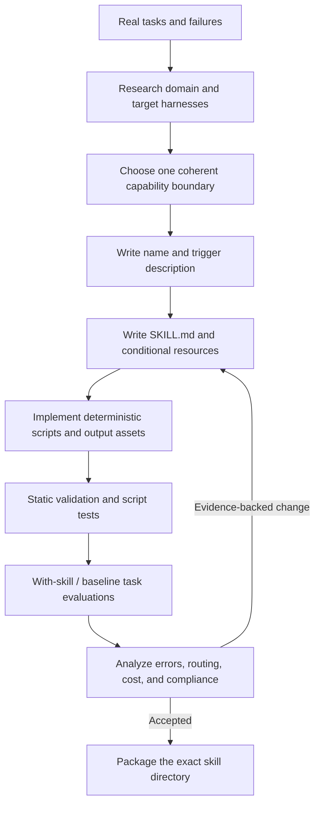

# Create Agent Skills

Build a focused, discoverable, self-contained skill that supplies non-obvious
domain knowledge and deterministic resources without replacing user intent,
repository controls, or the base agent's ordinary competence. Treat a skill as
versioned software: research it, implement it, evaluate it against realistic
tasks, and maintain it from observed failures.

## Operating contract

- Start from real tasks, domain evidence, target harnesses, and failure cases.
  Do not generate a generic skill from a topic name alone.
- Keep the skill's capability coherent. Split only when separate tasks have
  distinct triggers, procedures, resources, or ownership; avoid both catchalls
  and microscopic fragments.
- Use progressive disclosure: routing and invariants in `SKILL.md`, detailed
  knowledge in `references/`, deterministic mechanics in `scripts/`, and
  output/example projects in `assets/`.
- Do not create README/LICENSE sidecars, icons, brand metadata, custom schemas,
  routers, or placeholders unless the user or package contract requires them.
- Descriptions control discovery. They must state the actual capability,
  intended contexts, and a boundary that prevents likely false activation.
- Static validation is necessary but cannot establish trigger accuracy, task
  quality, directive compliance, or operational efficiency.

## Model and skill execution contract

- Treat the user goal, scope, approval boundary, and required evidence as
  controlling. This skill narrows how to produce a Agent Skill package; it MUST
  NOT broaden authority or override repository instructions.
- For GPT-5.6 and GPT-6, provide representative tasks, target clients and
  models, activation boundaries, resources, and package consumers, hard
  constraints, available tools, and the finish condition once. Remove repeated
  directions and examples unless a recorded evaluation shows that they prevent a
  real failure.
- Infer routine, reversible steps from inspected evidence. Ask only when an
  unresolved choice changes an external contract. Stop before an external write,
  destructive action, credential use, or material scope expansion that the user
  did not authorize.
- Load a linked reference only when its subject affects the current decision.
  Use scripts for deterministic mechanics; use model judgment for semantic
  decisions. Inspect tool output before relying on it.
- Validate at the boundary of the claim with official validation, script tests,
  activation trials, and paired task evaluations. Report commands, observed
  results, and gaps. A parser, build, or single green test proves only the
  property that it can discriminate.
- Use **MUST** only for an absolute safety or interoperability requirement,
  **SHOULD** for a default with valid exceptions, and **MAY** for an option.
  Write short active sentences and use one stable term for each concept. This
  style is STE-inspired; it is not a claim of formal ASD-STE100 conformance.

## Workflow

## Procedure

1. Collect representative user requests, near-miss requests, target outputs,
   required tools, existing examples, domain sources, and observed agent
   failures. Inspect the current skill and every bundled file before deleting or
   replacing anything.
1. Define the capability boundary in one sentence: action, object/domain,
   inputs, outputs, and exclusions. Choose a concise name that helps retrieval
   without trying to encode the entire procedure.
1. Write a description that matches user intent and likely phrasing. Include
   what the skill does, when to use it, and one or two important exclusions.
   Test the description independently from the body.
1. Design the resource graph. Put always-needed instructions, authority rules,
   route selection, stop conditions, and completion evidence in `SKILL.md`. Link
   each conditional reference at the point it becomes relevant.
1. Write task-specific references that remove model inference: API contracts,
   version rules, decision tables, failure signatures, commands, expected
   output, complete worked examples, and source applicability. Links support
   these instructions; they do not replace them.
1. Bundle scripts only when deterministic execution reduces repeated reasoning
   or error. Validate inputs, emit concise actionable output, avoid hidden
   network or mutation, and test failure behavior. Put templates, fixtures, and
   complete example projects under `assets/`.
1. Configure native metadata only where useful. For Codex `agents/openai.yaml`,
   keep display text, default prompt, dependencies, and invocation policy
   consistent with the skill; include optional visual fields only when
   requested.
1. Run repository-native validators, link/reference checks, script tests, and
   package checks. Then run realistic trigger/no-trigger and task evaluations
   against a baseline or prior version. Inspect artifacts and evidence, not only
   grader scores.
1. Change the smallest rule/resource supported by observed failures. Re-run
   held-out cases and coexistence tests with neighboring skills. Package only
   the authorized subtree and record unexecuted evaluations.

## Choose the agent-integration reference

| Situation | Read or use |
| --- | --- |
| Writing spec-compliant frontmatter and structure | [Specification and metadata](references/specification-and-metadata.md) |
| Writing and testing activation descriptions | [Description evaluation](references/description-evaluation.md) |
| Using scripts, deterministic validation, and clear stdout | [Scripts and validation](references/scripts-and-validation.md) |
| Auditing an existing skill and preserving useful resources | [Audit workflow](references/audit-workflow.md) |
| Configuring Codex 0.154.0 native metadata | [Codex metadata](references/codex-metadata.md) |
| Choosing exact, non-ambiguous task language | [Precise task language](references/precise-task-language.md) |
| Using repository and external validation tools | [Validation tools](references/validation-tools.md) |
| Applying enterprise packaging and governance | [Organizational controls and scale](references/agent-skill-organizational-controls-and-scale.md) |
| Studying complete authoring and evaluation examples | [Worked scenarios](references/agent-skill-worked-scenarios.md) |
| Avoiding under-specified references and false evaluation claims | [Failure patterns and recovery](references/agent-skill-failure-patterns-and-recovery.md) |
| Checking official guidance and large public collections | [Standards, APIs, and authorities](references/agent-skill-standards-apis-and-authorities.md) |
| Comparing public skill collections and enterprise quality patterns | [Industry skill patterns](references/industry-skill-patterns.md) |

## Agent behavior references

Read only the reference whose subject affects the current task.

| Reference | Use when |
| --- | --- |
| [Operational decisions](references/agent-skill-operational-decisions.md) | Use when selecting the next evidence-backed Agent Skill package action. |
| [Concepts, contracts, and invariants](references/agent-skill-concepts-contracts-and-invariants.md) | Use when distinguishing the requested Agent Skill package from observed repository state. |
| [Bundled resource map](references/agent-skill-bundled-resource-map.md) | Use when locating bundled resources for the Agent Skill package. |
| [Verification and claim evidence](references/agent-skill-verification-and-claim-evidence.md) | Select evidence at the boundary of the claim. |

## Behavioral evaluation

Run [the maintained Agent Skills evaluations](evals/evals.json) in clean
target-client contexts. Compare this revision with a no-skill or prior-skill
baseline. Review commands, diffs, and artifacts; do not grade prose alone. The
checked-in cases are test inputs, not claimed results.

## Bundled executable helpers

- No bundled script is mandatory. Use the target repository's established tools.

Run a helper only for the contract it documents. Inspect arguments and output; a
zero exit status proves only the checks implemented by that helper.

## Bundled output material

- `assets/SKILL.template.md`

Copy or adapt assets into the target workspace. Do not edit the installed skill
as a substitute for changing the requested repository.

## Completion evidence

- A coherent skill directory whose folder and frontmatter name match.
- A discriminating description and consistent native interface metadata.
- An entrypoint that routes to sufficient conditional references and resources.
- Tested scripts and complete assets with documented contracts.
- Static validation results plus realistic selection/task evaluation results
  actually executed.
- A file disposition record for revised skills and preserved out-of-scope
  repository state.

## Stop or escalate

- The capability, target users, output, or trigger boundary remains materially
  undefined after inspecting provided context.
- The skill would merely restate general coding advice already handled reliably,
  with no domain knowledge or deterministic resource.
- Required domain authority or version-specific API cannot be verified.
- The requested packaging would discard useful resources, modify out-of-scope
  infrastructure, or conceal failed checks.

Do not claim completion while a required check is failed, unattempted, or
unavailable. State the exact evidence and the remaining boundary instead of
promoting a narrower result into a broader claim.
