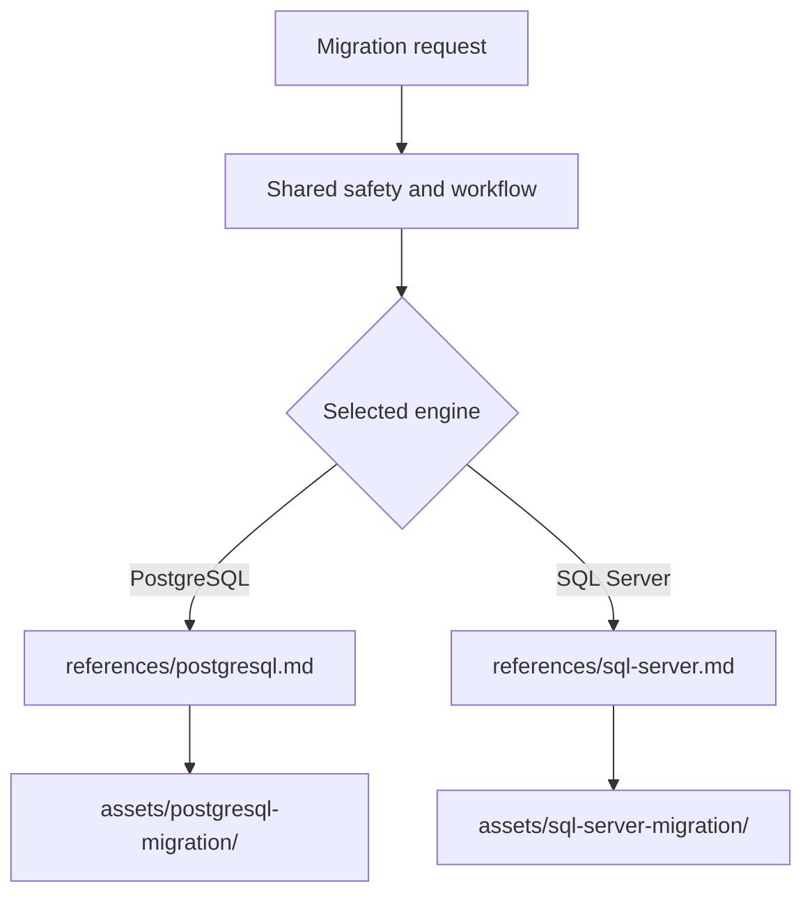

# Worked scenarios for Agent Skill

## Example 1: under-specified API skill

Weak instruction:

> Configure authentication and handle errors according to best practices.

Useful reference content instead includes:

- exact supported SDK versions and how to inspect the installed version;
- identity sources and precedence;
- complete initialization code;
- permission boundary and token audience;
- expected error types and remediation;
- a runnable fixture and the exact command;
- what the fixture does not prove.

The skill still links current official documentation, but the agent does not
have to reconstruct the operating contract from memory.

## Example 2: progressive disclosure



Do not load both engine guides when one is selected. Do not split them into
separate skills if users express one shared migration intent and the entrypoint
can route reliably.

## Example 3: evaluation record

A useful evaluation compares the old and revised skill on the same isolated
repository and request. It records:

```text
prompt, input revision, model, harness, skill version, produced diff/artifacts,
executed commands, objective checks, reviewer notes, duration, tokens, failures
```

A result such as “12 Markdown files passed lint” proves only lint compliance. It
does not prove correct skill selection, domain accuracy, or task completion.
