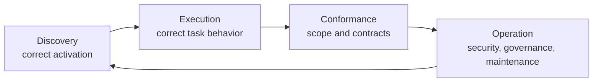

# Industry skill patterns and enterprise implications

This reference summarizes patterns observed in current public Agent Skills and
official authoring guidance. It is comparative evidence, not authority to copy a
vendor's process into another repository.

## Corpus inspected

The comparison covered the Agent Skills specification and authoring guidance,
selected complete skills and repository layouts from OpenAI Codex, Anthropic,
Google Agent Skills and Gemini CLI, GitHub Awesome Copilot, Microsoft's public
skill tooling and examples, Vercel's skill installer examples, and the
Superpowers collection. It also reviewed enterprise-oriented guidance from
Google Cloud and Red Hat and the repository's supplied agent-failure catalogue.

Public repositories differ in goals and quality. A field or workflow appearing
in a major repository is evidence that the pattern is used—not proof that it is
right for this skill.

## Convergent patterns

| Pattern | Why it exists | Application in this collection |
| --- | --- | --- |
| Precise selection metadata | Hosts see the name and description before the body. | Name the action and object; put trigger boundaries and near-miss exclusions in `description`. |
| Progressive disclosure | Full technical guidance competes with task context only after activation. | Keep the binding workflow in `SKILL.md`; route to focused references and complete assets. |
| Domain references | Product APIs, schemas, failure modes, and commands are too detailed for selection metadata. | Bundle enough source-grounded knowledge to avoid reconstruction from model memory. |
| Deterministic helpers | Recreating parsing, comparison, or transformation logic produces inconsistent results. | Put repeated executable mechanics in `scripts/`, test them, and document their evidence boundary. |
| Complete assets | A partial snippet often omits manifests, locks, descriptors, or test fixtures needed to run. | Keep templates and complete example projects in `assets/`, preserving native structure. |
| Realistic evaluations | Structural validation cannot establish routing or task improvement. | Test positive and near-miss routing plus task outcomes, fault discrimination, efficiency, and coexistence. |
| Maintained source links | APIs, CLIs, and agent hosts change. | Record authoritative sources, versions, and freshness rules; do not copy time-sensitive details without version context. |
| Ownership and governance | A skill is operational software-like content, not a permanent one-off prompt. | Define maintainers, review triggers, evaluation cadence, provenance, and deprecation through the repository's existing process. |

## Patterns that must not be cargo-culted

- A vendor-specific metadata field is optional unless the target host and user
  need it. Do not generate icons, colors, license comments, dependencies, or an
  explicit-only policy merely because a sample includes them.
- A large example repository may contain product marketing, platform packaging,
  or source-available license sidecars that are irrelevant to a user-owned skill
  collection.
- A fixed reviewer count, phase model, directory tree, or evaluation schema is
  not universally correct. Preserve the user's process and actual risk.
- A terse public skill may rely on model knowledge, private tools, a narrow code
  base, or hidden evaluation. Do not use its length as evidence that a broad
  enterprise skill needs little technical material.
- A huge reference dump is not better when the entry point cannot route to the
  relevant portion. Volume must be organized around decisions and operating
  modes.

## Enterprise quality model

Treat each skill as a maintained capability with four separable quality axes:

### Discovery

Evaluate realistic target prompts, paraphrases, terse requests, and neighboring
requests that must not activate the skill. Run against every production model
and harness materially used by the organization. Record actual selection, not a
keyword-classifier prediction.

### Execution

Use representative repositories and artifacts. Compare with-skill behavior to a
baseline or prior skill version. Check the user-visible result, changed files,
commands, side effects, and unverified boundaries—not merely output wording.

### Conformance

Test adversarial cases from real failure history: scope expansion, invented
compatibility, stale source use, generated-file edits, weakened tests, hidden
native options, unsupported targets, and false completion. Keep the expected
result independent of the implementation under test.

### Operation

Review every bundled executable and external dependency. Determine whether the
skill can expose secrets, mutate remote systems, execute untrusted content, or
bypass repository controls. Use the organization's existing ownership, release,
provenance, scanning, incident, and retirement mechanisms rather than creating a
parallel governance framework.

## Content sufficiency test

For every advertised operating mode, a fresh capable agent should be able to
answer these questions from the skill and target repository without inventing
missing facts:

1. What exact task and boundary am I handling?
1. Which target version, source of truth, and project configuration control?
1. What procedure and decision branches apply?
1. Which complete example, template, script, or official source should I use?
1. What common false solutions must I reject, and why?
1. What evidence establishes each completion claim?
1. What remains unknown, unavailable, unauthorized, or unexecuted?

If a critical answer is absent, add the missing domain material or narrow the
skill's advertised capability. Do not solve the deficit by asking the model to
"follow best practices."

## Primary sources

- [Agent Skills specification][agent-skills-spec]
- [Agent Skills best practices][agent-skills-practices]
- [Description optimization][description-optimization]
- [Script guidance][script-guidance]
- [OpenAI build-skills documentation][openai-build-skills]
- [OpenAI Codex 0.154.0 skill creator][codex-skill-creator]
- [Anthropic skill creator][anthropic-skill-creator]
- [Claude skill-authoring practices][claude-practices]
- [Gemini CLI skill practices][gemini-practices]
- [Google skills repository][google-skills]
- [Google build/test/scale account][google-scale]
- [GitHub Awesome Copilot skills][awesome-copilot]
- [Microsoft SkillOpt][skillopt]
- [Vercel skill tooling][vercel-skills]
- [Superpowers skills][superpowers]

[agent-skills-spec]: https://agentskills.io/specification
[agent-skills-practices]: https://agentskills.io/skill-creation/best-practices
[description-optimization]: https://agentskills.io/skill-creation/optimizing-descriptions
[script-guidance]: https://agentskills.io/skill-creation/using-scripts
[openai-build-skills]: https://learn.chatgpt.com/docs/build-skills
[codex-skill-creator]: https://github.com/openai/codex/blob/rust-v0.154.0/codex-rs/skills/src/assets/samples/skill-creator/SKILL.md
[anthropic-skill-creator]: https://github.com/anthropics/skills/blob/main/skills/skill-creator/SKILL.md
[claude-practices]: https://platform.claude.com/docs/en/agents-and-tools/agent-skills/best-practices
[gemini-practices]: https://geminicli.com/docs/cli/skills-best-practices/
[google-skills]: https://github.com/google/skills
[google-scale]: https://cloud.google.com/blog/topics/developers-practitioners/behind-the-scenes-how-we-build-test-and-scale-google-agent-skills
[awesome-copilot]: https://github.com/github/awesome-copilot/tree/main/skills
[skillopt]: https://github.com/microsoft/SkillOpt
[vercel-skills]: https://github.com/vercel-labs/skills
[superpowers]: https://github.com/obra/superpowers/tree/main/skills
