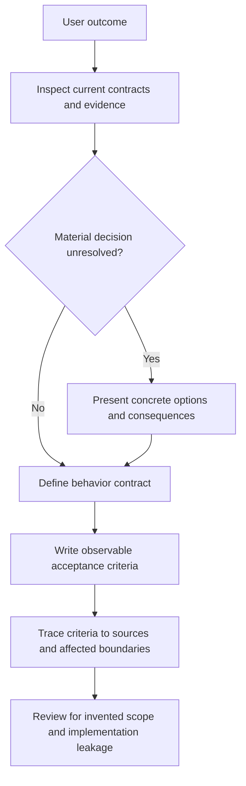

# Define Requirements

Turn an agreed outcome into observable, testable behavior and constraints
without stealing product decisions, choosing implementation, or inventing
thresholds. Requirements define what must hold at interfaces and state
transitions; design and planning decide how to build it.

## Operating contract

- Inspect the request, current behavior, public interfaces, support policy,
  issue/spec context, and relevant user corrections before drafting.
- Separate desired behavior from current state and from a hypothesis about the
  cause of a defect.
- Use domain terms and explicit units. Do not invent timeouts, limits,
  compatibility ranges, actors, approvals, or nonfunctional thresholds.
- State preconditions, inputs, outputs, side effects, errors, state transitions,
  concurrency/cancellation behavior, and observability only where material.
- Acceptance criteria must discriminate the requested behavior; they are not
  implementation prose or a preferred class/file layout.

## Workflow

## Procedure

1. Capture the exact requested outcome and authorized scope. List source
   statements and corrections that control the requirement. Inspect existing
   public behavior and support policies only to identify constraints, not to
   assume the current implementation is intended.
1. Identify actors/systems, trigger, preconditions, input domain, required
   outputs/effects, failure outcomes, and state transitions. Use one consistent
   domain vocabulary and units.
1. Surface material choices the evidence does not decide—for example overwrite
   policy, ordering guarantee, compatibility, retention, authorization, or
   external error mapping. Provide options with consequences rather than
   silently choosing.
1. Write atomic requirements in declarative language. Separate functional
   behavior, data/integrity constraints, security/authorization,
   performance/capacity, operability, compatibility/migration, and out-of-scope
   items only where relevant.
1. Write acceptance criteria as observations at the contract boundary. Include
   representative success, boundary, failure, cancellation/concurrency, and
   rollback/recovery cases when those behaviors are part of the request.
1. Trace each requirement to a user statement, public contract, authoritative
   external interface, or explicit decision. Mark assumptions and unresolved
   decisions; do not disguise them as requirements.
1. Review for implementation leakage, duplicated statements, unverifiable
   adjectives, invented numbers, example-as-requirement, and conflict with prior
   corrections. Deliver in the repository’s existing issue/spec format.

## Read only the material needed

| Situation | Read or use |
| --- | --- |
| Checking behavior, failure, state, and acceptance completeness | [Contract checks](references/contract-checks.md) |
| Choosing how much specification the task needs | [Decision guide](references/decision-guide.md) |
| Using complete requirement examples for APIs, async work, and data changes | [Worked examples](references/worked-examples.md) |
| Checking criterion-to-claim evidence | [Verification and evidence](references/verification-and-evidence.md) |
| Avoiding implementation leakage and invented constraints | [Failure modes](references/failure-modes.md) |
| Applying enterprise authority, traceability, and change control | [Enterprise operation](references/enterprise-operation.md) |
| Using the export/cancellation example | [Export cancellation specification](assets/export-cancellation-spec.md) |
| Checking requirements sources | [Source index](references/source-index.md) |

## Additional specialized references

Read only the reference whose subject affects the current task.

| Reference | Use when |
| --- | --- |
| [Domain model and authority](references/domain-model.md) | Current implementation is evidence of state, not automatically the desired contract. |
| [Bundled resource catalog](references/resource-catalog.md) | Use this catalog to locate the exact skill-local files needed for the task. |

## Evaluation cases

Use [evaluation cases](references/evaluation-cases.md) for realistic activation,
near-miss, and instruction-conformance probes. These are maintained test inputs,
not claimed results.

## Bundled executable helpers

- No bundled script is mandatory. Use the target repository’s established tools.

Run a helper only for the contract it documents. Inspect arguments and output; a
zero exit status proves only the checks implemented by that helper.

## Bundled output material

- `assets/export-cancellation-spec.md`

Copy or adapt assets into the target workspace. Do not edit the installed skill
as a substitute for changing the requested repository.

## Completion evidence

- Scope and authoritative inputs.
- Functional and relevant nonfunctional requirements with consistent
  terminology.
- Explicit unresolved material decisions and assumptions.
- Observable acceptance criteria mapped to each requirement.
- Out-of-scope behavior and preserved existing contracts.
- Traceability to user statements, public contracts, or approved decisions.

## Stop or escalate

- A material product, public-API, compatibility, legal, or policy decision
  remains unresolved.
- The requested behavior depends on a threshold or support range that no
  authoritative source defines.
- The task asks only for implementation of already complete requirements.
- The available evidence cannot distinguish desired behavior from current
  accidental behavior.

Do not claim completion while a required check is failed, unattempted, or
unavailable. State the exact evidence and the remaining boundary instead of
promoting a narrower result into a broader claim.
