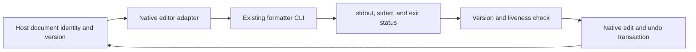

# Worked boundary decision: multi-editor formatter

Illustrative constraints: a formatter already exposes a CLI; editor integrations
need formatting and cancellation, while each editor must retain native settings
and undo behavior. No cross-file semantic analysis is requested.

The host owns document identity, version, selection and edit transaction. The
adapter owns the child process and its cancellation/cleanup. The formatter owns
only its input bytes and output bytes; it cannot decide whether a stale result
may replace a changed editor buffer.

Use the existing CLI contract first. A new language server is not justified by
“several editors” alone. If diagnostics, incremental synchronization or semantic
cross-file queries become actual requirements, evaluate LSP and negotiated
capabilities rather than inventing a formatter-specific transport protocol.

Capture document identity and version before starting. On completion, confirm
that the target is still live and unchanged before publishing an edit. Keep
provider-specific settings in the native host config; expose supported formatter
argv/environment through an explicit, validated native path. Do not silently
ignore a user's option because another editor lacks an equivalent setting.

Cancellation must own the process lifecycle and suppress stale publication.
Killing a client request is not proof that a child process has exited. Do not
apply callbacks to a closed editor or publish two competing results to one
buffer.

Source boundary: existing formatter help/manpage plus the target editor API.
This example's architectural choice is conditional on the stated constraints,
not a universal prohibition on shared processes or language servers.
