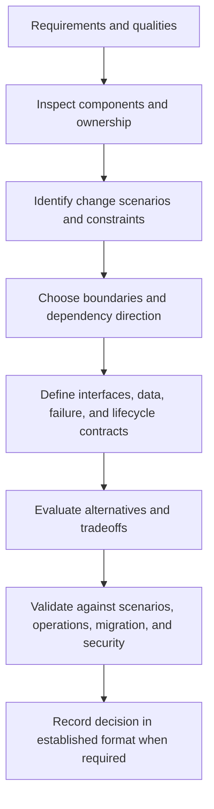

# Design System Architecture

Design or review system structure from actual quality attributes, ownership,
deployment, failure, data, security, and evolution constraints. Preserve
justified existing architecture and propose only the boundaries and mechanisms
needed by the requested outcome.

## Operating contract

- Inspect the existing architecture, source-of-truth relationships, deployment
  topology, data ownership, public contracts, and decision records before
  proposing change.
- Do not default every system to an in-process module, microservice, event bus,
  registry, ports-and-adapters layer, or other familiar pattern. Select
  mechanisms from constraints.
- A design review can recommend edits; it does not authorize implementation,
  deletion, migration, or production rollout.
- Keep one authoritative owner for each state and policy. Derived caches,
  replicas, generated outputs, and projections must declare provenance,
  invalidation, and failure behavior.
- Preserve native provider controls and protocol escape hatches. Unsupported
  settings must fail explicitly rather than disappear in an abstraction.

## Architecture-analysis contract

- Treat the user goal, scope, approval boundary, and required evidence as
  controlling. This skill narrows how to produce a architecture decision; it
  MUST NOT broaden authority or override repository instructions.
- For GPT-5.6 and GPT-6, provide quality attributes, workloads, components,
  dependency direction, data ownership, and deployment topology, hard
  constraints, available tools, and the finish condition once. Remove repeated
  directions and examples unless a recorded evaluation shows that they prevent a
  real failure.
- Infer routine, reversible steps from inspected evidence. Ask only when an
  unresolved choice changes an external contract. Stop before an external write,
  destructive action, credential use, or material scope expansion that the user
  did not authorize.
- Load a linked reference only when its subject affects the current decision.
  Use scripts for deterministic mechanics; use model judgment for semantic
  decisions. Inspect tool output before relying on it.
- Validate at the boundary of the claim with scenario walkthroughs, dependency
  checks, prototypes, and operational evidence. Report commands, observed
  results, and gaps. A parser, build, or single green test proves only the
  property that it can discriminate.
- Use **MUST** only for an absolute safety or interoperability requirement,
  **SHOULD** for a default with valid exceptions, and **MAY** for an option.
  Write short active sentences and use one stable term for each concept. This
  style is STE-inspired; it is not a claim of formal ASD-STE100 conformance.

## Workflow

## Procedure

1. Restate the requested architectural decision and affected quality attributes:
   correctness, availability, latency, throughput, security, privacy,
   operability, deployment, ownership, compatibility, and cost. Use
   measured/current constraints where available.
1. Map the existing system: components, processes, modules, stores, queues,
   external providers, generated artifacts, ownership, deployment units, and
   synchronous/asynchronous edges. Establish which artifacts are authoritative
   and which are derived.
1. Write concrete change and failure scenarios. Include ordinary evolution,
   partial failure, cancellation/timeouts, concurrent updates, rollout/rollback,
   data migration, and unsupported provider behavior where relevant.
1. Generate the smallest set of viable alternatives. Define boundaries by
   cohesive responsibility and authority, not visual similarity. Specify
   dependency direction, state/resource owner, interface, protocol/versioning,
   consistency, idempotency, backpressure, security, and observability.
1. Evaluate alternatives against the scenarios and quality attributes. Quantify
   material tradeoffs when data exists; otherwise state uncertainty. Do not hide
   operational complexity behind a generic interface.
1. Design migration and coexistence only for evidenced consumers and required
   rollout. Include rollback and data reconciliation where the change crosses
   persistent or distributed boundaries.
1. Deliver diagrams, interface/ownership contracts, rejected alternatives,
   tradeoffs, risks, and required verification. Use the repository's ADR/design
   format only when requested or established process requires it.

## Choose the architecture evidence reference

| Situation | Read or use |
| --- | --- |
| Choosing architecture styles and boundaries | [Architecture choices](references/architecture-choices.md) |
| Defining quality attributes and scenarios | [Quality attributes](references/quality-attributes.md) |
| Designing service contracts, compatibility, and failure semantics | [Service contracts](references/service-contracts.md) |
| Assigning state/resource ownership and migrations | [Ownership and migration](references/ownership-and-migration.md) |
| Designing protocols, consistency, synchronization, and retries | [Protocols and synchronization](references/protocols-and-synchronization.md) |
| Designing host/plugin, LSP, DAP, or editor boundaries | [Host boundaries and ports](references/host-boundaries-and-ports.md) |
| Selecting language/package/module layout | [Language layout](references/language-layout.md) |
| Reviewing patterns, pipelines, UI, and governance | [Patterns and pipelines](references/patterns-pipelines.md) |
| Using enterprise-scale decision examples | [Worked architecture examples](references/system-boundaries-worked-scenarios.md) |
| Checking design claims and scenarios | [Verification and claim evidence](references/system-boundaries-verification-and-claim-evidence.md) |
| Avoiding cargo-cult patterns and source-of-truth errors | [Failure patterns and recovery](references/system-boundaries-failure-patterns-and-recovery.md) |
| Checking standards and source applicability | [Standards, APIs, and authorities](references/system-boundaries-standards-apis-and-authorities.md) |

## Architecture decision references

Read only the reference whose subject affects the current task.

| Reference | Use when |
| --- | --- |
| [Operational decisions](references/system-boundaries-operational-decisions.md) | Use when selecting the next evidence-backed architecture decision action. |
| [Concepts, contracts, and invariants](references/system-boundaries-concepts-contracts-and-invariants.md) | Use when distinguishing the requested architecture decision from observed repository state. |
| [Editor-extension boundaries](references/editor-boundaries.md) | Use the host's declarative contribution mechanism first when it fully implements the feature: language configuration, grammar, snippets, theme, key binding, or command contribution. |
| [Enterprise operation and governance](references/system-boundaries-organizational-controls-and-scale.md) | Use when the architecture decision crosses ownership, data-handling, release, or audit boundaries. |
| [Coordinate software architecture decisions and implementation](references/governance-delivery.md) | Map product and platform responsibilities: name the team owning each capability and runtime, API/schema, data, on-call response, and deprecation decision. |
| [Bundled resource map](references/system-boundaries-bundled-resource-map.md) | Use when locating bundled resources for the architecture decision. |
| [Design software user interfaces and state transitions](references/ui-paradigms-principles.md) | A UI pattern is not a system architecture. |

## Behavioral evaluation

Run [the maintained Agent Skills evaluations](evals/evals.json) in clean
target-client contexts. Compare this revision with a no-skill or prior-skill
baseline. Review commands, diffs, and artifacts; do not grade prose alone. The
checked-in cases are test inputs, not claimed results.

## Bundled executable helpers

- No bundled script is mandatory. Use the target repository's established tools.

Run a helper only for the contract it documents. Inspect arguments and output; a
zero exit status proves only the checks implemented by that helper.

## Bundled output material

- `assets/boundary-decision-example.md`

Copy or adapt assets into the target workspace. Do not edit the installed skill
as a substitute for changing the requested repository.

## Completion evidence

- Existing-system map with authoritative and derived state identified.
- Architectural decision and alternatives tied to concrete requirements and
  change/failure scenarios.
- Component/process/data boundaries, dependency direction, and state/resource
  ownership.
- Interface, protocol, compatibility, security, failure, and observability
  contracts.
- Migration, coexistence, rollback, and operational implications where required.
- Evidence needed to validate the design and unresolved user-owned decisions.

## Stop or escalate

- A material product, public contract, data-residency, availability, security,
  or ownership decision remains unresolved.
- The target system or existing architecture has not been inspected enough to
  distinguish a new design from preservation obligations.
- The request is a routine local implementation with no architectural decision.
- The proposed design requires changing provider or organizational controls
  outside authorized scope.

Do not claim completion while a required check is failed, unattempted, or
unavailable. State the exact evidence and the remaining boundary instead of
promoting a narrower result into a broader claim.
