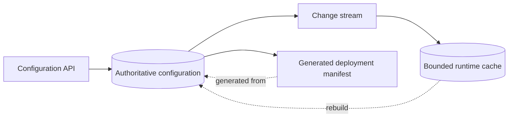

# Worked scenarios for System Boundaries

## Example 1: module versus service

Requirement: isolate a payment provider and support a second provider next year.

A service is not automatically required. Compare:

| Concern | In-process provider module | Separate provider service |
| --- | --- | --- |
| Deployment | same application | independent rollout/rollback |
| Failure | call failure within process | network + remote service failure |
| Secrets | application boundary | dedicated identity possible |
| Scaling | application scale | provider workload scale |
| Ownership | same team | separate operational owner possible |

Choose the service only when independent trust, deployment, scale, or ownership
benefits justify network and operational complexity. In both designs, retain an
explicit provider-native option path rather than flattening every capability.

## Example 2: source-of-truth map

The cache and manifest cannot write configuration back. Define invalidation,
rebuild, and version identity. A manually edited generated manifest is either
rejected or clearly outside the authoritative workflow.

## Example 3: two-sided protocol change

Changing a request field requires client/server schema, version negotiation,
serialization, validation, errors, compatibility policy, fixtures, and rollout
to agree. Updating only the server implementation is not an architectural
migration plan.
