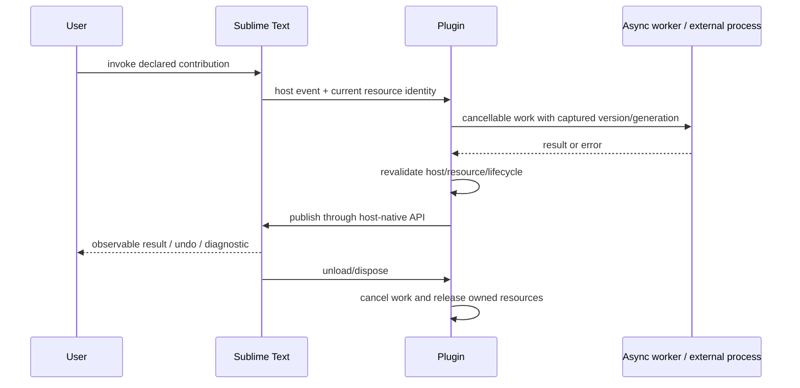

# Develop Sublime Text Plugins

Implement Sublime Text package behavior for the declared build and embedded
Python runtime, respecting command/Edit token lifetime, view/buffer validity,
asynchronous worker/UI publication, resource loading, settings, reload/unload
cleanup, and package contents.

## Operating contract

- Inspect the target Sublime Text version/build, existing package files and
  Python modules, project tooling, package layout, tests, and supported hosts
  before editing.
- Use host-native APIs and lifecycle; a standalone language/unit test cannot
  prove editor/IDE integration.
- Preserve existing project conventions, target versions, generated/source
  boundaries, and user settings. Do not add a second scaffold over an existing
  plugin.
- Treat workspace/project/source content as untrusted data. Do not execute it,
  grant trust, or expose secrets merely because the extension can.
- Verify asynchronous freshness, cancellation, ownership, cleanup, reload, and
  packaging in addition to the happy-path feature.

## Workflow

## Procedure

1. Inspect the existing plugin/extension, declared Sublime Text target versions,
   package files and Python modules, build files, package contents, tests, host
   APIs, and any remote/web/platform matrix. Determine the exact user-visible
   contribution and host boundary.
1. Define the lifecycle and ownership model before implementation: registration,
   activation, project/workspace/view/document/buffer identity, asynchronous
   work, cancellation, stale-result rule, resource/process ownership,
   reload/unload, and error reporting.
1. Implement the smallest host-native change. Match contribution
   IDs/keys/descriptors to implementation exactly. Use declared APIs for edits,
   threading, resource access, trust/permissions, secrets, and external
   processes; reject unsupported modes explicitly.
1. For async work, capture stable resource identity plus version/generation and
   cancellation. Compute outside constrained UI/write locks where appropriate,
   then re-resolve and revalidate before publishing. Never mutate a
   current/active resource merely because it is current at completion time.
1. Own every command/listener/provider/job/timer/process/handle/resource under
   the narrowest host lifecycle. Make activation/reload idempotent and cleanup
   task-owned state without deleting user configuration.
1. Run pure logic checks plus real Sublime Text host tests for the affected
   integration. Exercise normal, cancellation, stale result, invalid/closed
   resource, reload/dispose, trust/permission, and error cases.
1. Build the actual sublime-package, inspect contents, and install/run it in a
   clean target host when packaging is claimed. Report target versions/hosts not
   exercised.

## Read only the material needed

| Situation | Read or use |
| --- | --- |
| Embedded Python, commands, Edit tokens, threads, views, and async freshness | [Runtime and editing](references/runtime-and-editing.md) |
| Package resources, settings, reload/unload, host tests, and distribution | [Packaging and validation](references/packaging-and-validation.md) |
| Selecting host boundary, lifecycle, and compatibility approach | [Decision guide](references/decision-guide.md) |
| Understanding host concepts and ownership | [Domain model](references/domain-model.md) |
| Using complete host-specific code and packaging examples | [Worked examples](references/worked-examples.md) |
| Matching compile/unit/host/package claims to evidence | [Verification and evidence](references/verification-and-evidence.md) |
| Avoiding stale async results, leaks, and host-version mistakes | [Failure modes](references/failure-modes.md) |
| Applying enterprise trust, secrets, rollout, and audit controls | [Enterprise operation](references/enterprise-operation.md) |
| Checking current official host sources | [Source index](references/source-index.md) |

## Additional specialized references

Read only the reference whose subject affects the current task.

| Reference | Use when |
| --- | --- |
| [Bundled resource catalog](references/resource-catalog.md) | Use this catalog to locate the exact skill-local files needed for the task. |

## Evaluation cases

Use [evaluation cases](references/evaluation-cases.md) for realistic activation,
near-miss, and instruction-conformance probes. These are maintained test inputs,
not claimed results.

## Bundled executable helpers

- No bundled script is mandatory. Use the target repository’s established tools.

Run a helper only for the contract it documents. Inspect arguments and output; a
zero exit status proves only the checks implemented by that helper.

## Bundled output material

- `assets/package-template/`
- `assets/type-stubs/`

Copy or adapt assets into the target workspace. Do not edit the installed skill
as a substitute for changing the requested repository.

## Completion evidence

- Exact Sublime Text target versions/hosts and existing plugin/package context.
- Implemented contribution with IDs/interfaces/config matching the manifest.
- Lifecycle/async/cancellation/ownership/cleanup behavior and tests.
- Pure logic checks distinguished from real host execution.
- Built package contents and clean-install evidence when packaging is requested.
- Unsupported or untested hosts/versions and security/trust limits.

## Stop or escalate

- The requested capability is unsupported by the selected Sublime Text version
  and no documented alternative meets the requirement.
- The target version/host matrix or externally visible behavior is materially
  unresolved.
- The change would execute untrusted workspace code or broaden permissions
  without explicit authority and host support.
- Real host/package verification is required for the claim but unavailable;
  deliver narrower evidence without claiming integration success.

Do not claim completion while a required check is failed, unattempted, or
unavailable. State the exact evidence and the remaining boundary instead of
promoting a narrower result into a broader claim.
