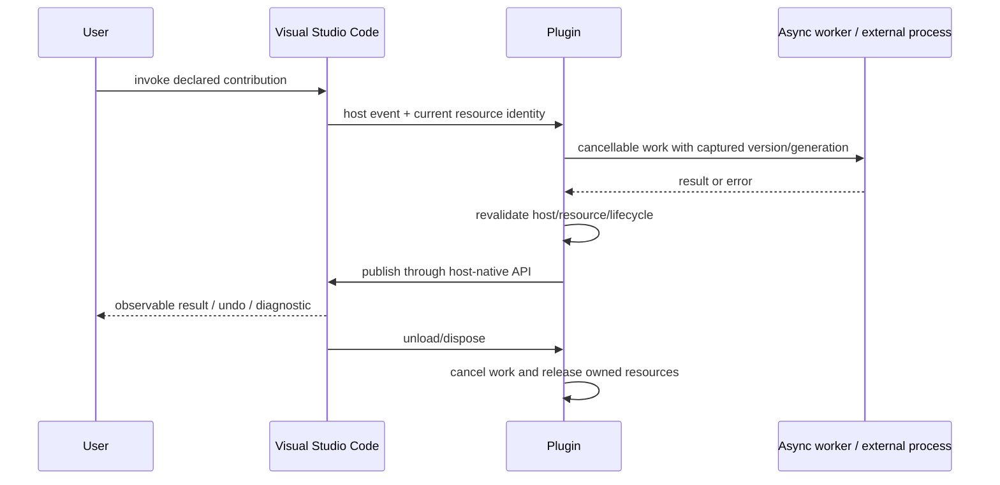

# Develop VS Code Extensions

Implement VS Code extension behavior against the declared desktop, remote, or
web extension hosts, preserving URI semantics, document freshness, Workspace
Trust, cancellation, disposable ownership, packaging, and target-version
compatibility.

## Operating contract

- Inspect the target Visual Studio Code version/build, existing package.json,
  project tooling, package layout, tests, and supported hosts before editing.
- Use host-native APIs and lifecycle; a standalone language/unit test cannot
  prove editor/IDE integration.
- Preserve existing project conventions, target versions, generated/source
  boundaries, and user settings. Do not add a second scaffold over an existing
  plugin.
- Treat workspace/project/source content as untrusted data. Do not execute it,
  grant trust, or expose secrets merely because the extension can.
- Verify asynchronous freshness, cancellation, ownership, cleanup, reload, and
  packaging in addition to the happy-path feature.

## Host-aware execution contract

- Treat the user goal, scope, approval boundary, and required evidence as
  controlling. This skill narrows how to produce a VS Code extension; it MUST
  NOT broaden authority or override repository instructions.
- For GPT-5.6 and GPT-6, provide VS Code version, desktop/web/remote host
  placement, URI schemes, document versions, trust, and VSIX metadata, hard
  constraints, available tools, and the finish condition once. Remove repeated
  directions and examples unless a recorded evaluation shows that they prevent a
  real failure.
- Infer routine, reversible steps from inspected evidence. Ask only when an
  unresolved choice changes an external contract. Stop before an external write,
  destructive action, credential use, or material scope expansion that the user
  did not authorize.
- Load a linked reference only when its subject affects the current decision.
  Use scripts for deterministic mechanics; use model judgment for semantic
  decisions. Inspect tool output before relying on it.
- Validate at the boundary of the claim with extension-host tests, remote/web
  cases, trust tests, and VSIX inspection. Report commands, observed results,
  and gaps. A parser, build, or single green test proves only the property that
  it can discriminate.
- Use **MUST** only for an absolute safety or interoperability requirement,
  **SHOULD** for a default with valid exceptions, and **MAY** for an option.
  Write short active sentences and use one stable term for each concept. This
  style is STE-inspired; it is not a claim of formal ASD-STE100 conformance.

## Workflow

## Procedure

1. Inspect the existing plugin/extension, declared Visual Studio Code target
   versions, package.json, build files, package contents, tests, host APIs, and
   any remote/web/platform matrix. Determine the exact user-visible contribution
   and host boundary.
1. Define the lifecycle and ownership model before implementation: registration,
   activation, project/workspace/view/document/buffer identity, asynchronous
   work, cancellation, stale-result rule, resource/process ownership,
   reload/unload, and error reporting.
1. Implement the smallest host-native change. Match contribution
   IDs/keys/descriptors to implementation exactly. Use declared APIs for edits,
   threading, resource access, trust/permissions, secrets, and external
   processes; reject unsupported modes explicitly.
1. For async work, capture stable resource identity plus version/generation and
   cancellation. Compute outside constrained UI/write locks where appropriate,
   then re-resolve and revalidate before publishing. Never mutate a
   current/active resource merely because it is current at completion time.
1. Own every command/listener/provider/job/timer/process/handle/resource under
   the narrowest host lifecycle. Make activation/reload idempotent and cleanup
   task-owned state without deleting user configuration.
1. Run pure logic checks plus real Visual Studio Code host tests for the
   affected integration. Exercise normal, cancellation, stale result,
   invalid/closed resource, reload/dispose, trust/permission, and error cases.
1. Build the actual VSIX, inspect contents, and install/run it in a clean target
   host when packaging is claimed. Report target versions/hosts not exercised.

## Choose the host-platform reference

| Situation | Read or use |
| --- | --- |
| Document identity, edits, async freshness, and cancellation | [Document lifecycle](references/document-lifecycle.md) |
| Desktop/remote/web hosts, trust, secrets, and packaging | [Hosts, trust, and packaging](references/hosts-trust-and-packaging.md) |
| Selecting host boundary, lifecycle, and compatibility approach | [Extension design decisions](references/vscode-extension-host-extension-design-decisions.md) |
| Understanding host concepts and ownership | [Domain model](references/vscode-extension-host-host-api-and-lifecycle-model.md) |
| Using complete host-specific code and packaging examples | [Extension case studies](references/vscode-extension-host-extension-case-studies.md) |
| Matching compile/unit/host/package claims to evidence | [Host test and package evidence](references/vscode-extension-host-host-test-and-package-evidence.md) |
| Avoiding stale async results, leaks, and host-version mistakes | [Extension failures and recovery](references/vscode-extension-host-extension-failures-and-recovery.md) |
| Applying enterprise trust, secrets, rollout, and audit controls | [Deployment, security, and support](references/vscode-extension-host-deployment-security-and-support.md) |
| Checking current official host sources | [Extension API and toolchain authorities](references/vscode-extension-host-extension-api-and-toolchain-authorities.md) |

## Extension engineering references

Read only the reference whose subject affects the current task.

| Reference | Use when |
| --- | --- |
| [Extension fixture and template map](references/vscode-extension-host-extension-fixture-and-template-map.md) | Use when locating bundled resources for the VS Code extension. |

## Behavioral evaluation

Run [the maintained Agent Skills evaluations](evals/evals.json) in clean
target-client contexts. Compare this revision with a no-skill or prior-skill
baseline. Review commands, diffs, and artifacts; do not grade prose alone. The
checked-in cases are test inputs, not claimed results.

## Bundled executable helpers

- No bundled script is mandatory. Use the target repository's established tools.

Run a helper only for the contract it documents. Inspect arguments and output; a
zero exit status proves only the checks implemented by that helper.

## Bundled output material

- `assets/extension-template/`

Copy or adapt assets into the target workspace. Do not edit the installed skill
as a substitute for changing the requested repository.

## Completion evidence

- Exact Visual Studio Code target versions/hosts and existing plugin/package
  context.
- Implemented contribution with IDs/interfaces/config matching the manifest.
- Lifecycle/async/cancellation/ownership/cleanup behavior and tests.
- Pure logic checks distinguished from real host execution.
- Built package contents and clean-install evidence when packaging is requested.
- Unsupported or untested hosts/versions and security/trust limits.

## Stop or escalate

- The requested capability is unsupported by the selected Visual Studio Code
  version and no documented alternative meets the requirement.
- The target version/host matrix or externally visible behavior is materially
  unresolved.
- The change would execute untrusted workspace code or broaden permissions
  without explicit authority and host support.
- Real host/package verification is required for the claim but unavailable;
  deliver narrower evidence without claiming integration success.

Do not claim completion while a required check is failed, unattempted, or
unavailable. State the exact evidence and the remaining boundary instead of
promoting a narrower result into a broader claim.
