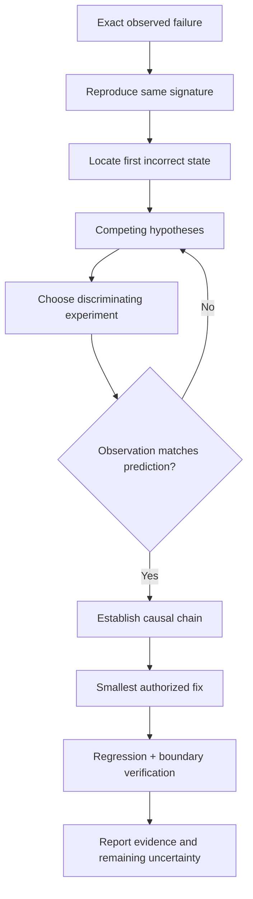

# Diagnose Software Failures

Establish the causal chain from an exact observed symptom to the first incorrect
state and owning subsystem. Use controlled observations to eliminate competing
explanations before changing production behavior.

## Operating contract

- Keep symptom, expected behavior, hypothesis, evidence, and established cause
  distinct. A user explanation is a hypothesis to test.
- Preserve the first useful error, stack, input, revision, environment, and
  state. Wrapper messages and downstream recovery may hide the initiating fault.
- Change one causal factor when possible. Do not accumulate speculative patches,
  retries, broad logging, dependency upgrades, or assertion changes.
- For intermittent failures, record attempts and conditions; one pass is not a
  fix.
- Diagnosis does not authorize mutation, production experiments, destructive
  cleanup, or disclosure of sensitive logs.

## Investigation contract

- Treat the user goal, scope, approval boundary, and required evidence as
  controlling. This skill narrows how to produce a root-cause investigation; it
  MUST NOT broaden authority or override repository instructions.
- For GPT-5.6 and GPT-6, provide failure signature, reproduction conditions,
  state timeline, competing hypotheses, and instrumentation limits, hard
  constraints, available tools, and the finish condition once. Remove repeated
  directions and examples unless a recorded evaluation shows that they prevent a
  real failure.
- Infer routine, reversible steps from inspected evidence. Ask only when an
  unresolved choice changes an external contract. Stop before an external write,
  destructive action, credential use, or material scope expansion that the user
  did not authorize.
- Load a linked reference only when its subject affects the current decision.
  Use scripts for deterministic mechanics; use model judgment for semantic
  decisions. Inspect tool output before relying on it.
- Validate at the boundary of the claim with controlled reproductions,
  discriminating experiments, traces, and first-bad-state evidence. Report
  commands, observed results, and gaps. A parser, build, or single green test
  proves only the property that it can discriminate.
- Use **MUST** only for an absolute safety or interoperability requirement,
  **SHOULD** for a default with valid exceptions, and **MAY** for an option.
  Write short active sentences and use one stable term for each concept. This
  style is STE-inspired; it is not a claim of formal ASD-STE100 conformance.

## Workflow

## Procedure

1. Capture the exact operation, expected and actual result, error/stack, input
   identity, revision/build, configuration, environment, timing/concurrency
   conditions, and recent change context. Establish whether the failure exists
   in the baseline.
1. Reproduce with the narrowest command that preserves the same failure
   signature. Distinguish product failure from test setup, dependency,
   credential, infrastructure, or harness failure.
1. Trace backward from the symptom to the first incorrect state, ownership
   transfer, protocol mismatch, or violated invariant. Inspect source, call
   sites, generated/source relationships, and runtime state at that boundary.
1. Maintain a small hypothesis table. For each hypothesis, state a predicted
   observation that differs from alternatives. Select a debugger, trace,
   sanitizer, reduced input, controlled schedule, binary search, or targeted log
   that can observe it.
1. Run the experiment without changing expected behavior to fit the result.
   Update or discard hypotheses. When repeated actions produce no new
   information, improve the observation or change strategy rather than patching
   forward.
1. Once the cause is established, identify the owning layer and smallest correct
   repair. If implementation is authorized, add a regression check with an
   independent expected result, apply the fix, and run boundary-appropriate
   verification.
1. Report reproducer, first divergence, causal chain, source locations, fix,
   executed checks, and uncertainty. Keep infrastructure gaps and untested
   production conditions explicit.

## Choose the diagnostic evidence reference

| Situation | Read or use |
| --- | --- |
| Designing discriminating experiments and stopping patch accumulation | [Causal investigation](references/causal-investigation.md) |
| Choosing debugger, trace, sanitizer, log, or reduction strategies | [Operational decisions](references/failure-investigation-operational-decisions.md) |
| Using crash, deadlock, race, memory, build, and data-corruption examples | [Worked investigations](references/failure-investigation-worked-scenarios.md) |
| Mapping diagnosis claims to evidence | [Verification and claim evidence](references/failure-investigation-verification-and-claim-evidence.md) |
| Avoiding retries, symptom patches, and harness conflation | [Failure patterns and recovery](references/failure-investigation-failure-patterns-and-recovery.md) |
| Handling enterprise logs, incidents, and production boundaries | [Organizational controls and scale](references/failure-investigation-organizational-controls-and-scale.md) |
| Reviewing a worked parser/default investigation | [Investigation example](assets/investigation-example.md) |
| Checking diagnostic tool sources | [Standards, APIs, and authorities](references/failure-investigation-standards-apis-and-authorities.md) |

## Failure-analysis references

Read only the reference whose subject affects the current task.

| Reference | Use when |
| --- | --- |
| [Concepts, contracts, and invariants](references/failure-investigation-concepts-contracts-and-invariants.md) | Use when distinguishing the requested root-cause investigation from observed repository state. |
| [Bundled resource map](references/failure-investigation-bundled-resource-map.md) | Use when locating bundled resources for the root-cause investigation. |

## Behavioral evaluation

Run [the maintained Agent Skills evaluations](evals/evals.json) in clean
target-client contexts. Compare this revision with a no-skill or prior-skill
baseline. Review commands, diffs, and artifacts; do not grade prose alone. The
checked-in cases are test inputs, not claimed results.

## Bundled executable helpers

- No bundled script is mandatory. Use the target repository's established tools.

Run a helper only for the contract it documents. Inspect arguments and output; a
zero exit status proves only the checks implemented by that helper.

## Bundled output material

- `assets/investigation-example.md`

Copy or adapt assets into the target workspace. Do not edit the installed skill
as a substitute for changing the requested repository.

## Completion evidence

- Exact reproducer and failure signature.
- Baseline comparison and first incorrect state.
- Hypotheses, discriminating experiments, and observed results.
- Causal chain and owning subsystem with source/runtime evidence.
- Authorized fix and regression verification, or diagnosis-only result.
- Uncertainty, unavailable checks, and production applicability limits.

## Stop or escalate

- The failure cannot be reproduced or observed enough to distinguish causes;
  report needed evidence rather than guessing.
- Production access, data, credentials, or experiments exceed authorization.
- A material expected-behavior decision is unresolved.
- The only remaining action is an unbounded retry/patch loop with no new
  evidence.

Do not claim completion while a required check is failed, unattempted, or
unavailable. State the exact evidence and the remaining boundary instead of
promoting a narrower result into a broader claim.
