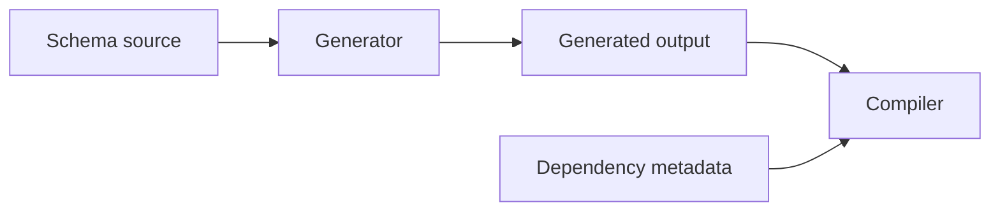

# Worked failure investigations

## Deadlock versus slow dependency

Symptom: request times out after 30 seconds.

1. Capture thread/task stacks at timeout.
1. Record lock ownership and waiters.
1. Correlate outbound request start/completion and connection-pool state.
1. If all workers wait on one lock whose owner waits on the same pool, test that
   cycle; do not merely increase the timeout.

A larger timeout can hide either problem and is not a diagnosis.

## Incremental-build failure

Clean build passes, second build after changing a schema fails.

Compare timestamps/hashes and declared dependencies. Fix the generator input or
build dependency; do not patch generated output or cite the clean build as
proof.

## Data parser regression

Use identical immutable bytes and options on a known-good and failing revision.
Record tokenization and the first output field that diverges. A test that checks
only “parse failed” cannot distinguish the regression from missing fixture data.
