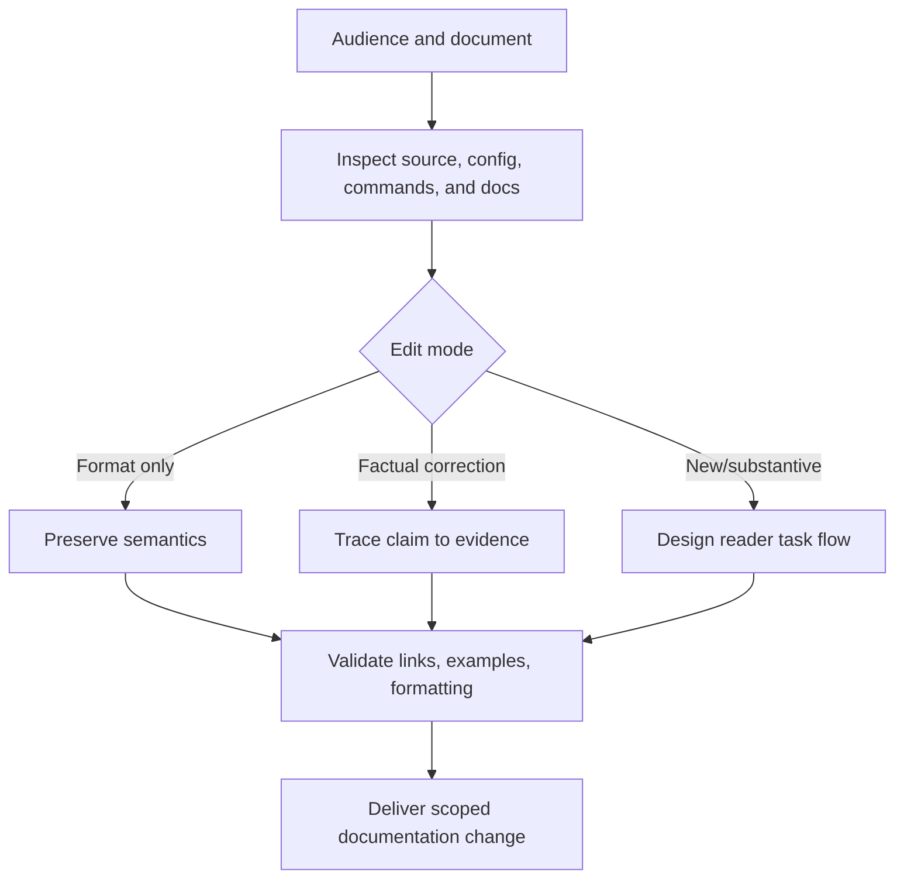

# Document Codebases

Create documentation that lets the intended reader perform the supported task
against the actual repository and product. Derive commands, configuration,
interfaces, examples, and support claims from source and execution rather than
model memory.

## Operating contract

- Identify the requested document, audience, edit mode, supported
  versions/platforms, and source of truth before writing.
- For formatting-only work, preserve meaning, commands, links, headings,
  examples, and scope unless an actual defect must be surfaced.
- Execute or otherwise verify commands and examples in the correct working
  directory and environment when practical. Do not mark placeholders or
  simulated output as executed.
- Do not document unimplemented features, unreleased versions, hidden flags,
  imagined compatibility, or future plans as current behavior.
- Preserve generated/manual boundaries and repository-native documentation
  structure.

## Documentation execution contract

- Treat the user goal, scope, approval boundary, and required evidence as
  controlling. This skill narrows how to produce a codebase documentation; it
  MUST NOT broaden authority or override repository instructions.
- For GPT-5.6 and GPT-6, provide current source, commands, supported workflows,
  audience, generated boundaries, and repository terminology, hard constraints,
  available tools, and the finish condition once. Remove repeated directions and
  examples unless a recorded evaluation shows that they prevent a real failure.
- Infer routine, reversible steps from inspected evidence. Ask only when an
  unresolved choice changes an external contract. Stop before an external write,
  destructive action, credential use, or material scope expansion that the user
  did not authorize.
- Load a linked reference only when its subject affects the current decision.
  Use scripts for deterministic mechanics; use model judgment for semantic
  decisions. Inspect tool output before relying on it.
- Validate at the boundary of the claim with executed examples, link checks,
  rendered review, and source-to-doc comparisons. Report commands, observed
  results, and gaps. A parser, build, or single green test proves only the
  property that it can discriminate.
- Use **MUST** only for an absolute safety or interoperability requirement,
  **SHOULD** for a default with valid exceptions, and **MAY** for an option.
  Write short active sentences and use one stable term for each concept. This
  style is STE-inspired; it is not a claim of formal ASD-STE100 conformance.

## Workflow

## Procedure

1. Classify the request: formatting, factual correction, new guide, API
   reference, tutorial, contribution guide, migration guide, or repository
   overview. Identify audience and required prerequisite knowledge.
1. Inspect existing documentation hierarchy, repository commands, manifests,
   configuration, public interfaces, examples, tests, release state, and
   supported environments. Resolve contradictions by source authority; do not
   silently choose the most polished text.
1. Design the reader path: prerequisite, setup, smallest successful operation,
   common variants, errors/troubleshooting, cleanup, and next references. Keep
   one canonical command path per supported concern unless alternatives are
   materially different.
1. Write complete examples with file paths, working directories, inputs,
   expected observations, and adaptation limits. Use Mermaid for workflows,
   state, dependencies, or interactions where a diagram improves understanding.
   Use code blocks for literal code, directory trees, and command output.
1. Verify commands/examples and inspect produced artifacts where possible. Check
   links and anchors, terminology, version claims, security-sensitive guidance,
   and whether examples expose secrets or unsafe defaults.
1. Apply repository lint/format/build checks. Review the diff for unsupported
   claims, accidental semantic edits, duplicate docs, and stale references.
   Report unexecuted platform/credential-dependent steps.

## Choose the documentation authority

| Situation | Read or use |
| --- | --- |
| Writing repository overview and contribution guides | [Repository guides](references/readme-and-contributing.md) |
| Using GitHub-flavored Markdown and Mermaid | [GitHub Markdown](references/github-markdown.md) |
| Choosing document structure and validation | [Structure and validation](references/structure-and-validation.md) |
| Selecting documentation type and source authority | [Operational decisions](references/codebase-documentation-operational-decisions.md) |
| Writing complete command/API/config examples | [Worked scenarios](references/codebase-documentation-worked-scenarios.md) |
| Checking claims, links, commands, and rendered behavior | [Verification and claim evidence](references/codebase-documentation-verification-and-claim-evidence.md) |
| Avoiding stale, aspirational, and formatting-driven changes | [Failure patterns and recovery](references/codebase-documentation-failure-patterns-and-recovery.md) |
| Using repository templates when they match | [Repository overview template](assets/repository-overview.template.md) |
| Using contribution structure when requested | [Contribution template](assets/CONTRIBUTING.template.md) |
| Checking source freshness | [Standards, APIs, and authorities](references/codebase-documentation-standards-apis-and-authorities.md) |

## Documentation quality references

Read only the reference whose subject affects the current task.

| Reference | Use when |
| --- | --- |
| [Concepts, contracts, and invariants](references/codebase-documentation-concepts-contracts-and-invariants.md) | Use when distinguishing the requested codebase documentation from observed repository state. |
| [Enterprise operation and governance](references/codebase-documentation-organizational-controls-and-scale.md) | Use when the codebase documentation crosses ownership, data-handling, release, or audit boundaries. |
| [Bundled resource map](references/codebase-documentation-bundled-resource-map.md) | Use when locating bundled resources for the codebase documentation. |

## Behavioral evaluation

Run [the maintained Agent Skills evaluations](evals/evals.json) in clean
target-client contexts. Compare this revision with a no-skill or prior-skill
baseline. Review commands, diffs, and artifacts; do not grade prose alone. The
checked-in cases are test inputs, not claimed results.

## Bundled executable helpers

- No bundled script is mandatory. Use the target repository's established tools.

Run a helper only for the contract it documents. Inspect arguments and output; a
zero exit status proves only the checks implemented by that helper.

## Bundled output material

- `assets/repository-overview.template.md`
- `assets/CONTRIBUTING.template.md`
- `assets/.markdownlint-cli2.jsonc`

Copy or adapt assets into the target workspace. Do not edit the installed skill
as a substitute for changing the requested repository.

## Completion evidence

- Documentation change scoped to the requested surface and audience.
- Source/evidence for each material behavior, command, version, and support
  claim.
- Complete examples with context and expected observations.
- Executed documentation/link/example checks and identified unexecuted steps.
- Preserved out-of-scope documentation and repository configuration.

## Stop or escalate

- The requested document would announce an unimplemented or unreleased behavior.
- A material support/version/security claim cannot be verified.
- The request is formatting-only but would require substantive decisions.
- The repository has conflicting authoritative sources that require owner
  resolution.

Do not claim completion while a required check is failed, unattempted, or
unavailable. State the exact evidence and the remaining boundary instead of
promoting a narrower result into a broader claim.
