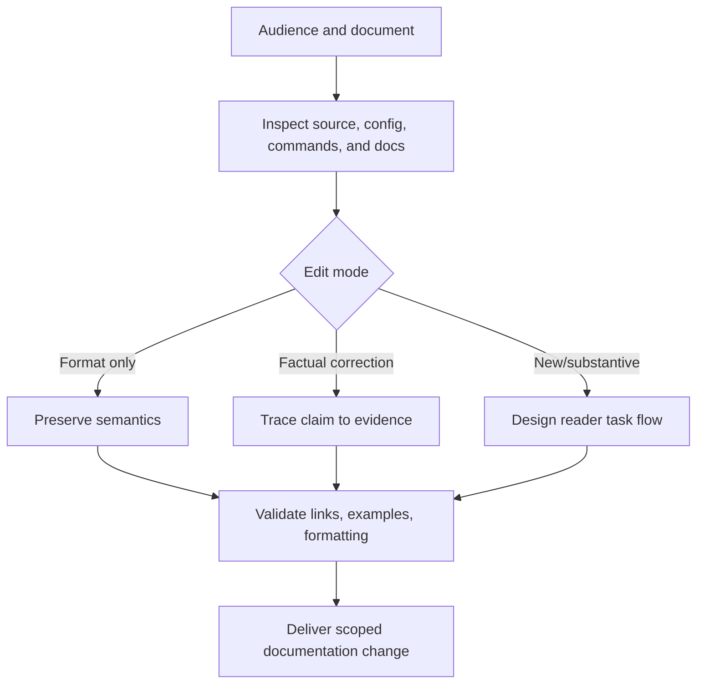

# Document Codebases

Create documentation that lets the intended reader perform the supported task
against the actual repository and product. Derive commands, configuration,
interfaces, examples, and support claims from source and execution rather than
model memory.

## Operating contract

- Identify the requested document, audience, edit mode, supported
  versions/platforms, and source of truth before writing.
- For formatting-only work, preserve meaning, commands, links, headings,
  examples, and scope unless an actual defect must be surfaced.
- Execute or otherwise verify commands and examples in the correct working
  directory and environment when practical. Do not mark placeholders or
  simulated output as executed.
- Do not document unimplemented features, unreleased versions, hidden flags,
  imagined compatibility, or future plans as current behavior.
- Preserve generated/manual boundaries and repository-native documentation
  structure.

## Workflow

## Procedure

1. Classify the request: formatting, factual correction, new guide, API
   reference, tutorial, contribution guide, migration guide, or repository
   overview. Identify audience and required prerequisite knowledge.
1. Inspect existing documentation hierarchy, repository commands, manifests,
   configuration, public interfaces, examples, tests, release state, and
   supported environments. Resolve contradictions by source authority; do not
   silently choose the most polished text.
1. Design the reader path: prerequisite, setup, smallest successful operation,
   common variants, errors/troubleshooting, cleanup, and next references. Keep
   one canonical command path per supported concern unless alternatives are
   materially different.
1. Write complete examples with file paths, working directories, inputs,
   expected observations, and adaptation limits. Use Mermaid for workflows,
   state, dependencies, or interactions where a diagram improves understanding.
   Use code blocks for literal code, directory trees, and command output.
1. Verify commands/examples and inspect produced artifacts where possible. Check
   links and anchors, terminology, version claims, security-sensitive guidance,
   and whether examples expose secrets or unsafe defaults.
1. Apply repository lint/format/build checks. Review the diff for unsupported
   claims, accidental semantic edits, duplicate docs, and stale references.
   Report unexecuted platform/credential-dependent steps.

## Read only the material needed

| Situation | Read or use |
| --- | --- |
| Writing repository overview and contribution guides | [Repository guides](references/readme-and-contributing.md) |
| Using GitHub-flavored Markdown and Mermaid | [GitHub Markdown](references/github-markdown.md) |
| Choosing document structure and validation | [Structure and validation](references/structure-and-validation.md) |
| Selecting documentation type and source authority | [Decision guide](references/decision-guide.md) |
| Writing complete command/API/config examples | [Worked examples](references/worked-examples.md) |
| Checking claims, links, commands, and rendered behavior | [Verification and evidence](references/verification-and-evidence.md) |
| Avoiding stale, aspirational, and formatting-driven changes | [Failure modes](references/failure-modes.md) |
| Using repository templates when they match | [Repository overview template](assets/repository-overview.template.md) |
| Using contribution structure when requested | [Contribution template](assets/CONTRIBUTING.template.md) |
| Checking source freshness | [Source index](references/source-index.md) |

## Additional specialized references

Read only the reference whose subject affects the current task.

| Reference | Use when |
| --- | --- |
| [Domain model and authority](references/domain-model.md) | Current implementation is evidence of state, not automatically the desired contract. |
| [Enterprise operation and governance](references/enterprise-operation.md) | The skill may be used in repositories with protected branches, regulated data, separate owning teams, long support windows, and reproducible-build or audit requirements. |
| [Bundled resource catalog](references/resource-catalog.md) | Use this catalog to locate the exact skill-local files needed for the task. |

## Evaluation cases

Use [evaluation cases](references/evaluation-cases.md) for realistic activation,
near-miss, and instruction-conformance probes. These are maintained test inputs,
not claimed results.

## Bundled executable helpers

- No bundled script is mandatory. Use the target repository’s established tools.

Run a helper only for the contract it documents. Inspect arguments and output; a
zero exit status proves only the checks implemented by that helper.

## Bundled output material

- `assets/repository-overview.template.md`
- `assets/CONTRIBUTING.template.md`
- `assets/.markdownlint-cli2.jsonc`

Copy or adapt assets into the target workspace. Do not edit the installed skill
as a substitute for changing the requested repository.

## Completion evidence

- Documentation change scoped to the requested surface and audience.
- Source/evidence for each material behavior, command, version, and support
  claim.
- Complete examples with context and expected observations.
- Executed documentation/link/example checks and identified unexecuted steps.
- Preserved out-of-scope documentation and repository configuration.

## Stop or escalate

- The requested document would announce an unimplemented or unreleased behavior.
- A material support/version/security claim cannot be verified.
- The request is formatting-only but would require substantive decisions.
- The repository has conflicting authoritative sources that require owner
  resolution.

Do not claim completion while a required check is failed, unattempted, or
unavailable. State the exact evidence and the remaining boundary instead of
promoting a narrower result into a broader claim.
