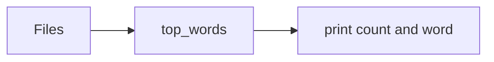

# Markdown and checks

GitHub Flavored Markdown ([GFM spec][gfm], [GitHub writing syntax][gh])
and the checks that catch broken docs. The tools are in `scripts/`.
`assets/verify.sh` runs them on the example project and runs
markdownlint through `bunx` with `assets/.markdownlint-cli2.jsonc`.

## Contents

- Relative links and heading anchors
- Link text and image alt text
- Fenced code with language tags
- Tables, task lists, alerts, and details
- Mermaid diagrams
- Formatting-only edits
- Markdown lint with the repository's config

## Relative links and heading anchors

**Definition.** A relative link resolves from the document's own
directory. GitHub builds a heading's anchor this way:

1. lowercase the text;
1. drop punctuation, keeping hyphens and underscores;
1. turn spaces into hyphens;
1. number repeated headings `-1`, `-2`, and so on.

For example, `Options & flags` becomes `#options--flags`.

**Use when.** Adding, moving, or renaming any linked file or heading.

**Do not use when.** The target is external. Check external links by
hand; a 200 status can still be a login page.

**Example.**

```text
$ python3 scripts/check_links.py README.broken.txt
error: README.broken.txt:35: no heading for #flags in README.broken.txt
error: README.broken.txt:35: missing target docs/CONTRIBUTING.md
```

**Cost removed.** Links that break silently after a rename or move.

**Verify.**

1. `check_links.py docs/ README.md` reports `0 error(s)`.

## Link text and image alt text

**Definition.** Link text names the destination. Images carry alt text
that states what the image shows. A diagram needs a sentence of prose
that says the same thing.

**Use when.** Every link and image.

**Do not use when.** The image is decorative. Empty alt text is correct
there; say so in review.

**Example.** Link text such as "the options" names the target; "here"
does not. The checker warns `vague link text 'here'` and
`image without alt text`.

**Cost removed.** Links that screen-reader users and skimmers cannot
use.

**Verify.**

1. `check_links.py` reports no warnings for changed lines.

## Fenced code with language tags

**Definition.** Commands and source code go in fenced blocks with a
language tag (`sh`, `python`, `text`). To show a nested fence, use a
longer outer fence (four backticks). Identifiers and file names go in
inline code.

**Use when.** Any code, command, or output.

**Do not use when.** Wrapping a long command to fit the line width would
change the command. Use `\` continuations only where the shell accepts
them.

**Example.** The quick-start card in `content.md` shows a README inside
a four-backtick fence, because the README itself contains three-backtick
fences.

**Cost removed.** Commands copied with prose attached, and fences that
end too early.

**Verify.**

1. markdownlint MD040 (fenced code language) and MD046 (fenced style)
   pass with the bundled config.

## Tables, task lists, alerts, and details

**Definition.** GFM tables suit data with the same columns in every
row. Task lists (`- [ ]`) are for pending work only. GitHub alerts
(`> [!NOTE]`, `[!WARNING]`) and `<details>` render on GitHub, but
not in every Markdown viewer.

**Use when.** The content has that shape, and the docs are read on
GitHub.

**Do not use when.**

- Putting multi-step procedures or code in table cells.
- Turning a plain list into checkboxes.
- Using alerts in docs that are published elsewhere.

**Example.**

```markdown
> [!WARNING]
> `--prune` deletes labels that are not in the file.
```

**Cost removed.** Content that renders as raw syntax on the target
site.

**Verify.**

1. Preview the page on the publishing target, or on GitHub for READMEs.
   Report it if you cannot.

## Mermaid diagrams

**Definition.** GitHub renders fenced `mermaid` blocks. GitHub's
Mermaid version determines which syntax works
([GitHub diagrams][diagrams]).

**Use when.** A flow or dependency graph is easier to see than to read.

**Do not use when.**

- A two-item list says the same thing.
- The target site does not render Mermaid.

**Example.**



Unverified: the Mermaid CLI was not installed. Give the diagram a
one-sentence prose summary.

**Cost removed.** Hand-drawn ASCII diagrams that drift and do not wrap.

**Verify.**

1. Preview on GitHub, and confirm the prose summary states the same
   relationship.

## Formatting-only edits

**Definition.** A formatting request changes layout only (wrapping, list
markers, heading style, table alignment), never words, URLs, or code.
`scripts/same_words.py BEFORE AFTER` compares the word
sequences, with Markdown syntax and wrapping ignored, and compares code
blocks line by line.

**Use when.** The user asked for formatting, linting fixes, or a
rewrap.

**Do not use when.** Content changes were also requested. Make them in a
separate commit or diff.

**Example.** `verify.sh` rewraps CONTRIBUTING and gets
`same words and code`. Adding `-v` to its command produces a code
difference, and the script exits 1.

**Cost removed.** Meaning changed under the label "formatting".

**Verify.**

1. `same_words.py old.md new.md` prints `same words and code`.

## Markdown lint with the repository's config

**Definition.** Run the repository's own linter and configuration, such
as `markdownlint-cli2` with its `.markdownlint-cli2.jsonc`. Use the
bundled config only in repositories that have none.

**Use when.** After every docs edit.

**Do not use when.** The repository has its own config. Do not add a
second linter or change its rules to make a file pass.

**Example.**

```sh
bunx markdownlint-cli2 README.md CONTRIBUTING.md
```

**Cost removed.** Style churn in review. Lint proves syntax and style
only, not that the instructions work.

**Verify.**

1. The linter exits 0 for the changed files, and the report names the
   config used.

[gfm]: https://github.github.com/gfm/
[gh]: https://docs.github.com/en/get-started/writing-on-github/getting-started-with-writing-and-formatting-on-github/basic-writing-and-formatting-syntax
[diagrams]: https://docs.github.com/en/get-started/writing-on-github/working-with-advanced-formatting/creating-diagrams
