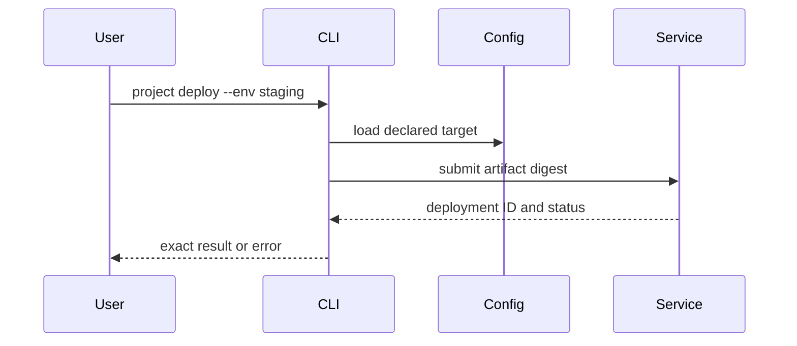

# Worked documentation examples

## Complete CLI example

```text
Repository root: /path/to/project
Prerequisite: tool version from .tool-versions
Command: just validate
Expected: project-defined validators run; exit 0 means those checks passed
Does not prove: production deployment or unavailable platform tests
```

A useful guide names the working directory and interpretation. It does not paste
an invented “Success!” transcript.

## GitHub-supported workflow diagram



The prose must still explain authentication, artifact identity, failure states,
and cleanup. The diagram is navigation, not the whole contract.

## Formatting-only boundary

When asked to normalize Markdown tables, do not replace `npm ci` with `bun
install`, modernize APIs, rename headings, or rewrite supported versions. Those
are substantive changes requiring separate evidence and authority.
