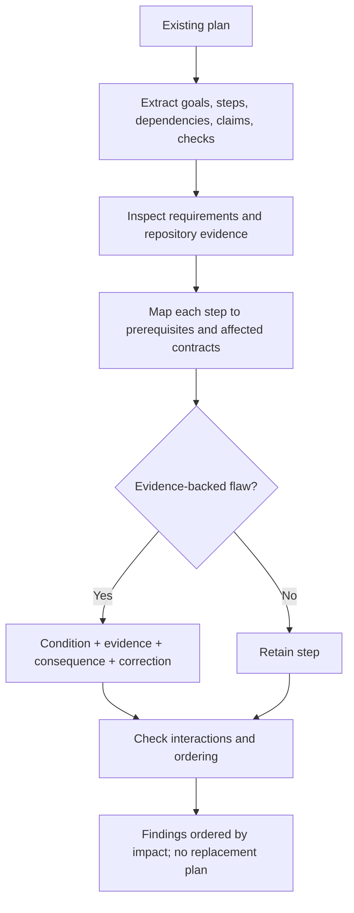

# Find Implementation Plan Flaws

Audit an existing plan against the actual repository, agreed requirements,
dependencies, migration/operational constraints, and verification boundaries.
Report only evidenced flaws and consequences; a clean audit is valid.

## Operating contract

- Review the supplied plan, not an imagined ideal process. Do not execute it or
  silently replace it with your preferred architecture.
- Inspect referenced files, APIs, manifests, commands, ownership, and current
  behavior before judging feasibility.
- Separate contradiction, omission, unsupported assumption, scope violation,
  sequencing defect, and verification gap.
- Do not manufacture findings, reviewer quotas, estimates, compatibility
  obligations, or approval stages.
- Recommendations do not authorize changes. Preserve user-owned product and
  policy decisions.

## Workflow

## Procedure

1. Read the complete plan and identify its stated outcome, scope, assumptions,
   steps, dependencies, migrations, rollout/rollback, and acceptance checks.
   Preserve its terminology.
1. Inspect agreed requirements and every load-bearing repository claim: named
   files, interfaces, schemas, generated sources, commands, dependencies,
   ownership, deployment, and support policy.
1. Build a dependency map. For each step, identify preconditions, outputs
   consumed later, parallelism constraints, state/data transitions, and
   irreversible operations.
1. Test decisions against evidence. Flag contradictions with requirements,
   unsupported architecture or compatibility choices, missing consumers, wrong
   source-of-truth edits, incomplete two-sided protocol changes, and steps
   ordered before prerequisites.
1. Evaluate verification at each changed boundary. Distinguish static, unit,
   integration, migration, packaging, deployment, and production checks. A named
   test suite is sufficient only for what it actually discriminates.
1. Write findings with severity/impact only where the project has a rubric or
   consequence supports it. Each finding contains condition, evidence/location,
   consequence, and a minimally scoped correction.
1. Check interactions among findings and report no finding where evidence
   supports the plan. Do not produce a rewritten plan unless separately
   requested.

## Read only the material needed

| Situation | Read or use |
| --- | --- |
| Studying a complete plan review | [Worked review](references/review-example.md) |
| Choosing finding types and evidence thresholds | [Decision guide](references/decision-guide.md) |
| Reviewing code, migration, rollout, and verification examples | [Worked examples](references/worked-examples.md) |
| Matching plan claims to repository evidence | [Verification and evidence](references/verification-and-evidence.md) |
| Avoiding architecture preference and finding quotas | [Failure modes](references/failure-modes.md) |
| Using a structured finding format | [Plan review template](assets/plan-review-template.md) |
| Checking authoritative planning sources | [Source index](references/source-index.md) |

## Additional specialized references

Read only the reference whose subject affects the current task.

| Reference | Use when |
| --- | --- |
| [Domain model and authority](references/domain-model.md) | Current implementation is evidence of state, not automatically the desired contract. |
| [Enterprise operation and governance](references/enterprise-operation.md) | The skill may be used in repositories with protected branches, regulated data, separate owning teams, long support windows, and reproducible-build or audit requirements. |
| [Bundled resource catalog](references/resource-catalog.md) | Use this catalog to locate the exact skill-local files needed for the task. |

## Evaluation cases

Use [evaluation cases](references/evaluation-cases.md) for realistic activation,
near-miss, and instruction-conformance probes. These are maintained test inputs,
not claimed results.

## Bundled executable helpers

- No bundled script is mandatory. Use the target repository’s established tools.

Run a helper only for the contract it documents. Inspect arguments and output; a
zero exit status proves only the checks implemented by that helper.

## Bundled output material

- `assets/plan-review-template.md`

Copy or adapt assets into the target workspace. Do not edit the installed skill
as a substitute for changing the requested repository.

## Completion evidence

- Plan scope and authoritative requirements/evidence inspected.
- Findings with exact plan/repository locations, condition, consequence, and
  correction.
- Dependency, migration, and verification interactions that affect multiple
  steps.
- Explicit unknowns and unavailable checks.
- A no-findings result when the inspected scope supports it.

## Stop or escalate

- The plan or referenced requirements are incomplete/unavailable enough to
  prevent a scoped review.
- A material product or architecture choice is unresolved rather than
  demonstrably flawed.
- The user requests plan creation or execution instead of review.
- Repository evidence conflicts and the owner must decide authority.

Do not claim completion while a required check is failed, unattempted, or
unavailable. State the exact evidence and the remaining boundary instead of
promoting a narrower result into a broader claim.
