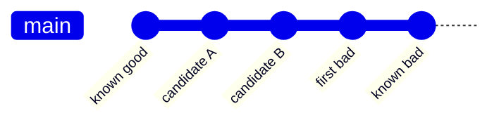

# Find Regression Commits

Identify the commit or bounded ambiguous range that changed a specific behavior
from working to failing, using one reproducible oracle and isolated revision
state. Do not classify setup failures as product defects or automatically revert
the result.

## Operating contract

- Define the exact defect and failure signature before searching history.
- Verify one known-good and one known-bad revision with the same oracle, inputs,
  toolchain policy, and classification rules.
- Use an isolated worktree or clean temporary clone without overwriting the
  user's current index/worktree.
- Classify unbuildable, missing-dependency, or infrastructure-failed revisions
  as skip/abort according to cause—not bad by default.
- A discovered commit is evidence for diagnosis; it does not authorize revert,
  blame, or compatibility work.

## Regression-search contract

- Treat the user goal, scope, approval boundary, and required evidence as
  controlling. This skill narrows how to produce a regression search; it MUST
  NOT broaden authority or override repository instructions.
- For GPT-5.6 and GPT-6, provide verified good and bad revisions, defect
  predicate, build prerequisites, and skip conditions, hard constraints,
  available tools, and the finish condition once. Remove repeated directions and
  examples unless a recorded evaluation shows that they prevent a real failure.
- Infer routine, reversible steps from inspected evidence. Ask only when an
  unresolved choice changes an external contract. Stop before an external write,
  destructive action, credential use, or material scope expansion that the user
  did not authorize.
- Load a linked reference only when its subject affects the current decision.
  Use scripts for deterministic mechanics; use model judgment for semantic
  decisions. Inspect tool output before relying on it.
- Validate at the boundary of the claim with repeatable predicates, bisect logs,
  endpoint checks, and culprit confirmation. Report commands, observed results,
  and gaps. A parser, build, or single green test proves only the property that
  it can discriminate.
- Use **MUST** only for an absolute safety or interoperability requirement,
  **SHOULD** for a default with valid exceptions, and **MAY** for an option.
  Write short active sentences and use one stable term for each concept. This
  style is STE-inspired; it is not a claim of formal ASD-STE100 conformance.

## Workflow

## Procedure

1. Capture the failure oracle, expected good/bad outcomes, exit-code mapping,
   timeout policy from project evidence, required environment, and immutable
   input. Make the oracle reject setup failure distinctly.
1. Identify and verify boundary revisions. Use ancestry-aware history; confirm
   the candidate range contains the change and that merges/submodules/generated
   dependencies are understood.
1. Create an isolated worktree or disposable clone. Preserve current user state
   and record the base repository path/revision.
1. Run `git bisect start`, mark verified bad and good boundaries, and classify
   each revision using the same oracle. Build/setup only as required for that
   revision. Use skip for genuinely untestable commits; abort when too many
   skips make the result ambiguous.
1. At the reported first bad commit, inspect the diff and rerun parent/commit
   manually. Confirm the same signature and rule out environmental drift, flaky
   behavior, or an unrelated setup transition.
1. Return the commit, parent/child evidence, oracle, commands, and ambiguity.
   Clean up only the worktree/bisect state created by this task. Do not revert
   or patch unless requested.

## Choose the history-analysis reference

| Situation | Read or use |
| --- | --- |
| Using Git bisect mechanics, skip, first-parent, merges, and cleanup | [Bisect mechanics](references/bisect-mechanics.md) |
| Choosing classifications and handling flaky or unbuildable revisions | [Operational decisions](references/git-regression-search-operational-decisions.md) |
| Using complete bisect scenarios | [Worked scenarios](references/git-regression-search-worked-scenarios.md) |
| Validating commit and range claims | [Verification and claim evidence](references/git-regression-search-verification-and-claim-evidence.md) |
| Avoiding setup-failure and history-shape mistakes | [Failure patterns and recovery](references/git-regression-search-failure-patterns-and-recovery.md) |
| Using the deterministic oracle wrapper | [Bisect oracle helper](scripts/bisect_oracle.py) |
| Checking official Git behavior | [Standards, APIs, and authorities](references/git-regression-search-standards-apis-and-authorities.md) |

## Bisect and history references

Read only the reference whose subject affects the current task.

| Reference | Use when |
| --- | --- |
| [Concepts, contracts, and invariants](references/git-regression-search-concepts-contracts-and-invariants.md) | Use when distinguishing the requested regression search from observed repository state. |
| [Enterprise operation and governance](references/git-regression-search-organizational-controls-and-scale.md) | Use when the regression search crosses ownership, data-handling, release, or audit boundaries. |
| [Bundled resource map](references/git-regression-search-bundled-resource-map.md) | Use when locating bundled resources for the regression search. |

## Behavioral evaluation

Run [the maintained Agent Skills evaluations](evals/evals.json) in clean
target-client contexts. Compare this revision with a no-skill or prior-skill
baseline. Review commands, diffs, and artifacts; do not grade prose alone. The
checked-in cases are test inputs, not claimed results.

## Bundled executable helpers

- `scripts/bisect_oracle.py --help`
- `scripts/test_bisect_oracle.py`
- `scripts/test_bisect_integration.py`

Run a helper only for the contract it documents. Inspect arguments and output; a
zero exit status proves only the checks implemented by that helper.

## Bundled output material

- No output template is mandatory. Preserve the repository's established format.

Copy or adapt assets into the target workspace. Do not edit the installed skill
as a substitute for changing the requested repository.

## Completion evidence

- Defect-specific oracle and classification map.
- Verified good/bad boundary revisions and range.
- First bad commit or explicitly ambiguous range.
- Parent/commit rerun and diff evidence.
- Skipped/unavailable revisions and environment limitations.
- Cleaned task-owned bisect/worktree state.

## Stop or escalate

- No stable defect-specific oracle can distinguish good, bad, and setup failure.
- Verified good/bad boundaries are not in a usable ancestry range.
- Skipped or flaky revisions prevent a unique conclusion.
- The search would require destructive changes to the user's active state.

Do not claim completion while a required check is failed, unattempted, or
unavailable. State the exact evidence and the remaining boundary instead of
promoting a narrower result into a broader claim.
