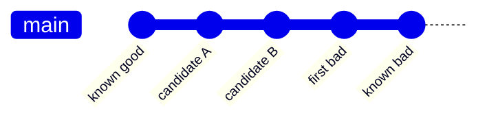

# Find Regression Commits

Identify the commit or bounded ambiguous range that changed a specific behavior
from working to failing, using one reproducible oracle and isolated revision
state. Do not classify setup failures as product defects or automatically revert
the result.

## Operating contract

- Define the exact defect and failure signature before searching history.
- Verify one known-good and one known-bad revision with the same oracle, inputs,
  toolchain policy, and classification rules.
- Use an isolated worktree or clean temporary clone without overwriting the
  user’s current index/worktree.
- Classify unbuildable, missing-dependency, or infrastructure-failed revisions
  as skip/abort according to cause—not bad by default.
- A discovered commit is evidence for diagnosis; it does not authorize revert,
  blame, or compatibility work.

## Workflow

## Procedure

1. Capture the failure oracle, expected good/bad outcomes, exit-code mapping,
   timeout policy from project evidence, required environment, and immutable
   input. Make the oracle reject setup failure distinctly.
1. Identify and verify boundary revisions. Use ancestry-aware history; confirm
   the candidate range contains the change and that merges/submodules/generated
   dependencies are understood.
1. Create an isolated worktree or disposable clone. Preserve current user state
   and record the base repository path/revision.
1. Run `git bisect start`, mark verified bad and good boundaries, and classify
   each revision using the same oracle. Build/setup only as required for that
   revision. Use skip for genuinely untestable commits; abort when too many
   skips make the result ambiguous.
1. At the reported first bad commit, inspect the diff and rerun parent/commit
   manually. Confirm the same signature and rule out environmental drift, flaky
   behavior, or an unrelated setup transition.
1. Return the commit, parent/child evidence, oracle, commands, and ambiguity.
   Clean up only the worktree/bisect state created by this task. Do not revert
   or patch unless requested.

## Read only the material needed

| Situation | Read or use |
| --- | --- |
| Using Git bisect mechanics, skip, first-parent, merges, and cleanup | [Bisect mechanics](references/bisect-mechanics.md) |
| Choosing classifications and handling flaky or unbuildable revisions | [Decision guide](references/decision-guide.md) |
| Using complete bisect scenarios | [Worked examples](references/worked-examples.md) |
| Validating commit and range claims | [Verification and evidence](references/verification-and-evidence.md) |
| Avoiding setup-failure and history-shape mistakes | [Failure modes](references/failure-modes.md) |
| Using the deterministic oracle wrapper | [Bisect oracle helper](scripts/bisect_oracle.py) |
| Checking official Git behavior | [Source index](references/source-index.md) |

## Additional specialized references

Read only the reference whose subject affects the current task.

| Reference | Use when |
| --- | --- |
| [Domain model and authority](references/domain-model.md) | Current implementation is evidence of state, not automatically the desired contract. |
| [Enterprise operation and governance](references/enterprise-operation.md) | The skill may be used in repositories with protected branches, regulated data, separate owning teams, long support windows, and reproducible-build or audit requirements. |
| [Bundled resource catalog](references/resource-catalog.md) | Use this catalog to locate the exact skill-local files needed for the task. |

## Evaluation cases

Use [evaluation cases](references/evaluation-cases.md) for realistic activation,
near-miss, and instruction-conformance probes. These are maintained test inputs,
not claimed results.

## Bundled executable helpers

- `scripts/bisect_oracle.py --help`
- `scripts/test_bisect_oracle.py`
- `scripts/test_bisect_integration.py`

Run a helper only for the contract it documents. Inspect arguments and output; a
zero exit status proves only the checks implemented by that helper.

## Bundled output material

- No output template is mandatory. Preserve the repository’s established format.

Copy or adapt assets into the target workspace. Do not edit the installed skill
as a substitute for changing the requested repository.

## Completion evidence

- Defect-specific oracle and classification map.
- Verified good/bad boundary revisions and range.
- First bad commit or explicitly ambiguous range.
- Parent/commit rerun and diff evidence.
- Skipped/unavailable revisions and environment limitations.
- Cleaned task-owned bisect/worktree state.

## Stop or escalate

- No stable defect-specific oracle can distinguish good, bad, and setup failure.
- Verified good/bad boundaries are not in a usable ancestry range.
- Skipped or flaky revisions prevent a unique conclusion.
- The search would require destructive changes to the user’s active state.

Do not claim completion while a required check is failed, unattempted, or
unavailable. State the exact evidence and the remaining boundary instead of
promoting a narrower result into a broader claim.
