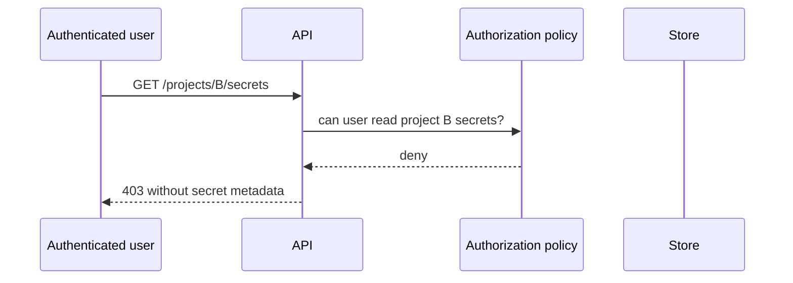

# Worked vulnerability examples

## Path traversal: prove the actual boundary

```python
root = Path(config_root).resolve()
target = (root / user_value).resolve()
if target != root and root not in target.parents:
    raise ForbiddenPath(user_value)
```

The review must also check symlink behavior, race conditions, platform path
semantics, and the later open operation. A test containing `../` is not enough
if the application uses another normalization or file descriptor path.

## Object-level authorization



Login is not authorization. Verify tenant/object/action and deny response, and
ensure caches or downstream services do not bypass the decision.

## Dependency advisory

Record resolved package version and build artifact. Trace whether the affected
module/function is included and reachable in the deployed configuration. Report
“affected version present, exploitability unverified” separately from a proven
reachable vulnerability.
