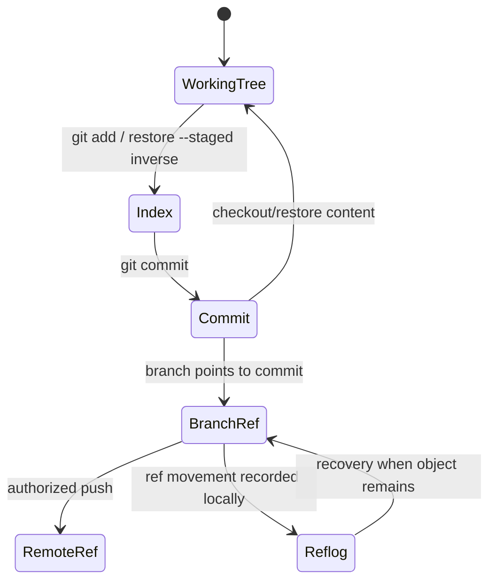

# Manage Git Changes

Perform the requested Git state transition while preserving unrelated files,
staged content, references, history, configuration, and remote state. Inspect
the actual repository state before and after every potentially destructive or
history-changing operation.

## Operating contract

- Git tool availability does not authorize a commit, reset, rebase, force push,
  deletion, or remote write.
- Distinguish HEAD, index, working tree, untracked files, branches/tags,
  worktrees, remotes, and submodules. Never treat “clean” as a universal
  prerequisite.
- Preserve pre-existing staged and unstaged changes, including mixed changes to
  the same file. Use path- and patch-scoped operations.
- Prefer reversible operations and create recovery evidence before destructive
  history changes.
- Remote operations, force updates, tags, and published-history rewrites require
  explicit authority and branch/ruleset awareness.

## Workflow

## Procedure

1. Inspect repository root, status with porcelain details, current branch/HEAD,
   index versus worktree diff, untracked/ignored files as relevant, worktrees,
   in-progress operations, remotes, upstream, and applicable hooks/rules.
1. Translate the request into an exact state transition and mutation boundary.
   Identify unrelated state to preserve and whether the action changes local
   content, index, references, history, or remote state.
1. For staging/commit, select exact paths/hunks and inspect the staged snapshot
   (`git diff --cached`). Do not stage generated, secret, lockfile, or unrelated
   changes merely because they are present.
1. For merge/rebase/cherry-pick/revert, establish bases and intended history
   semantics. Preserve a recovery reference or record current refs where risk
   warrants it. Resolve conflicts from the actual contract, not by choosing
   ours/theirs wholesale.
1. For reset/restore/clean/drop/force operations, confirm explicit necessity and
   authority; use the narrowest reversible alternative. Never delete untracked
   data without identifying it and authorization.
1. Run repository checks required for the requested change and inspect final
   diffs/status/history. Hooks may modify files; re-inspect rather than assuming
   the intended snapshot was committed.
1. For remote operations, verify destination, refspec, lease/current remote
   state, protections, and result. Report exact commits/refs changed and
   preserved unrelated state.

## Read only the material needed

| Situation | Read or use |
| --- | --- |
| Staging, committing, restore/reset, hooks, and snapshots | [Snapshots and refs](references/snapshots-and-refs.md) |
| Merge, rebase, cherry-pick, revert, push, and recovery | [Integration and recovery](references/integration-and-recovery.md) |
| Interpreting local Git feedback safely | [Local feedback](references/local-feedback.md) |
| Choosing the least destructive operation | [Decision guide](references/decision-guide.md) |
| Using complete mixed-index, conflict, worktree, and recovery examples | [Worked examples](references/worked-examples.md) |
| Proving state transitions and preservation | [Verification and evidence](references/verification-and-evidence.md) |
| Avoiding resets, force updates, and retry mistakes | [Failure modes](references/failure-modes.md) |
| Testing staged-snapshot assumptions | [Commit snapshot tests](scripts/test_commit_snapshots.py) |
| Checking official Git semantics | [Source index](references/source-index.md) |

## Additional specialized references

Read only the reference whose subject affects the current task.

| Reference | Use when |
| --- | --- |
| [Domain model and authority](references/domain-model.md) | Current implementation is evidence of state, not automatically the desired contract. |
| [Enterprise operation and governance](references/enterprise-operation.md) | The skill may be used in repositories with protected branches, regulated data, separate owning teams, long support windows, and reproducible-build or audit requirements. |
| [Bundled resource catalog](references/resource-catalog.md) | Use this catalog to locate the exact skill-local files needed for the task. |

## Evaluation cases

Use [evaluation cases](references/evaluation-cases.md) for realistic activation,
near-miss, and instruction-conformance probes. These are maintained test inputs,
not claimed results.

## Bundled executable helpers

- `scripts/test_commit_snapshots.py`

Run a helper only for the contract it documents. Inspect arguments and output; a
zero exit status proves only the checks implemented by that helper.

## Bundled output material

- No output template is mandatory. Preserve the repository’s established format.

Copy or adapt assets into the target workspace. Do not edit the installed skill
as a substitute for changing the requested repository.

## Completion evidence

- Exact authorized Git transition and pre-operation state.
- Changed local/remote refs, commits, index/worktree paths, and conflict
  resolutions.
- Final staged/unstaged/untracked status and relevant history.
- Checks/hooks actually executed and post-hook diff.
- Recovery reference/steps where material.
- Explicit preservation of unrelated state.

## Stop or escalate

- The requested destructive/remote effect is not explicit or conflicts with
  protections.
- An in-progress Git operation or unexpected repository state changes the
  requested transition.
- Unrelated user changes cannot be preserved safely with the proposed command.
- Remote state changed and a force/retry would risk overwriting another actor.

Do not claim completion while a required check is failed, unattempted, or
unavailable. State the exact evidence and the remaining boundary instead of
promoting a narrower result into a broader claim.
