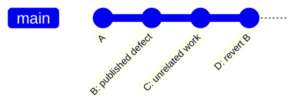

# Worked Git state examples

## Mixed staged and unstaged changes

```sh
git diff -- path/to/file
git diff --cached -- path/to/file
```

If only the assistant’s unstaged hunk must be removed, use a patch-scoped edit
or restore from a captured pre-edit version. `git restore path/to/file` would
also discard the user’s unstaged hunk.

## Safe published undo



A revert preserves published history. A reset/force push changes it and needs a
separate explicit decision.

## Worktree isolation

```sh
git worktree add ../project-task <base-ref>
# Record path and owner; work there.
git worktree remove ../project-task
```

Do not remove a worktree containing unintegrated or untracked work merely to
clean up.
