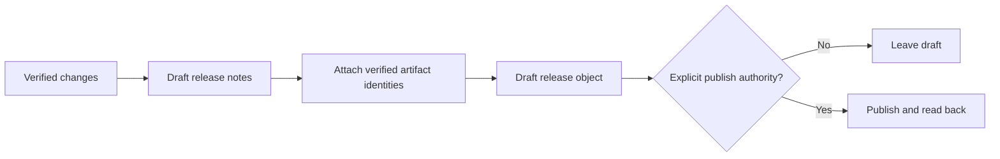

# Worked Git-hosting examples

## Review is not approval

Request: “Review PR 812 and leave findings.”

1. Resolve host/repository/PR and current head SHA.
1. Inspect diff, checks, and repository guidance.
1. Submit a comment/review with findings only if requested.
1. Do not approve, merge, enable auto-merge, or change branch protection.
1. Read back the review object and record its state/head SHA.

## Idempotent comment retry

Before posting after a timeout, list recent comments by the authenticated actor
and compare an operation marker or exact task identity. If the intended comment
exists, verify it rather than posting again.

## Release preparation

