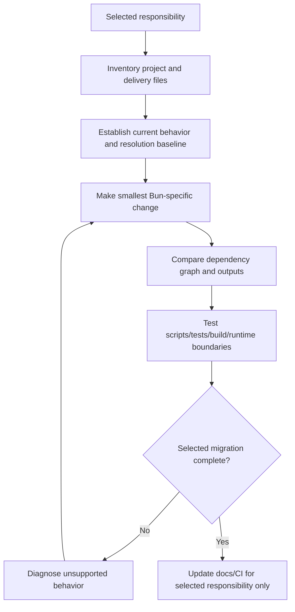

# Migrate JavaScript Tooling to Bun

Migrate only the selected JavaScript/TypeScript tooling responsibilities to Bun
while preserving dependency resolution, registry/authentication, lifecycle
behavior, runtime semantics, test behavior, build outputs, deployment contracts,
and retained Node or other tools.

## Operating contract

- Treat package manager, runtime, test runner, bundler, script shell, and
  deployment image as separate responsibilities. Migrate only those requested.
- Inspect package manifests, all lockfiles, workspaces, registries/scopes,
  lifecycle scripts, native dependencies, patches/overrides, CI, containers,
  deployment, and supported Node/Bun versions.
- Do not regenerate or replace lockfiles blindly. Compare resolved versions,
  integrity/provenance, peer/optional dependencies, and workspace links.
- Use Bun's actual compatibility for the target version. A Node API being listed
  as compatible does not prove the project's package/test/build works unchanged.
- Preserve security, secrets, registry authentication, frozen/reproducible
  install behavior, and production runtime when not selected.

## Toolchain migration contract

- Treat the user goal, scope, approval boundary, and required evidence as
  controlling. This skill narrows how to produce a Bun migration; it MUST NOT
  broaden authority or override repository instructions.
- For GPT-5.6 and GPT-6, provide selected package-manager, runtime, test, build,
  script, registry, lockfile, and deployment responsibilities, hard constraints,
  available tools, and the finish condition once. Remove repeated directions and
  examples unless a recorded evaluation shows that they prevent a real failure.
- Infer routine, reversible steps from inspected evidence. Ask only when an
  unresolved choice changes an external contract. Stop before an external write,
  destructive action, credential use, or material scope expansion that the user
  did not authorize.
- Load a linked reference only when its subject affects the current decision.
  Use scripts for deterministic mechanics; use model judgment for semantic
  decisions. Inspect tool output before relying on it.
- Validate at the boundary of the claim with clean installs, lockfile checks,
  script parity, tests, builds, and target-runtime execution. Report commands,
  observed results, and gaps. A parser, build, or single green test proves only
  the property that it can discriminate.
- Use **MUST** only for an absolute safety or interoperability requirement,
  **SHOULD** for a default with valid exceptions, and **MAY** for an option.
  Write short active sentences and use one stable term for each concept. This
  style is STE-inspired; it is not a claim of formal ASD-STE100 conformance.

## Workflow

## Procedure

1. State exactly which responsibilities move to Bun and which remain on
   Node/npm/yarn/pnpm/another tool. Record supported environments and rollout
   boundary.
1. Inventory manifests, lockfiles, workspaces, package manager fields, engines,
   `.npmrc`/registry/auth settings, install scripts, native addons,
   overrides/patches, CI caches, containers, deployment commands, test configs,
   and build outputs.
1. Run the current workflow in an isolated copy and record dependency
   resolution, scripts executed, tests/build outputs, runtime behavior, and
   relevant timing only if performance is an explicit objective.
1. Install or select the approved Bun version without changing global developer
   state. Perform the smallest migration. Preserve registry scopes/auth and use
   documented frozen/lockfile controls.
1. Compare old and new resolved graphs and workspace links. Investigate changed
   transitive versions, peer handling, optional/platform packages, lifecycle
   scripts, and native builds instead of accepting a green top-level install.
1. Run each selected responsibility and retained boundary: install, scripts,
   tests, type checks, build/bundle, package, application/runtime, and
   CI/deployment as applicable. Verify error codes, coverage/reporters,
   snapshots, watch behavior, and output compatibility.
1. Update only affected commands, docs, CI caches/images, and deployment
   declarations. Remove superseded files only after proving no retained consumer
   uses them. Report known Bun compatibility gaps and rollback.

## Choose the migration evidence reference

| Situation | Read or use |
| --- | --- |
| Selecting package-manager, runtime, test, or bundler scope | [Migration decisions](references/migration-decisions.md) |
| Checking Bun runtime, package manager, Node compatibility, and tests | [Runtime and tooling](references/runtime-and-tooling.md) |
| Choosing graph comparison and rollout checks | [Operational decisions](references/bun-toolchain-migration-operational-decisions.md) |
| Using complete package-manager and test-runner examples | [Worked scenarios](references/bun-toolchain-migration-worked-scenarios.md) |
| Verifying dependency, output, runtime, and CI equivalence | [Verification and claim evidence](references/bun-toolchain-migration-verification-and-claim-evidence.md) |
| Avoiding lockfile churn and accidental runtime replacement | [Failure patterns and recovery](references/bun-toolchain-migration-failure-patterns-and-recovery.md) |
| Checking current Bun documentation | [Standards, APIs, and authorities](references/bun-toolchain-migration-standards-apis-and-authorities.md) |

## Bun migration references

Read only the reference whose subject affects the current task.

| Reference | Use when |
| --- | --- |
| [Concepts, contracts, and invariants](references/bun-toolchain-migration-concepts-contracts-and-invariants.md) | Use when distinguishing the requested Bun migration from observed repository state. |
| [Enterprise operation and governance](references/bun-toolchain-migration-organizational-controls-and-scale.md) | Use when the Bun migration crosses ownership, data-handling, release, or audit boundaries. |

## Behavioral evaluation

Run [the maintained Agent Skills evaluations](evals/evals.json) in clean
target-client contexts. Compare this revision with a no-skill or prior-skill
baseline. Review commands, diffs, and artifacts; do not grade prose alone. The
checked-in cases are test inputs, not claimed results.

## Bundled executable helpers

- No bundled script is mandatory. Use the target repository's established tools.

Run a helper only for the contract it documents. Inspect arguments and output; a
zero exit status proves only the checks implemented by that helper.

## Bundled output material

- No output template is mandatory. Preserve the repository's established format.

Copy or adapt assets into the target workspace. Do not edit the installed skill
as a substitute for changing the requested repository.

## Completion evidence

- Explicit migrated and retained responsibilities.
- Current and candidate tool/runtime versions and configurations.
- Dependency-resolution comparison including workspaces, peers, optional/native
  packages, patches, and registries.
- Executed install/script/test/type/build/runtime/CI checks at affected
  boundaries.
- Scoped command/config/docs changes, rollback path, and known compatibility
  gaps.

## Stop or escalate

- The user has not decided which responsibility to migrate and the choice
  changes production behavior.
- Registry/authentication or dependency resolution cannot be preserved or
  compared safely.
- A required package/API/tool feature is unsupported by the selected Bun
  version.
- The migration would change production runtime, deployment, or dependency
  versions outside scope.

Do not claim completion while a required check is failed, unattempted, or
unavailable. State the exact evidence and the remaining boundary instead of
promoting a narrower result into a broader claim.
