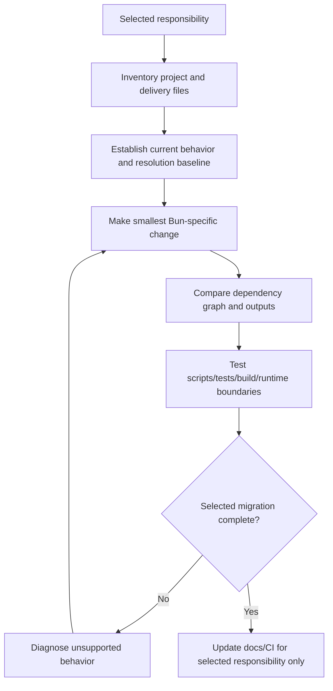

# Migrate JavaScript Tooling to Bun

Migrate only the selected JavaScript/TypeScript tooling responsibilities to Bun
while preserving dependency resolution, registry/authentication, lifecycle
behavior, runtime semantics, test behavior, build outputs, deployment contracts,
and retained Node or other tools.

## Operating contract

- Treat package manager, runtime, test runner, bundler, script shell, and
  deployment image as separate responsibilities. Migrate only those requested.
- Inspect package manifests, all lockfiles, workspaces, registries/scopes,
  lifecycle scripts, native dependencies, patches/overrides, CI, containers,
  deployment, and supported Node/Bun versions.
- Do not regenerate or replace lockfiles blindly. Compare resolved versions,
  integrity/provenance, peer/optional dependencies, and workspace links.
- Use Bun’s actual compatibility for the target version. A Node API being listed
  as compatible does not prove the project’s package/test/build works unchanged.
- Preserve security, secrets, registry authentication, frozen/reproducible
  install behavior, and production runtime when not selected.

## Workflow

## Procedure

1. State exactly which responsibilities move to Bun and which remain on
   Node/npm/yarn/pnpm/another tool. Record supported environments and rollout
   boundary.
1. Inventory manifests, lockfiles, workspaces, package manager fields, engines,
   `.npmrc`/registry/auth settings, install scripts, native addons,
   overrides/patches, CI caches, containers, deployment commands, test configs,
   and build outputs.
1. Run the current workflow in an isolated copy and record dependency
   resolution, scripts executed, tests/build outputs, runtime behavior, and
   relevant timing only if performance is an explicit objective.
1. Install or select the approved Bun version without changing global developer
   state. Perform the smallest migration. Preserve registry scopes/auth and use
   documented frozen/lockfile controls.
1. Compare old and new resolved graphs and workspace links. Investigate changed
   transitive versions, peer handling, optional/platform packages, lifecycle
   scripts, and native builds instead of accepting a green top-level install.
1. Run each selected responsibility and retained boundary: install, scripts,
   tests, type checks, build/bundle, package, application/runtime, and
   CI/deployment as applicable. Verify error codes, coverage/reporters,
   snapshots, watch behavior, and output compatibility.
1. Update only affected commands, docs, CI caches/images, and deployment
   declarations. Remove superseded files only after proving no retained consumer
   uses them. Report known Bun compatibility gaps and rollback.

## Read only the material needed

| Situation | Read or use |
| --- | --- |
| Selecting package-manager, runtime, test, or bundler scope | [Migration decisions](references/migration-decisions.md) |
| Checking Bun runtime, package manager, Node compatibility, and tests | [Runtime and tooling](references/runtime-and-tooling.md) |
| Choosing graph comparison and rollout checks | [Decision guide](references/decision-guide.md) |
| Using complete package-manager and test-runner examples | [Worked examples](references/worked-examples.md) |
| Verifying dependency, output, runtime, and CI equivalence | [Verification and evidence](references/verification-and-evidence.md) |
| Avoiding lockfile churn and accidental runtime replacement | [Failure modes](references/failure-modes.md) |
| Checking current Bun documentation | [Source index](references/source-index.md) |

## Additional specialized references

Read only the reference whose subject affects the current task.

| Reference | Use when |
| --- | --- |
| [Domain model and authority](references/domain-model.md) | Current implementation is evidence of state, not automatically the desired contract. |
| [Enterprise operation and governance](references/enterprise-operation.md) | The skill may be used in repositories with protected branches, regulated data, separate owning teams, long support windows, and reproducible-build or audit requirements. |

## Evaluation cases

Use [evaluation cases](references/evaluation-cases.md) for realistic activation,
near-miss, and instruction-conformance probes. These are maintained test inputs,
not claimed results.

## Bundled executable helpers

- No bundled script is mandatory. Use the target repository’s established tools.

Run a helper only for the contract it documents. Inspect arguments and output; a
zero exit status proves only the checks implemented by that helper.

## Bundled output material

- No output template is mandatory. Preserve the repository’s established format.

Copy or adapt assets into the target workspace. Do not edit the installed skill
as a substitute for changing the requested repository.

## Completion evidence

- Explicit migrated and retained responsibilities.
- Current and candidate tool/runtime versions and configurations.
- Dependency-resolution comparison including workspaces, peers, optional/native
  packages, patches, and registries.
- Executed install/script/test/type/build/runtime/CI checks at affected
  boundaries.
- Scoped command/config/docs changes, rollback path, and known compatibility
  gaps.

## Stop or escalate

- The user has not decided which responsibility to migrate and the choice
  changes production behavior.
- Registry/authentication or dependency resolution cannot be preserved or
  compared safely.
- A required package/API/tool feature is unsupported by the selected Bun
  version.
- The migration would change production runtime, deployment, or dependency
  versions outside scope.

Do not claim completion while a required check is failed, unattempted, or
unavailable. State the exact evidence and the remaining boundary instead of
promoting a narrower result into a broader claim.
