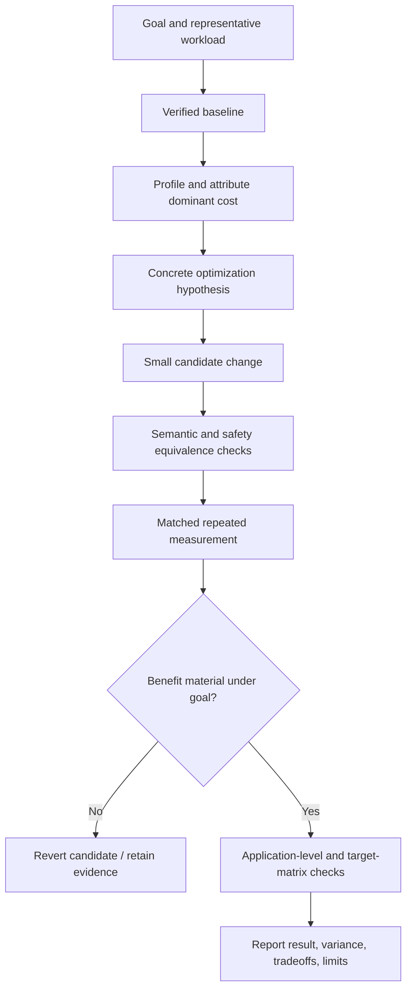

# Optimize JavaScript Code

Improve a measured JavaScript performance objective for the representative
browser or server JavaScript runtime, event loop, JIT, and GC while preserving
all observable behavior, supported targets, resource ownership, errors,
concurrency, and deployment contracts. Correctness and matched workload come
before timing.

## Operating contract

- Require a performance objective, representative workload, metric, and evidence
  that the target area is material. Do not optimize from aesthetics or folklore.
- Record baseline and candidate revision, toolchain/runtime, build/profile
  options, hardware/OS, input, concurrency, setup boundary, and correctness
  contract.
- Use target runtime profiler: Chrome DevTools Performance/Memory, Node.js
  `perf_hooks`, CPU/heap profiles, `--prof`/diagnostics, browser performance
  APIs, and the project benchmark/test harness as appropriate to the actual
  target; do not install or invoke every tool for completeness.
- Change one hypothesis-sized unit and preserve a clean comparison. Reduce
  work/algorithmic cost before syntax-level micro-tuning.
- Run independent semantic checks before and after measurement. A deliberately
  faulty example or changed workload is not a valid fast candidate.
- Use repeated matched measurements and report variability. One run, debug
  build, changed runtime flags, or incomparable environment cannot establish an
  improvement.

## Workflow

## Procedure

1. Define the requested metric—CPU time, wall latency, tail latency, throughput,
   allocation rate, retained memory, startup, build/type-check time, energy, or
   another project metric—and the representative workload/acceptance threshold
   from evidence. If no threshold exists, measure and report rather than invent
   one.
1. Establish baseline behavior and measurements on the actual target
   configuration. Separate setup from measured work, startup from steady state,
   CPU from elapsed time, allocation from retention, average from tail, and cold
   from warm cache/JIT state.
1. Profile using the target-appropriate tools and read the JavaScript guide.
   Attribute the dominant cost to algorithm, data movement/layout,
   allocation/GC/ARC, dispatch/JIT, contention/scheduling, I/O/syscalls,
   serialization, or native/host work.
1. State a causal hypothesis with predicted profile and metric changes.
   Implement the smallest candidate that tests it. Keep
   compiler/runtime/dependency/target settings matched unless the settings
   change is itself the authorized optimization and its deployment consequences
   are evaluated.
1. Run semantic equivalence checks over representative and boundary inputs,
   errors, ordering, cancellation/concurrency, ownership/lifetime, numeric
   behavior, ABI/API/serialization, and supported fallbacks. Use the bundled
   fixtures as examples, not proof for target code.
1. Measure with a target-runtime benchmark with warmup/process isolation as
   needed, stable inputs, observable result, event-loop/GC controls recorded,
   repeated samples and statistics; use Benchmark.js/tinybench/project harness
   only when already appropriate. Reject missing rows, invalid values, ambiguous
   units, unstable setup, incomparable identities, or benchmarks whose result is
   optimized away or whose candidate performs less work.
1. Validate the application-level effect and operational tradeoffs: memory
   versus CPU, throughput versus tail latency, startup versus steady state, code
   size, maintainability, security, portability, target fleet, and rollback.
   Keep the change only when evidence justifies its cost.
1. Report complete benchmark identity, raw/summary results,
   repetitions/variance, semantic checks, profile evidence, tradeoffs, and
   unexecuted targets. Do not generalize beyond the measured
   workload/environment.

## Read only the material needed

| Situation | Read or use |
| --- | --- |
| Reading JavaScript-specific profiling, runtime, and semantic constraints | [JavaScript language guide](references/javascript.md) |
| Understanding the bundled semantic fixtures and non-benchmark contract | [Executable fixture contract](references/executable-fixtures.md) |
| Choosing measurement method, setup boundary, and comparison design | [Profiling and benchmarking](references/profiling-and-benchmarking.md) |
| Selecting optimization techniques after profiling | [Optimization patterns](references/optimization-patterns.md) |
| Reviewing language-specific semantic traps | [Semantic traps](references/semantic-traps.md) |
| Using complete benchmark and optimization examples | [Worked examples](references/worked-examples.md) |
| Matching performance and correctness claims to evidence | [Verification and evidence](references/verification-and-evidence.md) |
| Avoiding benchmark, environment, and equivalence failures | [Failure modes](references/failure-modes.md) |
| Applying enterprise rollout, target, and reproducibility controls | [Enterprise operation](references/enterprise-operation.md) |
| Running the bundled examples | [Example verifier](assets/examples/verify.sh) |
| Using the performance report format | [Performance report template](assets/performance-report.md) |
| Checking current official sources | [Source index](references/source-index.md) |

## Additional specialized references

Read only the reference whose subject affects the current task.

| Reference | Use when |
| --- | --- |
| [Decision guide](references/decision-guide.md) | Use this guide after inspecting the target repository and current request. |
| [Domain model and authority](references/domain-model.md) | Current implementation is evidence of state, not automatically the desired contract. |
| [Bundled resource catalog](references/resource-catalog.md) | Use this catalog to locate the exact skill-local files needed for the task. |

## Evaluation cases

Use [evaluation cases](references/evaluation-cases.md) for realistic activation,
near-miss, and instruction-conformance probes. These are maintained test inputs,
not claimed results.

## Bundled executable helpers

- No bundled script is mandatory. Use the target repository’s established tools.

Run a helper only for the contract it documents. Inspect arguments and output; a
zero exit status proves only the checks implemented by that helper.

## Bundled output material

- `assets/examples/`
- `assets/performance-report.md`

Copy or adapt assets into the target workspace. Do not edit the installed skill
as a substitute for changing the requested repository.

## Completion evidence

- Performance goal, workload, metric, target threshold/source, and
  representative input.
- Baseline/candidate source revisions, toolchain/runtime/build options,
  hardware/OS, dependencies, and benchmark identity.
- Profile evidence and explicit optimization hypothesis.
- Independent semantic/safety checks including relevant faults and supported
  targets.
- Repeated matched measurements with units, variability, raw artifacts, and
  invalid-run handling.
- Application-level effect, tradeoffs, rollback, and unmeasured boundaries.

## Stop or escalate

- No representative workload, performance objective, or evidence that the area
  is material can be established.
- Correctness/equivalence cannot be demonstrated for the candidate.
- Baseline and candidate environments/jobs/inputs cannot be matched or
  normalized.
- The candidate requires unsupported target features, unsafe behavior, public
  contract change, or dependency/toolchain upgrade outside scope.
- Observed variance or benchmark invalidity is too large for the claimed
  conclusion.

Do not claim completion while a required check is failed, unattempted, or
unavailable. State the exact evidence and the remaining boundary instead of
promoting a narrower result into a broader claim.
