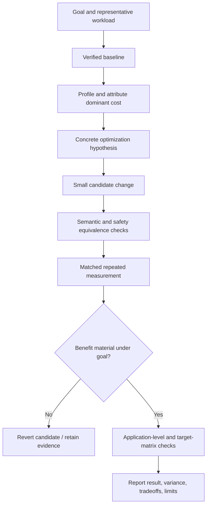

# Optimize Rust Code

Improve a measured Rust performance objective for the representative Rust
crate/binary, target features, ownership, async, and unsafe boundaries while
preserving all observable behavior, supported targets, resource ownership,
errors, concurrency, and deployment contracts. Correctness and matched workload
come before timing.

## Operating contract

- Require a performance objective, representative workload, metric, and evidence
  that the target area is material. Do not optimize from aesthetics or folklore.
- Record baseline and candidate revision, toolchain/runtime, build/profile
  options, hardware/OS, input, concurrency, setup boundary, and correctness
  contract.
- Use target profiler such as perf/Instruments/ETW, cargo profiling/flamegraph
  tools approved by project, Criterion or native benchmarks, compiler
  reports/disassembly, Miri/sanitizers where supported, allocator/heap tools,
  and project tests as appropriate to the actual target; do not install or
  invoke every tool for completeness.
- Change one hypothesis-sized unit and preserve a clean comparison. Reduce
  work/algorithmic cost before syntax-level micro-tuning.
- Run independent semantic checks before and after measurement. A deliberately
  faulty example or changed workload is not a valid fast candidate.
- Use repeated matched measurements and report variability. One run, debug
  build, changed runtime flags, or incomparable environment cannot establish an
  improvement.

## Measured optimization contract

- Treat the user goal, scope, approval boundary, and required evidence as
  controlling. This skill narrows how to produce a Rust optimization; it MUST
  NOT broaden authority or override repository instructions.
- For GPT-5.6 and GPT-6, provide Rust toolchain, target, Cargo profile,
  features, allocator, workload, ownership, synchronization, and unsafe
  boundary, hard constraints, available tools, and the finish condition once.
  Remove repeated directions and examples unless a recorded evaluation shows
  that they prevent a real failure.
- Infer routine, reversible steps from inspected evidence. Ask only when an
  unresolved choice changes an external contract. Stop before an external write,
  destructive action, credential use, or material scope expansion that the user
  did not authorize.
- Load a linked reference only when its subject affects the current decision.
  Use scripts for deterministic mechanics; use model judgment for semantic
  decisions. Inspect tool output before relying on it.
- Validate at the boundary of the claim with Criterion or cargo benchmarks, perf
  profiles, Miri/sanitizers where applicable, and semantic tests. Report
  commands, observed results, and gaps. A parser, build, or single green test
  proves only the property that it can discriminate.
- Use **MUST** only for an absolute safety or interoperability requirement,
  **SHOULD** for a default with valid exceptions, and **MAY** for an option.
  Write short active sentences and use one stable term for each concept. This
  style is STE-inspired; it is not a claim of formal ASD-STE100 conformance.

## Workflow

## Procedure

1. Define the requested metric—CPU time, wall latency, tail latency, throughput,
   allocation rate, retained memory, startup, build/type-check time, energy, or
   another project metric—and the representative workload/acceptance threshold
   from evidence. If no threshold exists, measure and report rather than invent
   one.
1. Establish baseline behavior and measurements on the actual target
   configuration. Separate setup from measured work, startup from steady state,
   CPU from elapsed time, allocation from retention, average from tail, and cold
   from warm cache/JIT state.
1. Profile using the target-appropriate tools and read the Rust guide. Attribute
   the dominant cost to algorithm, data movement/layout, allocation/GC/ARC,
   dispatch/JIT, contention/scheduling, I/O/syscalls, serialization, or
   native/host work.
1. State a causal hypothesis with predicted profile and metric changes.
   Implement the smallest candidate that tests it. Keep
   compiler/runtime/dependency/target settings matched unless the settings
   change is itself the authorized optimization and its deployment consequences
   are evaluated.
1. Run semantic equivalence checks over representative and boundary inputs,
   errors, ordering, cancellation/concurrency, ownership/lifetime, numeric
   behavior, ABI/API/serialization, and supported fallbacks. Use the bundled
   fixtures as examples, not proof for target code.
1. Measure with Criterion or existing benchmark target with release profile,
   target features, allocator, inputs, black-box/observable result, repeated
   statistics and independent semantic tests. Reject missing rows, invalid
   values, ambiguous units, unstable setup, incomparable identities, or
   benchmarks whose result is optimized away or whose candidate performs less
   work.
1. Validate the application-level effect and operational tradeoffs: memory
   versus CPU, throughput versus tail latency, startup versus steady state, code
   size, maintainability, security, portability, target fleet, and rollback.
   Keep the change only when evidence justifies its cost.
1. Report complete benchmark identity, raw/summary results,
   repetitions/variance, semantic checks, profile evidence, tradeoffs, and
   unexecuted targets. Do not generalize beyond the measured
   workload/environment.

## Choose the language-performance reference

| Situation | Read or use |
| --- | --- |
| Reading Rust-specific profiling, runtime, and semantic constraints | [Rust language guide](references/rust.md) |
| Understanding the bundled semantic fixtures and non-benchmark contract | [Executable fixture contract](references/rust-native-performance-executable-performance-fixtures.md) |
| Choosing measurement method, setup boundary, and comparison design | [Profiling and benchmark protocol](references/rust-native-performance-profiling-and-benchmark-protocol.md) |
| Selecting optimization techniques after profiling | [Measured optimization techniques](references/rust-native-performance-measured-optimization-techniques.md) |
| Reviewing language-specific semantic traps | [Performance semantic hazards](references/rust-native-performance-performance-semantic-hazards.md) |
| Using complete benchmark and optimization examples | [Optimization case studies](references/rust-native-performance-optimization-case-studies.md) |
| Matching performance and correctness claims to evidence | [Benchmark, profile, and equivalence evidence](references/rust-native-performance-benchmark-profile-and-equivalence-evidence.md) |
| Avoiding benchmark, environment, and equivalence failures | [Optimization regressions and recovery](references/rust-native-performance-optimization-regressions-and-recovery.md) |
| Applying enterprise rollout, target, and reproducibility controls | [Performance rollout and governance](references/rust-native-performance-performance-rollout-and-governance.md) |
| Running the bundled examples | [Example verifier](assets/examples/verify.sh) |
| Using the performance report format | [Performance report template](assets/performance-report.md) |
| Checking current official sources | [Performance, language, and runtime authorities](references/rust-native-performance-performance-language-and-runtime-authorities.md) |

## Optimization decision references

Read only the reference whose subject affects the current task.

| Reference | Use when |
| --- | --- |
| [Cost model and optimization rules](references/rust-native-performance-cost-model-and-optimization-rules.md) | Use when selecting the next evidence-backed Rust optimization action. |
| [Runtime semantics and invariants](references/rust-native-performance-runtime-semantics-and-invariants.md) | Use when distinguishing the requested Rust optimization from observed repository state. |
| [Performance fixture and tool map](references/rust-native-performance-performance-fixture-and-tool-map.md) | Use when locating bundled resources for the Rust optimization. |

## Behavioral evaluation

Run [the maintained Agent Skills evaluations](evals/evals.json) in clean
target-client contexts. Compare this revision with a no-skill or prior-skill
baseline. Review commands, diffs, and artifacts; do not grade prose alone. The
checked-in cases are test inputs, not claimed results.

## Bundled executable helpers

- No bundled script is mandatory. Use the target repository's established tools.

Run a helper only for the contract it documents. Inspect arguments and output; a
zero exit status proves only the checks implemented by that helper.

## Bundled output material

- `assets/examples/`
- `assets/performance-report.md`

Copy or adapt assets into the target workspace. Do not edit the installed skill
as a substitute for changing the requested repository.

## Completion evidence

- Performance goal, workload, metric, target threshold/source, and
  representative input.
- Baseline/candidate source revisions, toolchain/runtime/build options,
  hardware/OS, dependencies, and benchmark identity.
- Profile evidence and explicit optimization hypothesis.
- Independent semantic/safety checks including relevant faults and supported
  targets.
- Repeated matched measurements with units, variability, raw artifacts, and
  invalid-run handling.
- Application-level effect, tradeoffs, rollback, and unmeasured boundaries.

## Stop or escalate

- No representative workload, performance objective, or evidence that the area
  is material can be established.
- Correctness/equivalence cannot be demonstrated for the candidate.
- Baseline and candidate environments/jobs/inputs cannot be matched or
  normalized.
- The candidate requires unsupported target features, unsafe behavior, public
  contract change, or dependency/toolchain upgrade outside scope.
- Observed variance or benchmark invalidity is too large for the claimed
  conclusion.

Do not claim completion while a required check is failed, unattempted, or
unavailable. State the exact evidence and the remaining boundary instead of
promoting a narrower result into a broader claim.
