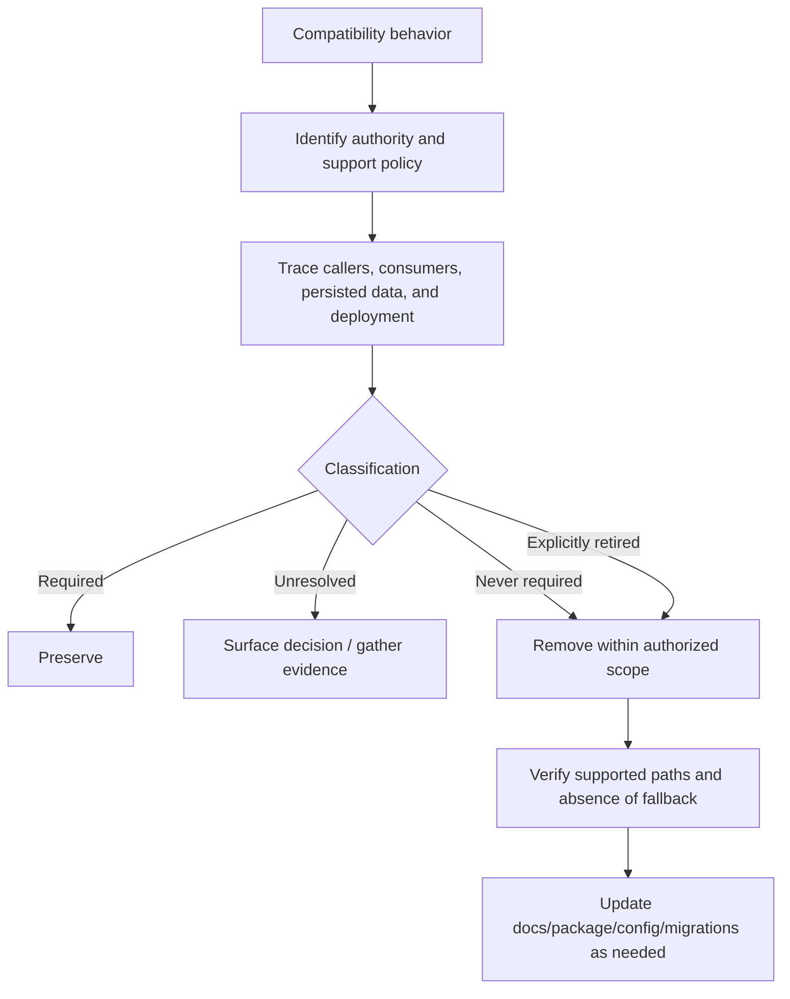

# Remove Unneeded Compatibility Code

Remove compatibility behavior only after classifying its authority and
consumers. Distinguish never-required agent-invented support from legitimate
support that has been formally retired, and preserve real public,
persisted-data, deployment, and external-consumer obligations.

## Operating contract

- Do not equate “legacy,” old, unused locally, ugly, failing, or covered by a
  test with unneeded. Establish the support authority.
- Classify each behavior as required, never required, explicitly retired, or
  unresolved. Existing code/tests do not decide the category by themselves.
- Trace internal callers, public consumers, serialized data, configuration,
  CLI/API names, plugin/provider contracts, package exports, docs, migrations,
  and operational tooling.
- Remove the full obsolete path—registration, dispatch, tests, docs, packaging,
  feature flags, telemetry, and migration state—without deleting unique required
  validation, cleanup, or error behavior.
- Do not reintroduce the same behavior under a synonym, catch-all fallback, or
  “temporary” alias.

## Workflow

## Procedure

1. Name the exact alias, shim, fallback, version/platform branch, deprecated
   API, package export, config key, or data compatibility behavior. Record its
   current implementation and claimed purpose.
1. Find authority: current request, declared stable public contract,
   version/deprecation policy, release history, migration decision, supported
   platform/version matrix, and owner decisions. Do not let an agent-added test
   create its own support mandate.
1. Trace consumers using source search, history, generated/source relationships,
   package/export metadata, telemetry where approved, docs, downstream
   repositories where available, persisted/serialized data, deployment config,
   and runtime registration. Treat absent local references as unknown for
   external public surfaces.
1. Classify required, never required, retired, or unresolved. If unresolved and
   externally meaningful, stop for a decision. Do not invent a deprecation
   period or migration for support that never existed.
1. Remove the obsolete path and only its dependent artifacts. Preserve
   validation, errors, cleanup, and shared implementation used by supported
   paths. Remove registrations and packaging that would silently keep the
   behavior alive.
1. Update or remove tests according to the actual contract. Add negative checks
   for removed public aliases only when rejection behavior is part of the
   contract. Ensure supported inputs still work and unknown inputs fail
   explicitly.
1. Run package/API/serialization/migration/integration checks appropriate to the
   surface. Inspect artifact exports and runtime registration. Report
   consumers/evidence, classification, changes, and remaining uncertainty.

## Read only the material needed

| Situation | Read or use |
| --- | --- |
| Tracing authority, consumers, data, and complete removal | [Removal evidence](references/removal-evidence.md) |
| Classifying required, never-required, retired, and unresolved support | [Decision guide](references/decision-guide.md) |
| Using API, CLI, config, data, and platform examples | [Worked examples](references/worked-examples.md) |
| Verifying removal and supported behavior | [Verification and evidence](references/verification-and-evidence.md) |
| Avoiding empty-search, test-as-spec, and alias-reintroduction errors | [Failure modes](references/failure-modes.md) |
| Applying enterprise version/support governance | [Enterprise operation](references/enterprise-operation.md) |
| Checking SemVer/package export sources | [Source index](references/source-index.md) |

## Additional specialized references

Read only the reference whose subject affects the current task.

| Reference | Use when |
| --- | --- |
| [Domain model and authority](references/domain-model.md) | Current implementation is evidence of state, not automatically the desired contract. |

## Evaluation cases

Use [evaluation cases](references/evaluation-cases.md) for realistic activation,
near-miss, and instruction-conformance probes. These are maintained test inputs,
not claimed results.

## Bundled executable helpers

- No bundled script is mandatory. Use the target repository’s established tools.

Run a helper only for the contract it documents. Inspect arguments and output; a
zero exit status proves only the checks implemented by that helper.

## Bundled output material

- No output template is mandatory. Preserve the repository’s established format.

Copy or adapt assets into the target workspace. Do not edit the installed skill
as a substitute for changing the requested repository.

## Completion evidence

- Exact compatibility behavior and all implementation/registration/package
  surfaces.
- Authority and consumer evidence with one of four classifications.
- Scoped removal or explicit preservation/unresolved decision.
- Updated tests/docs/package/config/migration artifacts required by the actual
  contract.
- Executed supported-path and absence/rejection verification.
- Remaining external-consumer or persisted-data uncertainty.

## Stop or escalate

- A declared stable/public or persisted-data consumer may exist and available
  evidence cannot resolve it.
- The support decision belongs to the user/product owner and has not been made.
- Removal would affect another package/repository/system outside authorized
  scope.
- The behavior contains unique required validation, cleanup, or error handling
  not yet relocated safely.

Do not claim completion while a required check is failed, unattempted, or
unavailable. State the exact evidence and the remaining boundary instead of
promoting a narrower result into a broader claim.
