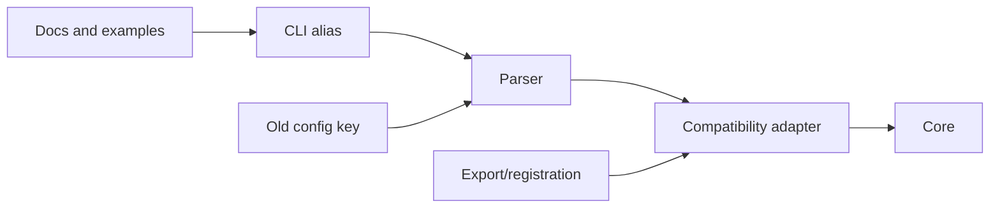

# Worked scenarios for Compatibility Retirement

## Agent-invented fallback

A prior change added:

```python
def read_mode(cfg):
    return cfg.get("mode") or cfg.get("legacy_mode") or "auto"
```

No requirement, release, documentation, persisted data, or consumer ever used
`legacy_mode`; the same agent also wrote a test for it. The test does not create
a product contract. Remove the alias and its test, preserve the required `mode`
validation, and verify unknown keys do not silently change behavior.

## Real public alias still supported

A CLI flag is documented in the current LTS manual and scripts in downstream
repositories use it. A deprecation annotation is not enough to remove it. Follow
the actual retirement policy or preserve it.

## Complete removal surface



Remove every obsolete incoming path and registration while retaining `Core` and
any required validation/error handling.
