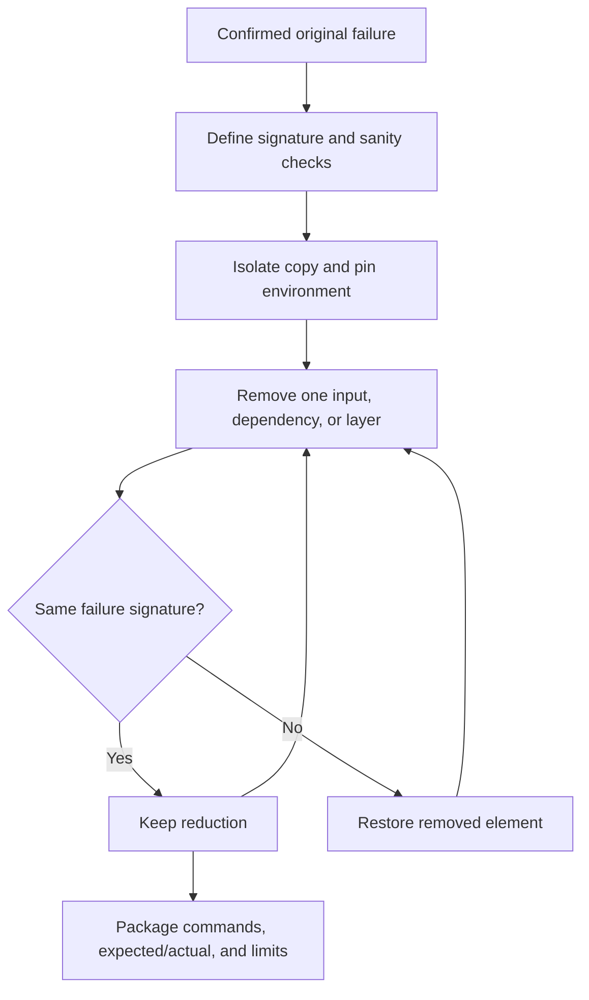

# Reproduce Software Bugs

Create an isolated, independently runnable artifact that demonstrates the same
defect and distinguishes it from setup failures. Reduce only while the failure
signature and relevant boundary remain intact.

## Operating contract

- Define the exact failure signature before removing anything. A generic
  exception, crash, or nonzero exit is not automatically the same bug.
- Start from a confirmed failing case and preserve immutable inputs, versions,
  configuration, platform constraints, and timing/concurrency conditions that
  matter.
- Remove one dependency or dimension at a time and rerun both failure and
  environment sanity checks.
- Do not mock away the failing integration, replace real behavior with an
  explanation, or hard-code a failure unrelated to the product defect.
- Keep credentials, customer data, proprietary code, and large artifacts out of
  the reproducer; synthesize or sanitize without changing the failure.

## Reproduction fidelity contract

- Treat the user goal, scope, approval boundary, and required evidence as
  controlling. This skill narrows how to produce a bug reproducer; it MUST NOT
  broaden authority or override repository instructions.
- For GPT-5.6 and GPT-6, provide original failure signature, environment,
  inputs, timing, dependencies, and independent oracle, hard constraints,
  available tools, and the finish condition once. Remove repeated directions and
  examples unless a recorded evaluation shows that they prevent a real failure.
- Infer routine, reversible steps from inspected evidence. Ask only when an
  unresolved choice changes an external contract. Stop before an external write,
  destructive action, credential use, or material scope expansion that the user
  did not authorize.
- Load a linked reference only when its subject affects the current decision.
  Use scripts for deterministic mechanics; use model judgment for semantic
  decisions. Inspect tool output before relying on it.
- Validate at the boundary of the claim with fresh-environment runs, signature
  comparisons, reduction logs, and stability repetitions. Report commands,
  observed results, and gaps. A parser, build, or single green test proves only
  the property that it can discriminate.
- Use **MUST** only for an absolute safety or interoperability requirement,
  **SHOULD** for a default with valid exceptions, and **MAY** for an option.
  Write short active sentences and use one stable term for each concept. This
  style is STE-inspired; it is not a claim of formal ASD-STE100 conformance.

## Workflow

## Procedure

1. Record the original command, environment, revision, versions, input identity,
   expected behavior, actual failure, and distinguishing signature. Confirm it
   more than once when nondeterministic.
1. Create an isolated copy or minimal project using the same failing boundary.
   Pin required dependencies/toolchain and add a sanity check that distinguishes
   setup failure.
1. Reduce systematically: files/modules, dependencies, input fields/bytes,
   configuration, data volume, timing, platform layers, and steps. Change one
   dimension when possible; after each reduction rerun the failure signature and
   sanity check.
1. Preserve a control or known-good variant when useful. For races, retain a
   controlled schedule/barrier or repeat rule; do not turn timing into a
   sleep-only coincidence.
1. Replace confidential/proprietary data with generated data only after proving
   the same internal condition and signature. Remove credentials and unrelated
   network dependencies.
1. Package the smallest practical complete project under normal native structure
   with exact setup/run/cleanup commands, expected versus actual result,
   versions, and limits. Verify from a fresh directory or environment.
1. Link the reproducer back to the production boundary and state what it does
   not model. Do not replace the repository's regression test; use the
   reproducer to diagnose and derive the proper test.

## Choose the failure-reproduction reference

| Situation | Read or use |
| --- | --- |
| Reducing inputs/dependencies and packaging a complete reproducer | [Reduction and packaging](references/reduction-and-packaging.md) |
| Choosing reduction dimensions and failure signatures | [Operational decisions](references/bug-reproduction-operational-decisions.md) |
| Using complete deterministic, race, build, and integration examples | [Worked scenarios](references/bug-reproduction-worked-scenarios.md) |
| Verifying same defect and fresh-environment execution | [Verification and claim evidence](references/bug-reproduction-verification-and-claim-evidence.md) |
| Avoiding generic errors, mocks, and setup failures | [Failure patterns and recovery](references/bug-reproduction-failure-patterns-and-recovery.md) |
| Applying enterprise data and disclosure controls | [Organizational controls and scale](references/bug-reproduction-organizational-controls-and-scale.md) |
| Checking source guidance | [Standards, APIs, and authorities](references/bug-reproduction-standards-apis-and-authorities.md) |

## Reproducer construction references

Read only the reference whose subject affects the current task.

| Reference | Use when |
| --- | --- |
| [Concepts, contracts, and invariants](references/bug-reproduction-concepts-contracts-and-invariants.md) | Use when distinguishing the requested bug reproducer from observed repository state. |
| [Bundled resource map](references/bug-reproduction-bundled-resource-map.md) | Use when locating bundled resources for the bug reproducer. |

## Behavioral evaluation

Run [the maintained Agent Skills evaluations](evals/evals.json) in clean
target-client contexts. Compare this revision with a no-skill or prior-skill
baseline. Review commands, diffs, and artifacts; do not grade prose alone. The
checked-in cases are test inputs, not claimed results.

## Bundled executable helpers

- No bundled script is mandatory. Use the target repository's established tools.

Run a helper only for the contract it documents. Inspect arguments and output; a
zero exit status proves only the checks implemented by that helper.

## Bundled output material

- No output template is mandatory. Preserve the repository's established format.

Copy or adapt assets into the target workspace. Do not edit the installed skill
as a substitute for changing the requested repository.

## Completion evidence

- Original and reduced commands, versions, inputs, and failure signature.
- Complete isolated project/files needed to run.
- Sanity check that distinguishes setup from target defect.
- Reduction log or rationale for remaining elements.
- Fresh-environment result and nondeterminism rule where applicable.
- Security/privacy sanitization and known differences from production.

## Stop or escalate

- The original defect cannot be confirmed or distinguished from setup failure.
- Reduction would require disclosing sensitive/proprietary data without an
  approved sanitization path.
- The failing boundary is unavailable and a mock would remove the defect.
- The remaining nondeterminism has no reproducible classification rule.

Do not claim completion while a required check is failed, unattempted, or
unavailable. State the exact evidence and the remaining boundary instead of
promoting a narrower result into a broader claim.
