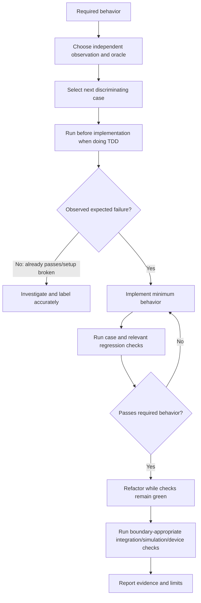

# Test Implementation Behavior

Design tests that observe required behavior at the appropriate boundary, use
expected results independent from the implementation under test, reject relevant
defects, accept conforming alternative implementations, and report exactly which
execution layer produced the evidence.

## Operating contract

- Establish the required behavior and source of authority before writing
  assertions. A user’s causal hypothesis, current output, visible test,
  snapshot, comment, or plan is evidence—not an expected result by itself.
- For test-first work, select one next behavioral case, run it before the
  implementation, observe the intended failure, implement the behavior, rerun,
  and refactor while green. Do not manufacture retrospective red/green evidence.
- Reserve red/green for observed test states. Call instructional examples by
  their actual defect, such as implementation-coupled, tautological, or
  corrected contract test.
- Observe results, errors, state transitions, persistent effects,
  timing/signals, resource/lifecycle effects, or protocol interactions at the
  claimed boundary. Source markers and preferred names are valid only when
  structure itself is the requirement.
- Do not delete assertions, bless unexplained snapshots, copy actual output into
  expected output, loosen tolerances, skip cases, special-case fixtures, or mock
  away the failing boundary to obtain a pass.
- Separate compile/static checks, host execution, simulation/emulation,
  hardware-in-the-loop, and physical-device measurements. Do not promote one
  layer into another.

## Workflow

## Procedure

1. Identify the contract, authority, affected boundary, supported environments,
   and failure to discriminate. Write a behavior list containing success,
   boundary, failure, cancellation/concurrency, persistence, and recovery cases
   only where relevant.
1. Choose the test level and observation closest to the claim without
   unnecessary breadth. Define expected results independently from
   implementation output. Select realistic inputs and a known defect, mutant, or
   alternative implementation that demonstrates discrimination.
1. For TDD, write and execute one next test before implementing its behavior.
   Confirm it fails for the intended missing/incorrect behavior—not a missing
   import, build error, bad fixture, unavailable service, or broken setup. Label
   characterization tests that pass immediately accurately.
1. Implement or adapt the test using the project framework, fixtures, naming,
   isolation, and cleanup. Prefer observable state/results over private call
   order. Use test doubles only to isolate a unit while preserving a realistic
   boundary test for the integration being claimed.
1. Run the test and relevant existing checks. If it fails, determine whether
   implementation, expectation, fixture, environment, or nondeterminism is
   wrong. Do not change the oracle merely because the implementation disagrees.
1. Demonstrate discrimination: the test rejects a relevant faulty variant and
   accepts at least one conforming alternative when feasible. Use
   mutation/property/generative tools where they add evidence, not as a
   percentage target detached from contract risk.
1. For firmware/HDL/hardware, select build-only, simulator/emulator, HIL, or
   physical target deliberately. Record target identity, firmware/bitstream,
   fixture, wiring/instrument setup, calibration, tolerances from authority,
   stimuli, observations, cleanup, and unexecuted layers.
1. Review test coupling, determinism, parallel safety, time control, resource
   cleanup, failure messages, runtime cost, and suite placement. Retire tests
   only when their behavior is removed/covered elsewhere and their unique defect
   discrimination is preserved or no longer required.

## Read only the material needed

| Situation | Read or use |
| --- | --- |
| Using Arrange-Act-Assert and canonical test-first sequencing | [AAA and TDD](references/aaa-and-tdd.md) |
| Choosing unit, integration, system, contract, simulation, or device boundaries | [Boundaries and oracles](references/boundaries-and-oracles.md) |
| Avoiding overspecified and implementation-coupled tests | [Test design and coupling](references/test-design-and-coupling.md) |
| Testing interactions only when interactions are the contract | [Interaction testing](references/interaction-testing.md) |
| Using property, generative, fuzz, and mutation methods | [Generative and mutation testing](references/generative-and-mutation.md) |
| Handling regressions, nondeterminism, clocks, and concurrency | [Regressions and nondeterminism](references/regressions-and-nondeterminism.md) |
| Testing firmware, HDL, simulators, HIL, and physical devices | [Hardware and firmware](references/hardware-and-firmware.md) |
| Retiring or consolidating tests without losing coverage | [Test retirement](references/test-retirement.md) |
| Studying complete behavior-focused examples | [Worked examples](references/worked-examples.md) |
| Running the filesystem rename contract example | [Rename contract test](assets/rename-contract/test_rename_operation.py) |
| Running the HDL counter example when a simulator is available | [HDL example](assets/hdl-counter/verify.sh) |
| Matching claims to actual execution layers | [Verification and evidence](references/verification-and-evidence.md) |
| Avoiding false passes and test-as-spec failures | [Failure modes](references/failure-modes.md) |
| Checking authoritative testing sources | [Source index](references/source-index.md) |

## Additional specialized references

Read only the reference whose subject affects the current task.

| Reference | Use when |
| --- | --- |
| [Decision guide](references/decision-guide.md) | Use this guide after inspecting the target repository and current request. |
| [Domain model and authority](references/domain-model.md) | Current implementation is evidence of state, not automatically the desired contract. |
| [Enterprise operation and governance](references/enterprise-operation.md) | The skill may be used in repositories with protected branches, regulated data, separate owning teams, long support windows, and reproducible-build or audit requirements. |
| [Construct examples that demonstrate the claimed behavior](references/pair-construction.md) | Use a stated contract, actual implementations, independent observations, and runnable commands. |
| [Bundled resource catalog](references/resource-catalog.md) | Use this catalog to locate the exact skill-local files needed for the task. |

## Evaluation cases

Use [evaluation cases](references/evaluation-cases.md) for realistic activation,
near-miss, and instruction-conformance probes. These are maintained test inputs,
not claimed results.

## Bundled executable helpers

- No bundled script is mandatory. Use the target repository’s established tools.

Run a helper only for the contract it documents. Inspect arguments and output; a
zero exit status proves only the checks implemented by that helper.

## Bundled output material

- `assets/oracle-example.py`
- `assets/rename-contract/`
- `assets/hdl-counter/`

Copy or adapt assets into the target workspace. Do not edit the installed skill
as a substitute for changing the requested repository.

## Completion evidence

- Behavior contract and authority for each expected result.
- Test level, boundary, inputs, independent oracle, fixtures, and cleanup.
- Observed pre-implementation failure where TDD is claimed, with setup failures
  distinguished.
- Passing intended and conforming alternative implementations plus rejected
  relevant fault where feasible.
- Executed static/unit/integration/simulation/device checks and exact
  target/environment.
- Nondeterminism, unavailable layers, test cost, and remaining coverage limits.

## Stop or escalate

- Required behavior or tolerance is a user/product/policy decision and cannot be
  established.
- A realistic boundary cannot be exercised and a mock would remove the defect;
  report the limit rather than overclaim.
- Physical testing would require unapproved device access, flashing, wiring,
  credentials, or unsafe conditions.
- The only route to green is weakening or rewriting the contract without
  authority.

Do not claim completion while a required check is failed, unattempted, or
unavailable. State the exact evidence and the remaining boundary instead of
promoting a narrower result into a broader claim.
