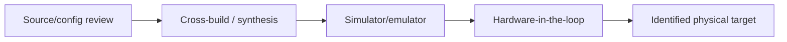
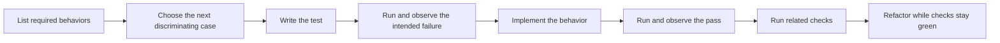

# Worked scenarios for Behavioral Testing

## Independent oracle versus implementation prose

Bad:

```python
def test_uses_fast_parser():
    assert "FastParser" in Path("parser.py").read_text()
```

Unless the class name is a required public artifact, this does not test parsing.
Better:

```python
def test_trailing_empty_field_is_preserved():
    assert parse_csv_line("a,b,") == ["a", "b", ""]
```

The expected fields come from the CSV contract, not from `parse_csv_line`.

## Conforming alternative

The rename example applies the same filesystem oracle to two implementations:
one uses `Path.rename`, another uses an equivalent supported operation. A no-op
implementation fails because source/destination state is wrong. This avoids
freezing a preferred helper call.

## Firmware evidence ladder



Each layer can find defects and is worth reporting. None automatically proves
the next layer. Record target, stimuli, observations, tolerances, and cleanup.

## Canonical test-first chronology



A test that passes immediately may be a characterization or existing behavior;
investigate and label it rather than forcing a synthetic failure.
