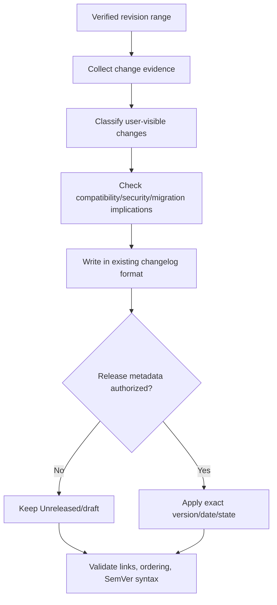

# Update Changelogs

Derive accurate user-facing change history from verified revisions and
repository release conventions without inventing versions, dates, availability,
compatibility impact, or publication status.

## Operating contract

- Establish the exact revision range, target changelog/release document,
  audience, release state, and formatting convention.
- Use commits, diffs, issues/PRs, tests, and product behavior together. Commit
  messages alone may be incomplete or misleading.
- Describe observable user/operator/developer impact, not implementation noise.
  Do not list refactors unless they change supported behavior or materially
  relevant internals for the audience.
- Do not choose a version, date, SemVer bump, release channel, or publication
  status without authority.
- Keep Unreleased, draft, tagged, published, and deployed states distinct.

## Workflow

## Procedure

1. Inspect the changelog/release-note format, previous entries, release tooling,
   tags, branch, and exact start/end revisions. Determine audience and whether
   the target is Unreleased, a draft, or an already published release
   correction.
1. Collect candidate changes from diffs, commits, merged requests, issues,
   tests, migration files, deprecations, security advisories, and documentation.
   Verify the actual behavior and shipped/package state.
1. Group by the repository’s existing categories. Write concise entries that
   state what changed, who is affected, and required action. Preserve
   identifiers/links according to local style.
1. Assess breaking behavior, deprecations, migrations, known issues, security
   impact, and compatibility from actual contracts. Do not infer SemVer
   significance solely from file paths or conventional-commit labels.
1. Apply only authorized version/date/release metadata. Do not move entries out
   of Unreleased or publish/create tags/releases unless explicitly requested.
1. Run changelog/Markdown/link/SemVer validators and inspect
   chronological/order/duplicate entries. Compare entries with the revision
   range and package contents.
1. Report the exact range and source evidence. State omitted internal changes
   and unresolved release metadata.

## Read only the material needed

| Situation | Read or use |
| --- | --- |
| Applying changelog and SemVer conventions | [Changelog and SemVer](references/changelog-and-semver.md) |
| Understanding bundled validator contracts | [Validator contracts](references/validator-contracts.md) |
| Choosing entries and release state | [Decision guide](references/decision-guide.md) |
| Using complete Unreleased, migration, and release examples | [Worked examples](references/worked-examples.md) |
| Verifying range, links, versions, and publication claims | [Verification and evidence](references/verification-and-evidence.md) |
| Avoiding commit-message summaries and invented releases | [Failure modes](references/failure-modes.md) |
| Running changelog validators | [Changelog validator](scripts/audit_changelog.py) |
| Checking authoritative conventions | [Source index](references/source-index.md) |

## Additional specialized references

Read only the reference whose subject affects the current task.

| Reference | Use when |
| --- | --- |
| [Domain model and authority](references/domain-model.md) | Current implementation is evidence of state, not automatically the desired contract. |
| [Enterprise operation and governance](references/enterprise-operation.md) | The skill may be used in repositories with protected branches, regulated data, separate owning teams, long support windows, and reproducible-build or audit requirements. |
| [Bundled resource catalog](references/resource-catalog.md) | Use this catalog to locate the exact skill-local files needed for the task. |

## Evaluation cases

Use [evaluation cases](references/evaluation-cases.md) for realistic activation,
near-miss, and instruction-conformance probes. These are maintained test inputs,
not claimed results.

## Bundled executable helpers

- `scripts/audit_changelog.py --help`
- `scripts/audit_semver.py --help`
- `scripts/changelog_markdown.py --help`
- `scripts/test_validators.py`

Run a helper only for the contract it documents. Inspect arguments and output; a
zero exit status proves only the checks implemented by that helper.

## Bundled output material

- `assets/CHANGELOG.template.md`

Copy or adapt assets into the target workspace. Do not edit the installed skill
as a substitute for changing the requested repository.

## Completion evidence

- Target document, audience, release state, and exact revision range.
- Entries derived from verified behavior and existing format.
- Breaking/deprecation/migration/security notes only where established.
- Authorized version/date/state or explicit unresolved metadata.
- Executed Markdown/link/changelog/SemVer checks.

## Stop or escalate

- The revision range or target release state cannot be established.
- A version/date/publication decision is user-owned and absent.
- A claimed user-visible or breaking change cannot be verified.
- The request is to publish/tag/release when only text update is authorized.

Do not claim completion while a required check is failed, unattempted, or
unavailable. State the exact evidence and the remaining boundary instead of
promoting a narrower result into a broader claim.
