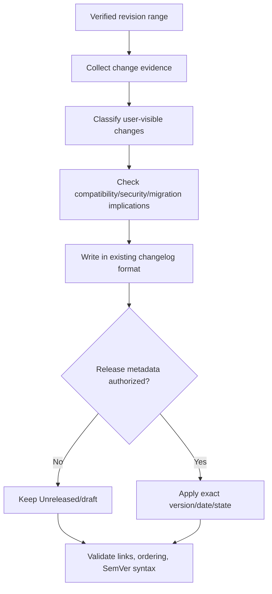

# Update Changelogs

Derive accurate user-facing change history from verified revisions and
repository release conventions without inventing versions, dates, availability,
compatibility impact, or publication status.

## Operating contract

- Establish the exact revision range, target changelog/release document,
  audience, release state, and formatting convention.
- Use commits, diffs, issues/PRs, tests, and product behavior together. Commit
  messages alone may be incomplete or misleading.
- Describe observable user/operator/developer impact, not implementation noise.
  Do not list refactors unless they change supported behavior or materially
  relevant internals for the audience.
- Do not choose a version, date, SemVer bump, release channel, or publication
  status without authority.
- Keep Unreleased, draft, tagged, published, and deployed states distinct.

## Release-history contract

- Treat the user goal, scope, approval boundary, and required evidence as
  controlling. This skill narrows how to produce a changelog entry; it MUST NOT
  broaden authority or override repository instructions.
- For GPT-5.6 and GPT-6, provide verified revision range, project format,
  user-visible effects, release status, and publication authority, hard
  constraints, available tools, and the finish condition once. Remove repeated
  directions and examples unless a recorded evaluation shows that they prevent a
  real failure.
- Infer routine, reversible steps from inspected evidence. Ask only when an
  unresolved choice changes an external contract. Stop before an external write,
  destructive action, credential use, or material scope expansion that the user
  did not authorize.
- Load a linked reference only when its subject affects the current decision.
  Use scripts for deterministic mechanics; use model judgment for semantic
  decisions. Inspect tool output before relying on it.
- Validate at the boundary of the claim with commit/PR traceability, format
  checks, link checks, and release-state comparison. Report commands, observed
  results, and gaps. A parser, build, or single green test proves only the
  property that it can discriminate.
- Use **MUST** only for an absolute safety or interoperability requirement,
  **SHOULD** for a default with valid exceptions, and **MAY** for an option.
  Write short active sentences and use one stable term for each concept. This
  style is STE-inspired; it is not a claim of formal ASD-STE100 conformance.

## Workflow

## Procedure

1. Inspect the changelog/release-note format, previous entries, release tooling,
   tags, branch, and exact start/end revisions. Determine audience and whether
   the target is Unreleased, a draft, or an already published release
   correction.
1. Collect candidate changes from diffs, commits, merged requests, issues,
   tests, migration files, deprecations, security advisories, and documentation.
   Verify the actual behavior and shipped/package state.
1. Group by the repository's existing categories. Write concise entries that
   state what changed, who is affected, and required action. Preserve
   identifiers/links according to local style.
1. Assess breaking behavior, deprecations, migrations, known issues, security
   impact, and compatibility from actual contracts. Do not infer SemVer
   significance solely from file paths or conventional-commit labels.
1. Apply only authorized version/date/release metadata. Do not move entries out
   of Unreleased or publish/create tags/releases unless explicitly requested.
1. Run changelog/Markdown/link/SemVer validators and inspect
   chronological/order/duplicate entries. Compare entries with the revision
   range and package contents.
1. Report the exact range and source evidence. State omitted internal changes
   and unresolved release metadata.

## Choose the revision-evidence reference

| Situation | Read or use |
| --- | --- |
| Applying changelog and SemVer conventions | [Changelog and SemVer](references/changelog-and-semver.md) |
| Understanding bundled validator contracts | [Validator contracts](references/validator-contracts.md) |
| Choosing entries and release state | [Operational decisions](references/release-history-operational-decisions.md) |
| Using complete Unreleased, migration, and release examples | [Worked scenarios](references/release-history-worked-scenarios.md) |
| Verifying range, links, versions, and publication claims | [Verification and claim evidence](references/release-history-verification-and-claim-evidence.md) |
| Avoiding commit-message summaries and invented releases | [Failure patterns and recovery](references/release-history-failure-patterns-and-recovery.md) |
| Running changelog validators | [Changelog validator](scripts/audit_changelog.py) |
| Checking authoritative conventions | [Standards, APIs, and authorities](references/release-history-standards-apis-and-authorities.md) |

## Changelog decision references

Read only the reference whose subject affects the current task.

| Reference | Use when |
| --- | --- |
| [Concepts, contracts, and invariants](references/release-history-concepts-contracts-and-invariants.md) | Use when distinguishing the requested changelog entry from observed repository state. |
| [Enterprise operation and governance](references/release-history-organizational-controls-and-scale.md) | Use when the changelog entry crosses ownership, data-handling, release, or audit boundaries. |
| [Bundled resource map](references/release-history-bundled-resource-map.md) | Use when locating bundled resources for the changelog entry. |

## Behavioral evaluation

Run [the maintained Agent Skills evaluations](evals/evals.json) in clean
target-client contexts. Compare this revision with a no-skill or prior-skill
baseline. Review commands, diffs, and artifacts; do not grade prose alone. The
checked-in cases are test inputs, not claimed results.

## Bundled executable helpers

- `scripts/audit_changelog.py --help`
- `scripts/audit_semver.py --help`
- `scripts/changelog_markdown.py --help`
- `scripts/test_validators.py`

Run a helper only for the contract it documents. Inspect arguments and output; a
zero exit status proves only the checks implemented by that helper.

## Bundled output material

- `assets/CHANGELOG.template.md`

Copy or adapt assets into the target workspace. Do not edit the installed skill
as a substitute for changing the requested repository.

## Completion evidence

- Target document, audience, release state, and exact revision range.
- Entries derived from verified behavior and existing format.
- Breaking/deprecation/migration/security notes only where established.
- Authorized version/date/state or explicit unresolved metadata.
- Executed Markdown/link/changelog/SemVer checks.

## Stop or escalate

- The revision range or target release state cannot be established.
- A version/date/publication decision is user-owned and absent.
- A claimed user-visible or breaking change cannot be verified.
- The request is to publish/tag/release when only text update is authorized.

Do not claim completion while a required check is failed, unattempted, or
unavailable. State the exact evidence and the remaining boundary instead of
promoting a narrower result into a broader claim.
