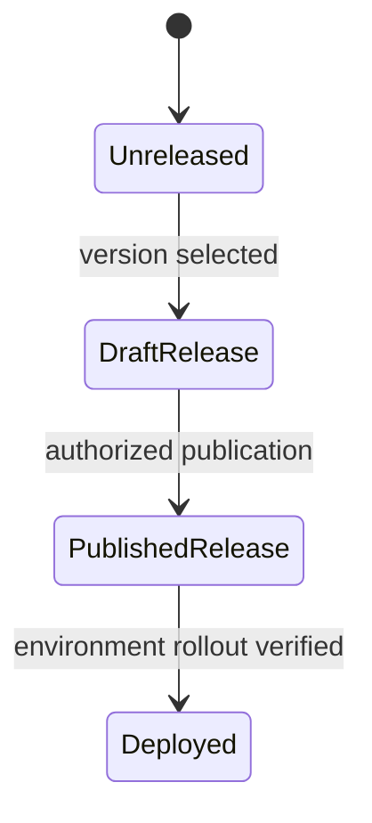

# Worked changelog examples

## User-visible fix

Weak:

> Refactored parser state machine.

Useful:

> Fixed CSV imports dropping a trailing empty field, which could shift columns
> in exported records. Existing files do not require migration.

The second entry states effect and migration impact, supported by the diff and
regression test.

## Unreleased without invented version

```markdown
## [Unreleased]

### Fixed
- Preserve cancellation errors from the export API instead of returning an
  empty result.
```

Do not rename this heading to `2.4.0 - 2026-09-16` unless the release process
has selected that version and date.

## Release-state model



These states may occur in a different order/process, but writing notes does not
advance them by itself.
