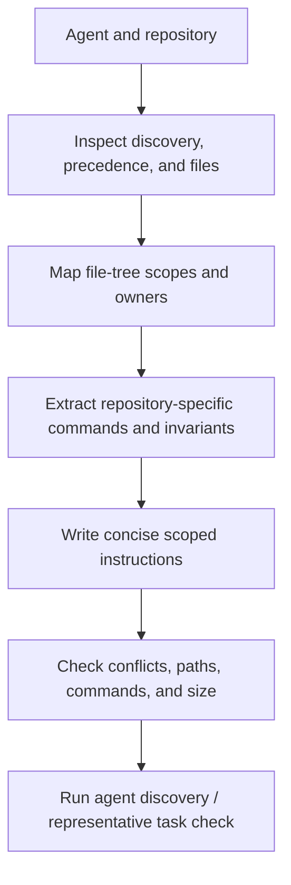

# Write AGENTS.md

Write concise repository-scoped instructions that tell coding agents what is
specific, non-obvious, and authoritative for the files in scope: commands,
architecture, ownership, generated/source boundaries, validation, and
operational constraints.

## Operating contract

- Inspect the target agent/client's current discovery, scope, precedence,
  filename, and size behavior before creating or moving instruction files.
- Derive commands and rules from the repository, not model memory. Run or
  inspect every critical command and identify its working directory and scope.
- Keep reusable task knowledge in Agent Skills and repository-specific always-on
  context in AGENTS.md. Do not duplicate whole manuals or skill bodies.
- Preserve existing instructions outside the requested scope and resolve
  conflicts explicitly. A nested file narrows its subtree; it does not silently
  override user authority.
- Do not add style/personality/rhetorical guidance unrelated to repository work
  or turn one incident into a universal prohibition.

## Model and skill execution contract

- Treat the user goal, scope, approval boundary, and required evidence as
  controlling. This skill narrows how to produce a AGENTS.md instructions; it
  MUST NOT broaden authority or override repository instructions.
- For GPT-5.6 and GPT-6, provide target agent client, file scope, precedence,
  repository commands, generated boundaries, and ownership rules, hard
  constraints, available tools, and the finish condition once. Remove repeated
  directions and examples unless a recorded evaluation shows that they prevent a
  real failure.
- Infer routine, reversible steps from inspected evidence. Ask only when an
  unresolved choice changes an external contract. Stop before an external write,
  destructive action, credential use, or material scope expansion that the user
  did not authorize.
- Load a linked reference only when its subject affects the current decision.
  Use scripts for deterministic mechanics; use model judgment for semantic
  decisions. Inspect tool output before relying on it.
- Validate at the boundary of the claim with scope checks, command execution,
  precedence scenarios, and target-client discovery. Report commands, observed
  results, and gaps. A parser, build, or single green test proves only the
  property that it can discriminate.
- Use **MUST** only for an absolute safety or interoperability requirement,
  **SHOULD** for a default with valid exceptions, and **MAY** for an option.
  Write short active sentences and use one stable term for each concept. This
  style is STE-inspired; it is not a claim of formal ASD-STE100 conformance.

## Workflow

## Procedure

1. Identify the exact coding-agent client(s), supported instruction filename(s),
   repository root, nested scopes, and existing global/project/user
   instructions. Read current official client behavior for the installed
   version.
1. Inventory repository structure, build/test/lint/format/type/package commands,
   generated files, language/runtime versions, source-of-truth rules, ownership,
   sensitive areas, and validation gates. Execute or verify critical commands.
1. Decide placement: root instructions for repository-wide facts; nested
   instructions only for genuinely different subtree commands or contracts.
   Avoid duplicate text and contradictory layers.
1. Write direct instructions with scope and rationale where non-obvious. Include
   exact commands with working directory, files that must not be hand-edited,
   required check selection, authority boundaries, and links to durable
   repository docs or skills.
1. Exclude generic advice, transient task state, agent self-management, long
   architecture tutorials, secrets, unsupported future policy, and rules already
   enforced clearly by tooling unless agents need the command/path.
1. Validate Markdown, file paths, command names, and precedence. Test
   representative tasks from affected subdirectories with the target client when
   available; verify which instruction files it actually loads.
1. Review the diff against existing content. Preserve still-valid rules, remove
   stale contradictions only within scope, and report client behavior not
   exercised.

## Choose the agent-integration reference

| Situation | Read or use |
| --- | --- |
| Writing evidence-backed concise instructions and client scope | [Format and evidence](references/format-and-evidence.md) |
| Choosing root versus nested instruction placement | [Operational decisions](references/repository-agent-instructions-operational-decisions.md) |
| Using complete monorepo, generated-code, and validation examples | [Worked scenarios](references/repository-agent-instructions-worked-scenarios.md) |
| Checking discovery, commands, paths, and behavior claims | [Verification and claim evidence](references/repository-agent-instructions-verification-and-claim-evidence.md) |
| Avoiding prompt stacking, stale rules, and skill duplication | [Failure patterns and recovery](references/repository-agent-instructions-failure-patterns-and-recovery.md) |
| Applying enterprise ownership and policy boundaries | [Organizational controls and scale](references/repository-agent-instructions-organizational-controls-and-scale.md) |
| Checking current AGENTS.md client documentation | [Standards, APIs, and authorities](references/repository-agent-instructions-standards-apis-and-authorities.md) |

## Agent behavior references

Read only the reference whose subject affects the current task.

| Reference | Use when |
| --- | --- |
| [Concepts, contracts, and invariants](references/repository-agent-instructions-concepts-contracts-and-invariants.md) | Use when distinguishing the requested AGENTS.md instructions from observed repository state. |
| [Bundled resource map](references/repository-agent-instructions-bundled-resource-map.md) | Locate and apply complete native templates without treating them as universal defaults. |

## Behavioral evaluation

Run [the maintained Agent Skills evaluations](evals/evals.json) in clean
target-client contexts. Compare this revision with a no-skill or prior-skill
baseline. Review commands, diffs, and artifacts; do not grade prose alone. The
checked-in cases are test inputs, not claimed results.

## Bundled executable helpers

- No bundled script is mandatory. Use the target repository's established tools.

Run a helper only for the contract it documents. Inspect arguments and output; a
zero exit status proves only the checks implemented by that helper.

## Bundled output material

- `assets/AGENTS.template.md`

Copy or adapt assets into the target workspace. Do not edit the installed skill
as a substitute for changing the requested repository.

## Completion evidence

- Target clients, discovery/precedence behavior, and instruction scopes.
- Repository-specific commands, working directories, generated/source rules, and
  constraints.
- Root/nested instruction files with no unnecessary duplication.
- Validated paths/commands and representative loading behavior when available.
- Preserved out-of-scope instructions and listed untested clients.

## Stop or escalate

- The target client or instruction discovery semantics cannot be established.
- A material organization policy or command is disputed and repository evidence
  cannot resolve it.
- The requested content belongs in a reusable skill, transient task plan, secret
  manager, or external policy system instead.
- Updating a parent/global instruction file is outside authorized scope.

Do not claim completion while a required check is failed, unattempted, or
unavailable. State the exact evidence and the remaining boundary instead of
promoting a narrower result into a broader claim.
