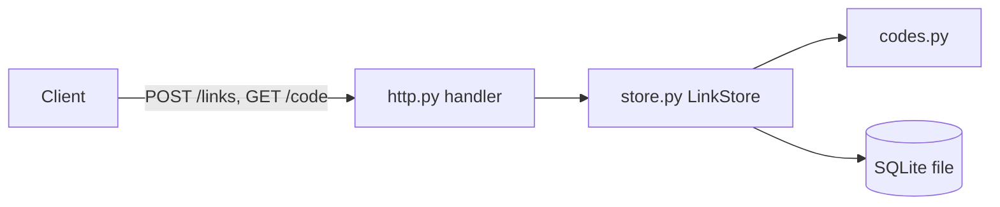

# Architecture Overview

`shortlinks` is a single-process URL shortener. A client posts a URL and
gets a base62 code; a later `GET` of that code answers with a redirect.
It is a layered Python package on the standard library only: pure code
conversion, SQLite persistence, and an HTTP front end.

## 1. Project Structure

```text
shortlinks/                # repository root
├── shortlinks/            # the application package
│   ├── __main__.py        # CLI entry point: parses --db and --port
│   ├── http.py            # HTTP front end (make_server, request handler)
│   ├── store.py           # LinkStore: SQLite persistence
│   └── codes.py           # encode/decode between row ids and codes
├── tests/                 # unittest suite, runs the real HTTP server
└── ARCHITECTURE.md        # this document
```

## 2. High-Level System Diagram



## 3. Core Components

### 3.1. HTTP front end

`shortlinks/http.py`. `make_server` builds a `ThreadingHTTPServer` bound to
`127.0.0.1`. `POST /links` reads the body as a URL, rejects schemes other
than `http` and `https` with 400, and returns the code with 201.
`GET /<code>` answers 302 with `Location`, or 404. It holds no state of its
own; everything goes through `LinkStore`.

### 3.2. Link store

`shortlinks/store.py`. `LinkStore.add` inserts a row and returns
`codes.encode(row id)`; `LinkStore.resolve` decodes a code and reads the
row, returning `None` for unknown or malformed codes.

### 3.3. Codes

`shortlinks/codes.py`. `encode` and `decode` convert between non-negative
integers and base62 strings. Pure functions with no imports.

## 4. Data Stores

### 4.1. Links database

SQLite, one file chosen with `--db` (default `links.db`; tests use
`:memory:`). One table, `links (id INTEGER PRIMARY KEY, url TEXT)`, created
on startup by `LinkStore`. No migrations exist; a schema change needs one.

## 5. External Integrations / APIs

None. The service stores URLs but never fetches them.

## 6. Deployment & Infrastructure

Not evident from the repository: no container, CI, or hosting
configuration. The process runs as `python3 -m shortlinks`.

## 7. Security Considerations

- Only `http` and `https` URLs are accepted, which blocks `javascript:`
  redirects.
- The server binds to `127.0.0.1`; no authentication or rate limiting
  exists, so anyone who can reach the port can create links.
- SQL uses bound parameters only.

## 8. Development & Testing Environment

Python 3.10 or later, standard library only. From the repository root:

```sh
python3 -m unittest discover -s tests -t .
! grep -rlIE '^(import|from) sqlite3' shortlinks | grep -vqx shortlinks/store.py
! grep -qE '^(import|from) ' shortlinks/codes.py
```

The second and third commands check the invariants below.

### Invariants

- Only `store.py` imports `sqlite3`; the HTTP layer never touches the
  database directly.
- `codes.py` imports nothing, so code conversion stays testable without a
  database or server.

## 9. Future Considerations / Roadmap

Recommendations, not documented plans:

- Add schema migrations before changing the `links` table.
- Add authentication before binding to a public interface.

## 10. Project Identification

- Project name: shortlinks
- Repository URL: Not evident from the repository.
- Primary contact: Not evident from the repository.
- Date of last update: 2026-09-29

## 11. Glossary / Acronyms

- Code: the base62 form of a `links` row id, used as the URL path.
- base62: digits, then lowercase, then uppercase letters (`ALPHABET`).
