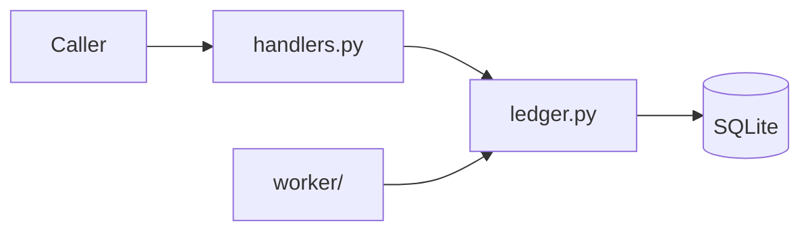

# Architecture Overview

`billing` records invoices and payments.

## 1. Project Structure

```text
billing/
├── billing/
│   ├── handlers.py        # request handlers
│   └── ledger.py          # SQLite ledger
├── worker/                # nightly reminder emails
└── tests/
```

## 2. High-Level System Diagram



## 3. Core Components

### 3.1. Handlers

`billing/handlers.py` validates input and calls `Ledger`.

### 3.2. Ledger

`billing/ledger.py` owns the `invoices` table.

### 3.3. Reminder worker

`worker/remind.py` emails customers with unpaid invoices every night.

## 4. Data Stores

SQLite, table `invoices (id, customer, cents, paid)`, created by `Ledger`.

## 5. External Integrations / APIs

SMTP, used by the reminder worker.

## 6. Deployment & Infrastructure

Not evident from the repository.

## 7. Security Considerations

SQL uses bound parameters.

## 8. Development & Testing Environment

```sh
python3 -m unittest discover -s tests -t .
```

## 9. Future Considerations / Roadmap

Recommendations, not documented plans:

- Support more than one currency.

## 10. Project Identification

- Project name: billing
- Date of last update: 2025-01-10

## 11. Glossary / Acronyms

- Ledger: the SQLite-backed store of invoices.
