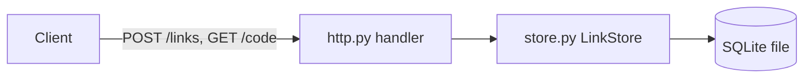

# Section content

What each section of an ARCHITECTURE.md holds and how to prove it true.
The outline is the architecture.md template
([`architecture.md`][template] at commit `fed7705`, 2026-07-15) and its
generator prompt ([`prompt.md`][prompt]). The worked document is
`assets/examples/shortlinks/ARCHITECTURE.md`; `assets/examples/verify.sh`
checks it and runs its commands.

## Contents

- Evidence for every claim
- Project structure tree
- Diagram that matches the components
- Core components
- Data flow and data stores
- Integrations, deployment, and security
- Development commands that run
- Invariants and boundaries
- Decisions, debt, and roadmap
- Project identification and glossary
- Optional sections from the prompt

## Evidence for every claim

**Definition.** Every component, store, integration, technology, and
control in the document is backed by a file in the repository: an import,
a manifest entry, a config file, a workflow, or a schema. A section with
no evidence gets one line: "Not evident from the repository." That
wording is the prompt's rule for unknowns.

**Use when.** Every section, and most of all the template's slots that
invite guesses: cloud provider, monitoring, authentication, encryption.

**Do not use when.** The user states a fact the repository cannot show
(a hosting target, an owner). Write it and attribute it: "Hosted on Fly.io
(per the maintainers; no config in the repository)."

**Example.**

```markdown
## 6. Deployment & Infrastructure

Not evident from the repository: no container, CI, or hosting
configuration. The process runs as `python3 -m shortlinks`.
```

**Cost removed.** Invented infrastructure. The template's defaults
(AWS, Redis, JWT, Kubernetes) become false facts that later agents act
on. `ARCHITECTURE.broken.txt` names Redis, PostgreSQL, JWT, and ECS;
`verify.sh` shows none has a match in the code.

**Verify.**

1. For each technology named, search for evidence:
   `rg -il 'redis|postgres|jwt' --glob '!ARCHITECTURE.md'`. No match
   means remove the claim or mark it as not evident.
1. Search the draft for the template's example values that survived:
   `rg -n 'e\.g\.|AWS|Kubernetes|OAuth2' ARCHITECTURE.md`, and check each
   hit against the code.

## Project structure tree

**Definition.** An annotated `tree`-style block of the directories and
root files that matter, grouped by layer or concern, with a short comment
per entry.

**Use when.** Always; it is the template's first section and answers
"where is the thing that does X?"

**Do not use when.** The tree would list every file. Stop at the level
where a directory has one responsibility. Omit build output, caches, and
vendored dependencies.

**Example.**

```text
shortlinks/                # repository root
├── shortlinks/            # the application package
│   ├── http.py            # HTTP front end
│   └── store.py           # LinkStore: SQLite persistence
└── tests/                 # unittest suite
```

**Cost removed.** A tree copied from the template (`backend/`,
`frontend/`) or from memory sends agents to paths that do not exist.

**Verify.**

1. `python3 scripts/check_architecture.py ARCHITECTURE.md` rebuilds every
   tree path, reports each one that does not exist, and reports each
   tracked top-level directory the document never mentions.

## Diagram that matches the components

**Definition.** A fenced Mermaid `flowchart` (or a fenced text diagram)
showing entry points, components, stores, external systems, and the
direction of calls. Node labels use the component names from the text.

**Use when.** Always; the template requires section 2. Add a Mermaid
`sequenceDiagram` for the main request flow when there is one.

**Do not use when.** An unfenced line of text such as
`[User] <--> [Frontend]`. Markdown reflows it and the checker rejects it.
Do not draw boxes that no section describes.

**Example.**



**Cost removed.** A diagram that contradicts the text, so a reader cannot
tell which one is true.

**Verify.**

1. Each node matches a component heading or a data store, and each
   component appears in the diagram. Check this by reading; the checker
   only confirms that a fenced diagram exists.
1. Render the Mermaid block (GitHub preview or `mmdc`), or state that it
   was not rendered.

## Core components

**Definition.** One subsection per component: its path, its
responsibility, its main inputs and outputs, the components it calls, and
the state or side effects it owns.

**Use when.** Each unit that a change would target: a package, service,
worker, CLI, or frontend app.

**Do not use when.** The subsection would explain how every function
works. matklad's rule applies: "A codemap is a map of a country, not an
atlas of maps of its states" ([matklad][matklad]). Put details in
docstrings.

**Example.**

```markdown
### 3.2. Link store

`shortlinks/store.py`. `LinkStore.add` inserts a row and returns
`codes.encode(row id)`; `LinkStore.resolve` decodes a code and reads the
row, returning `None` for unknown or malformed codes.
```

**Cost removed.** Agents reading files in sequence to find where a change
goes. matklad's estimate for a newcomer: a patch takes 2x longer to
write, but "10x more time to figure out where you should change the code"
([matklad][matklad]). It is his estimate, not a measurement.

**Verify.**

1. Every backticked path and file name exists (the checker reports
   missing ones).
1. Every symbol named exists: `rg -n 'class LinkStore|def resolve'`.

## Data flow and data stores

**Definition.** For each store: technology, what it holds, main tables or
collections, who writes it, and how its schema changes (migrations or
none). For flow: the main read and write paths, with the validation and
serialization points.

**Use when.** The code opens a connection, a file, a queue, or a cache.

**Do not use when.** No persistent state exists. Write "None: all state
is in memory" instead of an empty section.

**Example.**

```markdown
SQLite, one file chosen with `--db`. One table,
`links (id INTEGER PRIMARY KEY, url TEXT)`, created on startup by
`LinkStore`. No migrations exist; a schema change needs one.
```

**Cost removed.** Schema changes made without knowing that a migration
path is missing, or two components writing the same table without the
owner knowing.

**Verify.**

1. Find the connections: `rg -n 'sqlite3|psycopg|redis|boto3|open\('`.
1. Find the schema: `rg -n 'CREATE TABLE|migrations/'`.

## Integrations, deployment, and security

**Definition.** Third-party services with the call site and the
integration method; build artifacts, configuration, CI, and hosting; and
the security controls the code enforces (authentication, authorization,
input validation, secrets handling, trust boundaries).

**Use when.** Always; these are template sections 5 to 7. Fill them from
SDK imports, HTTP clients, workflow files, Dockerfiles, IaC, middleware,
and validation code.

**Do not use when.** A control is only hoped for. Do not claim a control
exists unless the codebase shows it (the prompt's rule). A missing
control is a fact worth stating.

**Example.**

```markdown
- The server binds to `127.0.0.1`; no authentication or rate limiting
  exists, so anyone who can reach the port can create links.
```

**Cost removed.** False assurance. A reviewer who reads "JWT on every
request" in a codebase without JWT does not check authentication.

**Verify.**

1. For each control, name the code that enforces it and open it.
1. `fd -H 'Dockerfile|\.ya?ml$' .github deploy infra` (only the
   directories that exist) for deployment evidence.

## Development commands that run

**Definition.** The commands to install, run, test, and check the
project, each run from the stated directory before it is written down.

**Use when.** Section 8. Keep it to the commands that show how the
system is built and tested.

**Do not use when.** The README or AGENTS.md already owns a long setup
procedure. Keep the commands here to what the architecture needs, and do
not replace facts with "see CONTRIBUTING.md"
([self-contained](durability.md#self-contained)).

**Example.**

```sh
python3 -m unittest discover -s tests -t .
```

**Cost removed.** Commands from memory (`npm test` in a Bun repository)
that fail on first use.

**Verify.**

1. `python3 scripts/check_architecture.py --commands ARCHITECTURE.md`
   lists the commands; run each one and record its exit status.

## Invariants and boundaries

**Definition.** Rules the code keeps that a reader cannot see in one
file, often an absence: "Important invariants are expressed as an
*absence* of something" ([matklad][matklad]). Boundaries are the
interfaces between layers that constrain what may change behind them.

**Use when.** A layer must not import another, one module owns all access
to a resource, or a type is the only way across a boundary. Put them in
section 8 or in a subsection of section 3.

**Do not use when.** The rule is not true in the code today. State it as
debt in the constraints section.

**Example.**

```sh
# Only store.py imports sqlite3.
! grep -rlIE '^(import|from) sqlite3' shortlinks | grep -vqx shortlinks/store.py
```

**Cost removed.** Changes that break a layer boundary because nothing in
the file showed the boundary. `verify.sh` adds `import sqlite3` to
`http.py` and shows the command fails.

**Verify.**

1. Run each invariant command on the current tree: it passes.
1. Introduce a violation in a scratch copy: it fails.

## Decisions, debt, and roadmap

**Definition.** Decisions visible in the code with their evidence and
consequences; constraints, risks, and debt with where they show; future
work split into documented plans and labeled recommendations.

**Use when.** The code or its docs show a choice, a TODO, a deprecated
path, or an incomplete migration.

**Do not use when.** The rationale is not documented. Write "Rationale not
documented" (the prompt's wording) instead of inventing history.

**Example.**

```markdown
Recommendations, not documented plans:

- Add schema migrations before changing the `links` table.
```

**Cost removed.** Invented history that later readers treat as a
decision record.

**Verify.**

1. Each item names its evidence: `rg -n 'TODO|FIXME|deprecated'`.
1. Each recommendation is labeled as one.

## Project identification and glossary

**Definition.** Project name, repository URL, contact, and date of last
update (YYYY-MM-DD); then project-specific terms and acronyms.

**Use when.** Always; template sections 10 and 11.

**Do not use when.** An owner or URL is not in the repository or the
user's message. Write "Not evident from the repository."

**Example.**

```markdown
- Date of last update: 2026-09-29
- Code: the base62 form of a `links` row id, used as the URL path.
```

**Cost removed.** Readers cannot tell how stale the document is, and
agents misread internal names.

**Verify.**

1. The checker warns when the identification section has no date.
1. `git remote get-url origin` for the URL.

## Optional sections from the prompt

**Definition.** The generator prompt adds Data Flow, Key Technologies,
Monitoring & Observability, Performance & Scalability, Testing Strategy,
Architectural Decisions, and Constraints/Technical Debt to the template's
eleven sections.

**Use when.** The repository has evidence for the section: a queue for
data flow, metrics code for observability, a benchmark suite for
performance.

**Do not use when.** The only content would be "Not evident from the
repository." Keep those one-liners for the eleven template sections,
which the checker requires.

**Example.** A repository with logging and a `/healthz` handler gets a
Monitoring section naming both; one with neither omits the section.

**Cost removed.** Length without facts. Every recurring contributor reads
the file ([matklad][matklad]), so empty optional sections cost each of
them time.

**Verify.**

1. Every optional section names at least one path or symbol.

[template]: https://github.com/timajwilliams/architecture/blob/fed7705ccb5b90980fae624fc30f21a1f45655ac/architecture.md
[prompt]: https://github.com/timajwilliams/architecture/blob/fed7705ccb5b90980fae624fc30f21a1f45655ac/prompt.md
[matklad]: https://matklad.github.io/2021/02/06/ARCHITECTURE.md.html
