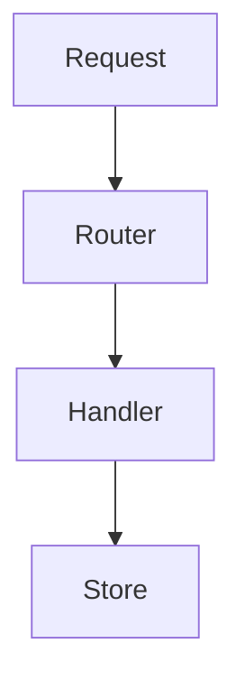

# GitHub extensions

Syntax that GitHub renders but the [GFM spec][spec] does not define:
alerts, footnotes, collapsed sections, diagrams, and math. The spec says
"GitHub.com and GitHub Enterprise perform additional post-processing and
sanitization after GFM is converted to HTML". Quotes come from GitHub
Docs pages [Basic writing and formatting syntax][basic],
[Organizing information with collapsed sections][collapsed],
[Creating diagrams][diagrams], and
[Writing mathematical expressions][math].

## Contents

- [GitHub rendering and other renderers](#github-rendering-and-other-renderers)
- [Alerts](#alerts)
- [Footnotes](#footnotes)
- [Collapsed sections](#collapsed-sections)
- [Mermaid diagrams](#mermaid-diagrams)
- [Math expressions](#math-expressions)

## GitHub rendering and other renderers

**Definition.** GFM is "a strict superset of CommonMark"; its extensions
are tables, task lists, strikethrough, extended autolinks, and a filter
on some raw HTML tags. Alerts, footnotes, Mermaid, math, heading anchors,
and autolinked references are GitHub features on top of that. Other
renderers (a documentation site generator, an IDE preview, a package
registry page) may show them as plain blockquotes, literal `[^1]`, or
code.

**Use when.** The file is also published outside github.com, or you are
told a feature "works on GitHub" and must decide whether it works here.

**Do not use when.** The file is read only on github.com; use the
features where they help the reader.

**Example.** The GFM "tagfilter" extension filters these raw HTML tags:
`<title>`, `<textarea>`, `<style>`, `<xmp>`, `<iframe>`, `<noembed>`,
`<noframes>`, `<script>`, and `<plaintext>`. Do not rely on them in a
README.

Placement also differs. Line breaks from a single newline appear in
issues, pull requests, and discussions but not in `.md` files
([line breaks](blocks-and-lists.md#line-breaks)). Autolinked `#123`
references appear in conversations but not in repository files
([autolinked references](headings-and-links.md#autolinked-references)).
Footnotes "are not supported in wikis."

**Cost removed.** A README that is correct on github.com and broken on
the project's documentation site.

**Verify.** Render GitHub features through the REST API with
`mode` set to `gfm`; the default `markdown` mode is plain CommonMark and
shows alerts, task lists, and math as text:

```sh
jq -Rs '{text: ., mode: "gfm"}' FILE.md | gh api markdown --input -
```

In the HTML, an alert is a `markdown-alert` element, a task item has
`task-list-item-checkbox`, math is a `math-renderer` element, and Mermaid
is a `render-needs-enrichment` section. The `gfm` mode renders like a
comment, so a single newline becomes `<br>` there but not in a `.md`
file. For the final page, ask the user to open the file on GitHub, or
view the pushed file yourself. Render the file with each other target
the project publishes to (its site build, its registry preview). Without
a renderer, say in the report which GitHub-only features the file uses.

## Alerts

**Definition.** A blockquote whose first line is `[!NOTE]`, `[!TIP]`,
`[!IMPORTANT]`, `[!WARNING]`, or `[!CAUTION]` renders with a color and
icon. GitHub: "Use alerts only when they are crucial for user success and
limit them to one or two per article to prevent overloading the reader.
Additionally, you should avoid placing alerts consecutively. Alerts
cannot be nested within other elements."

**Use when.** One fact the reader must not miss: data loss, an
irreversible command, a required setting.

**Do not use when.**

- The text is ordinary guidance; a plain sentence is enough.
- The alert would sit inside a list, table, or another quote, or right
  after another alert.
- The file is also rendered elsewhere, where the alert shows as a quote
  starting with a literal `[!WARNING]`.

**Example.**

```markdown
> [!WARNING]
> `just reset-db` deletes every local table. Export data first.
```

A bold `> **Note:**` label is a plain quote, not an alert. Use one of the
five types, alone on the first line of the quote.

**Cost removed.** Warnings that blend into the text, and pages where every
paragraph is a colored box so none stands out.

**Verify.** `rg -n '^> \[!' FILE` lists at most one or two alerts, each a
known type alone on its line, none adjacent. markdownlint MD028 flags a
blank line between two quotes, which usually means two alerts in a row.

## Footnotes

**Definition.** `[^1]` in the text links to a definition `[^1]: text`
written anywhere; GitHub renders all footnotes at the bottom: "The
position of a footnote in your Markdown does not influence where the
footnote will be rendered."

**Use when.** A citation or aside that would interrupt the sentence, in a
long document read on GitHub.

**Do not use when.**

- The note is needed to act correctly; put it in the text.
- The file is a wiki page, or is rendered by a tool without footnotes.
- A link would do: agents reading the raw file must search for the label
  to find the note.

**Example.**

```markdown
The cache holds 24 hours of results.[^1]

[^1]: Set by `CACHE_TTL` in `config/defaults.toml`.
```

**Cost removed.** Parenthetical detail that breaks the flow of a
sentence.

**Verify.** Every `[^label]` in the text has one definition, and every
definition is used: compare `rg -o '\[\^[^]]+\]' FILE | sort | uniq -c`.

## Collapsed sections

**Definition.** A `<details>` element with a `<summary>` label hides its
content until the reader expands it: "Any Markdown within the
`<details>` block will be collapsed until the reader clicks to expand the
details." `<details open>` starts expanded.

**Use when.** Long logs, full configuration dumps, or optional detail in
an issue or pull request that most readers skip.

**Do not use when.** The content is a step the reader must follow, or the
file is read raw by agents; collapsing does not shorten the raw text, and
hidden steps are skipped by people.

**Example.** Leave a blank line after `</summary>` and before
`</details>`, as GitHub's example does, so the Markdown inside is parsed
instead of treated as part of the HTML block.

````markdown
<details>
<summary>Full test log</summary>

```text
FAILED tests/test_api.py::test_timeout
```

</details>
````

**Cost removed.** A pull request description where 300 lines of log push
the summary off the screen.

**Verify.** In the preview, the summary line shows and the content,
including its code block, renders when expanded.

## Mermaid diagrams

**Definition.** A fenced block with the `mermaid` info string renders as
a diagram: "To create a Mermaid diagram, add Mermaid syntax inside a
fenced code block with the mermaid language identifier." GitHub also
renders `geojson`, `topojson`, and `stl` blocks. "Diagram rendering is
available in GitHub Issues, GitHub Discussions, pull requests, wikis, and
Markdown files."

**Use when.** A flow, sequence, or dependency graph that is easier to
follow as a picture and must stay editable in diffs.

**Do not use when.** A list or table says it as clearly; the raw Mermaid
source is harder to read than prose. GitHub notes: "You may observe
errors if you run a third-party Mermaid plugin when using Mermaid syntax
on GitHub."

**Example.**



**Cost removed.** Diagram images that go stale because nobody can edit
the source.

**Verify.** Preview the file on GitHub. To check which Mermaid version
GitHub runs, render a block containing only `info`. Names in the diagram
match names in the text.

## Math expressions

**Definition.** GitHub renders LaTeX with MathJax. Inline math uses
`$...$`, or `` $`...`$ `` when the expression contains characters that
"overlap with markdown syntax". A block uses `$$` delimiters or a fenced
block with the `math` info string.

**Use when.** A formula that readers must read exactly: a complexity
bound, a scoring rule, a unit conversion.

**Do not use when.** The formula is short plain arithmetic that reads
as well in a code span. On a line that has math, a literal dollar sign
needs care: "you need to escape the non-delimiter $ to ensure the line
renders correctly." Inside the expression, escape it with a backslash.
Outside it, on the same line, GitHub's example wraps the sign in a `span`
element. Put prices and shell variables in code spans.

**Example.**

````markdown
Inline: $`O(n \log n)`$

```math
\sum_{k=1}^{n} k = \frac{n(n+1)}{2}
```
````

**Cost removed.** Formulas written as ASCII approximations that readers
misread, and prices swallowed into math.

**Verify.** Preview on GitHub; check every line with two or more `$` for
unintended pairs: `rg -n '\$.*\$' FILE`.

[basic]: https://docs.github.com/en/get-started/writing-on-github/getting-started-with-writing-and-formatting-on-github/basic-writing-and-formatting-syntax
[collapsed]: https://docs.github.com/en/get-started/writing-on-github/working-with-advanced-formatting/organizing-information-with-collapsed-sections
[diagrams]: https://docs.github.com/en/get-started/writing-on-github/working-with-advanced-formatting/creating-diagrams
[math]: https://docs.github.com/en/get-started/writing-on-github/working-with-advanced-formatting/writing-mathematical-expressions
[spec]: https://github.github.com/gfm/
